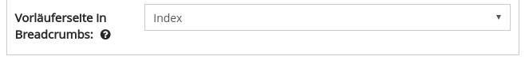

# Dezember

Auch wenn der Monat Dezember und das Jahr 2017 noch nicht zu Ende ist, die Entwicklungsarbeiten für diesen Monat sind abgeschlossen. Es gibt verschiedene Neuerungen zu berichten.

Zuerst sind wir Stolz darauf, dass Anfang des Monats das Sammlungsportal der Universität Göttingen offiziell eröffnet wurde. Das Portal basiert auf dem Goobi viewer und ist unter der folgenden URL erreichbar:

* [http://sammlungen.uni-goettingen.de](http://sammlungen.uni-goettingen.de/)

## Entwicklungen

### CMS

Endlich ist es möglich in CMS-Seiten auch die Breadcrumbs zu definieren. Dafür kann für jede Seite ausgewählt werden welche andere Seite die potentielle Eltern-Seite ist. Standardmäßig sind alle Seiten Kinder der Startseite. Auf diese Seite können nun auch Breadcrumbs wie zum Beispeil "Startseite &gt; Sammlungen &gt; Sammlungsname" festgelegt werden.



### PDF-Download

Der Goobi viewer kann die Generierung von PDF-Dokumenten an den TaskManager deligieren. Durch dessen Warteschlange ist es möglich die Lastverteilung auf dem System besser zu deligieren. 

Dieses Feature existiert bereits seit über einem Jahr. Wir haben nun das Nutzerfeedback aufgenommen und verschiedenste Punkte verbessert, korrigiert und refaktorisiert. Sichtbar ist vor allem die angepasste Oberfläche im TaskManager Backend. Dort werden nun weitergehende Informationen angezeigt. Auch wird ei der EPUB-Generierung die zu erwartende Größe des EPUB-Dokuments ermittelt und dem Nutzer im Vorfeld präsentiert.  
Durch die Anpassungen im Code ist der gesamte Prozess deutlich robuster und übersichtlicher geworden.

### Volltext-Hinweise

Wenn für ein Werk Volltexte vorliegen, dann wird ein entsprechender Volltext-Link in der Navigationsleiste angezeigt. Darüber kann der Text für das Werk betrachtet werden.

Oft gibt es aber gerade bei der Transkription von Handschriften und weitere über das Crowdsourcing erfasste Volltexte das Problem, dass nur nur für wenige Seiten Daten vorliegen, aber der Volltextlink global für das Werk angezeigt wird. Es war nicht möglich zu erkennen für welche Seiten nun die Texte genau vorliegen.

Dieses Problem wurde nun durch die Möglichkeit behoben weitere Hinweise einzublenden. Die Anzeige wird auf Basis eines konfigurierbaren Wertes aktiviert. Der Wert definiert einen prozentualen Anteil an Volltexten am Gesamtwerk. Wird dieser unterschritten werden die Hinweise angezeigt.

Diese Hinweise stellen sich wie folgt dar:

1. vorhandener Volltext wird in der Bildanzeige mit einem zusätzlichen Icon oberhalb des Bildes signalisiert: [http://digi.landesbibliothek.at/viewer/image/177/158/](http://digi.landesbibliothek.at/viewer/image/177/158/)
2. auf vorhandene Volltexte wird in der Seitenvorschau mit einem zusätzlichen Icon hingewiesen: [http://digi.landesbibliothek.at/viewer/thumbs/177/6/](http://digi.landesbibliothek.at/viewer/thumbs/177/6/)
3. auf der Volltext-Seite werden nun im DropDown-Menü nur noch die Seiten angezeigt, die auch einen Volltext besitzen: [http://digi.landesbibliothek.at/viewer/fulltext/177/162/](http://digi.landesbibliothek.at/viewer/fulltext/177/162/)

### URLs

Unter der Haube gab es sehr viele Änderungen was das Handling von URLs und Weiterleitungen angeht. Technisch gesehen findet das nämlich an verschiedenen Stellen statt und war bisher immer weiter gewachsen. URLs sind ja einerseits von der Applikation vorgegeben zum Beispiel

```text
/viewer/image/IDENTIFIER/SEITE/
```

können andererseits aber auch im CMS selber gesetzt werden, zum Beispiel:

```text
  /viewer/news/unbekanntes-werk-wiederentdeckt/
```

Im ersten Beispiel kann nun aber das /image/ in der URL über einen Konfigurationsschalter geändert werden, so dass es zum Beispiel /objekt/ heißt. Das zweite Beispiel ist als CMS-Seite aber auch unter der URL /viewer/cms/CMSID/ aufrufbar. Auch auf der Suchen-Seite wird vieles wie der Suchstring, die gewählten Facettierungen etc. über die URL abgebildet.

Durch die Verlagerung von Funktionen in das CMS war es nun notwendig an dieser Stelle aufzuräumen, neu zu implementieren und den Code weitergehend zu dokumentieren. Diese Änderungen bildet die Grundlage für weitere Entwicklungen, wie zum Beispiel die Integration der Suche in das CMS.

### Sprachversionen für ein Dokument

Der Goobi viewer kann nun mehrere Sprachversionen eines Werkes verwalten. Dadurch ist es zum Beispiel möglich, verschiedene Übersetzungen für ein Werk anzuzeigen. Entwickelt wurde dieses, um die Anzeige von TEI-Dokumenten im Goobi viewer zu ermöglichen. Mehr dazu folgt in einem späteren Digest

### Goobi viewer Indexer

Der Goobi viewer Indexer hat verschiedene Neuerungen erhalten. Mit einem Update auf den aktuellen Master ist es notwendig auch den Indexer und das Solr-Schema zu aktualisieren sowie die Konfigurationsdatei anzupassen.

Zuerst wurde der Ort, an denen der Indexer bei der Indexierung nach Bildern in den LIDO-Dateien sucht, konfigurierbar. Dafür gibt es eine Liste an XPATH-Ausdrücken, die in der obersten init-Sektion wie folgt angegeben werden können:

```markup
<lido>
    <imageXPath>lido:resourceID</imageXPath>
    <imageXPath>lido:resourceRepresentation[@lido:type='image_master']/lido:linkResource</imageXPath>
    <imageXPath>lido:resourceRepresentation[@lido:type='http://terminology.lido-schema.org/resourceRepresentation_type/provided_representation']/lido:linkResource</imageXPath>
    <imageXPath>lido:resourceRepresentation[@lido:type='http://terminology.lido-schema.org/lido00464']/lido:linkResource</imageXPath>
    <imageXPath>lido:resourceRepresentation[@lido:type='image_overview']/lido:linkResource</imageXPath>
</lido>
```

Außerdem kann der Indexer nun angewiesen werden extern verlinkte Bilder aus den LIDO-Dateien bei der Indexierung herunterzuladen. Dafür müssen die Bilder in der LIDO Datei entsprechend referenziert sein und unter einem der konfigurierten XPATH Ausdrücke gefunden werden können. Der Download wird initiiert, sofern neben der LIDO Datei auch ein Ordner mit VORGANGSTITEL\_downloadimages im Hotfolder liegt.

Zu guter Letzt kennt der Indexer nun verschiedene Strategien um die indexierten Objekte auf Speicherbereiche zu verteilen. Damit können nun verschiedenen Systemarchitekturen bedient werden. Die Strategien sind wie folgt:

* **SingleRepositoryStrategy**: Die Werke werden wie bisher alle in die bekannte, flache Dateisysteminfrastruktur verschoben
* **MaxRecordNumberStrategy**: Hierbei werden die Werke auf verschiedene "Datarepositories" verschoben. Pro Repository wird eine konfigurierbare Anzahl an Werken verschoben. Dadurch kann sichergestellt werden, dass es nicht mehr als zum Beispiel 5000 Unterordner in einem Verzeichnis gibt.
* **RemainingSpaceStrategy**: Hierbei werden die Werke ebenfalls auf verschiedene "Datarepositories" aufgeteilt. Dabei wird geschaut wie groß das Werk mit allen zugehörigen Dateien ist und das nächste Repository ausgewählt, dass den dafür notwendigen freien Speicher noch ausweist. Dadurch können die Datensätze zum Beispiel in handliche 5TB Happen aufgeteilt werden.

Als "Datarepositories" werden im Indexer-Kontext eine Liste an Ordnern im Dateisystem bezeichnet. An diese Ordner können dann zum Beispiel für die RemainingSpaceStragety verschiedene Mountpoints eingehängt werden. Die Konfiguration erfolgt ebenfalls wieder in der obersten init-Sektion wie folgt:

```markup
<dataRepositories>
    <strategy>SingleRepositoryStrategy</strategy>
    <maxRecords>10000</maxRecords>
    <dataRepository>/opt/digiverso/viewer/data/1</dataRepository>
    <dataRepository>/opt/digiverso/viewer/data/2</dataRepository>    
    <dataRepository>/opt/digiverso/viewer/data/3</dataRepository>
</dataRepositories>
```


