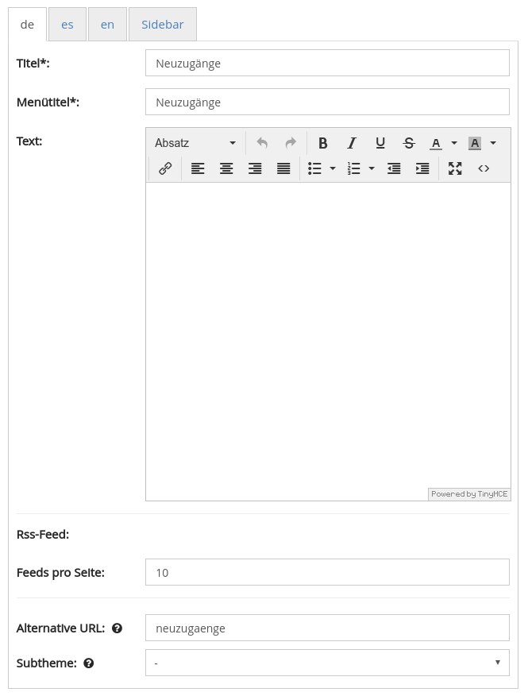
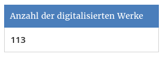

# Oktober

Im Oktober freuen wir uns über die Freischaltung des neuen Themes der HLB-Fulda:

* [http://fuldig.hs-fulda.de](http://fuldig.hs-fulda.de/)
* [https://www.hs-fulda.de/hlb/ueber-die-hlb/aktuelles/meldungsdetails/news/neuer-fuldig-viewer-geht-online/](https://www.hs-fulda.de/hlb/ueber-die-hlb/aktuelles/meldungsdetails/news/neuer-fuldig-viewer-geht-online/)

Auch das neue Grimm-Portal das unter Federführung der Universität Kassel entwickelt wurde ist mit großem Medienecho online gegangen:

* [https://www.grimm-portal.de](https://www.grimm-portal.de/)
* [http://www.hessenschau.de/kultur/grimms-werke-und-briefe-auf-onlineportal-weltweit-verfuegbar](http://www.hessenschau.de/kultur/grimms-werke-und-briefe-auf-onlineportal-weltweit-verfuegbar),grimm-portal-kassel-100.html
* [http://www.ardmediathek.de/radio/hr4-Nord-Osthessen/Fundgrube-f%C3%BCr-Grimm-Freunde-In-Kassel-/hr4/Audio-Podcast?bcastId=10886542&documentId=47172112](http://www.ardmediathek.de/radio/hr4-Nord-Osthessen/Fundgrube-f%C3%BCr-Grimm-Freunde-In-Kassel-/hr4/Audio-Podcast?bcastId=10886542&documentId=47172112)
* [http://www.sueddeutsche.de/news/kultur/kultur---kassel-werke-der-brueder-grimm-bekommen-digitale-plattform-dpa.urn-newsml-dpa-com-20090101-171024-99-583675](http://www.sueddeutsche.de/news/kultur/kultur---kassel-werke-der-brueder-grimm-bekommen-digitale-plattform-dpa.urn-newsml-dpa-com-20090101-171024-99-583675)

## Entwicklungen

### CMS

Im CMS-Bereich gibt es verschiedene Neuerungen. Zuerst gibt es zwei neue Templates. Eines für die Anzeige der letzten Neuzugänge auf einer eigenen Seite \(ähnlich zum RSS-Feed\), und einmal zur Anzeige von Sammlungen als Akkordeon

Um die Funktionalität zur Verfügung zu stellen sind auch die ersten Teile der Implementierung der IIIF Presentation API in den Master Branch zurück geflossen.

Weiter wurde ein neues Widget entwickelt, dass die Anzahl der insgesamt verfügbaren Digitalisate in der Sidebar anzeigt

Mit dem Grimm-Portal ist ein Goobi viewer online gegangen, der sich den Datenbestand komplett mit einer anderen Instanz \(ORKA\) teilt. Es ist nur eine andere Sicht darauf. Dafür waren verschiedene kleinere Arbeiten im CMS-Bereich und der Suche notwendig um die Trennung sauber und performant zu vervollständigen.

### Speicherverbrauch

Um den Speicherverbrauch zu optimieren gab es verschiedene Umstellungen im Goobi viewer Indexer und dem Goobi viewer core. Der Indexer konvertiert bereits lange verschiedenste Formate zu ALTO. Neu ist, dass diese ab sofort nicht mehr mehr exklusiv im Solr Suchindex sondern auch im Dateisystem gespeichert sind. Im Suchindex sind die Texte für die Suche indexiert. Für die Anzeige werden jetzt ALTO Dateien aus dem Dateisystem gelesen. Dadurch konnte die Größe des Suchindexes bei gleichbleibender Funktionalität reduziert werden. Zusätzlich können die ALTO Dateien nun auch von anderen Komponenten, wie zum Beispiel dem ContentServer, für die PDF-Generierung zur Hinterlegung von Volltexten herangezogen werden. 

### PDF-Generierung

Im Kontext PDF-Generierung gab es zwei kleinere Verbesserungen. Zum einen wird bei der PDF-Generierung nun konsistent die im Viewer konfigurierte watermarkID übergeben, um sicherzustellen, dass die im PDF enthaltenen Bilder die gewünschten Bildspiegel enthalten. Zum anderen kann im Download-Modal die Größe des zu generierenden PDF-Dokumentes nun besser dargestellt werden.

### Suche

Nachdem im letzten Monat geschwungene Klammern in der Facettierung zu Fehlern führten, waren es diesen Monat eckige Klammern in der normalen Suche, bei denen ein Fehler behoben wurde. Des Weiteren wurde die Trunkierung auf beiden Seiten nun auch in der erweiterten Suche implementiert. Gibt es in der aggregierten Suchtrefferanzeige Strukturtypen ohne Titel, werden diese nun auch über die messages Dateien übersetzt.

