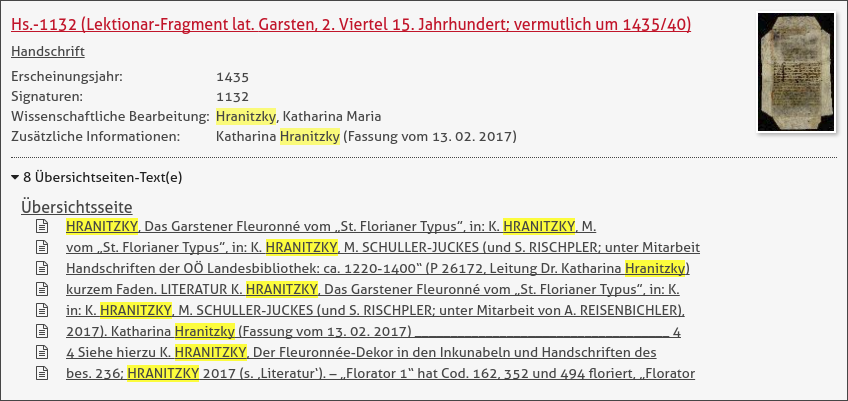
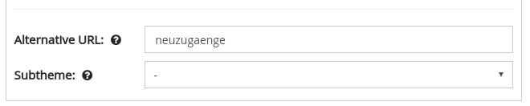

# September

## Entwicklungen

Im September gab es verschiedenste Entwicklungsarbeiten im Goobi viewer die hier noch einmal in aller Kürze zusammengefasst sind.

### Suche

In der Suche gab es Verbesserungen und Bugfixes. So wird zum Beispiel pro Suchtreffer auf der Übersichtsseite eine eigene Zeile angezeigt.



Außerdem werden Titel in der aggregierten Suchtrefferanzeige nicht mehr als zusätzliche Kindelemente angezeigt um Dopplungen zu vermeiden.  
Weiter können Metadatentreffer nun auch übersetzt werden. Das ist zum Beispiel für Treffer wie digitale Kollektionen oder Strukturelemente wichtig. Sollen bestimmte Metadaten nicht angezeigt werden können diese in einer ignoreList gepflegt werden.  
Ein Fehler ist aufgetreten, wenn Werte nach denen Facettiert werden sollte eine geschwungene Klammer enthielten. Dieser Fehler wurde behoben

### Werksanzeige

Wenn man ein Werk in der Werksanzeige betrachtet, kann das Inhaltsverzeichnis in der Seitenleiste angezeigt werden. Hier ist es möglich den Titel des Hauptelementes individuell zu konfigurieren um zum Beispiel bei Zeitungsbänden das Erscheinungsjahr mit anzuzeigen. Der Titel, der in der Werksanzeige ganz oben angezeigt wird, wird nun mit dem für das Inhaltsverzeichnis konfigurierten Wert synchronisiert.

### Übersetzungen

Früher war es notwendig, dass beim Einpflegen neuer Übersetzungen der Goobi viewer neu gestartet werden musste bis die Änderungen übernommen wurden. Der Umstand entfällt nun und die neuen Werte werden sofort eingelesen.

### CMS

Im CMS gab es vor allem drei Änderungen. Zuerst können CMS-Seiten nun eigene, sprechenden Namen für die URL bekommen. Dadurch sind nun auch URLs wie "/viewer/sammlungen/spezial" realisierbar.  
Als zweites können die aus der Werksansicht bekannten Sub-Themes nun auch für CMS-Seiten genutzt werden.



Die dritte Anpassung gab es im Sidebar-Widget für die konfigurierbare Facettierung. Hier kann die gewünschte Sortierung nun innerhalb des Widgets selbst festgelegt werden.

### API

Die REST-Schnittstelle hat einen neuen Endpoint für RSS-Feeds bekommen:

```text
/viewer/rest/rss/LANG/PARTNERID/HITCOUNT/
```

### Download über Warteschlange

Der Goobi viewer bietet die Möglichkeit die Generierung von PDF-Dokumenten an den intranda TaskManager zu delegieren. Durch die bewährte Warteschlange kann so eine deutlich bessere Lastverteilung erreicht werden. Außerdem verhindert ein vorgeschaltetes Modal, dass ein Klick auf einen PDF-Button direkt die Generierung aktiviert die potentiell viel Last auf dem System erzeugt.

Bei dieser Integration wurde nun noch einmal an der Bedienbarkeit gearbeitet. Das vorgeschaltete Modal wurde optisch überarbeitet um die einzelnen Inhalte klarer voneinander zu trennen. Im oberen Bereich wird nun auch ein Richtwert für die zu erwartende Größe der PDF-Datei angezeigt. Die Seite die die Position des eigenen Dokumentes in der Warteschlange anzeigt wurde dahingehend erweitert, dass sie sich selbst neu lädt. Ist das Dokument fertig generiert wird automatisch auf die Seite zum akzeptieren der Lizenzbedingungen und Download weitergeleitet.

## Veröffentlichungen

Im Oktober haben wir die Theme-Boilerplate für den Goobi viewer veröffentlicht. Dieses Grundgerüst bietet eine saubere und klar strukturierte Möglichkeit um eigene Themes für den Goobi viewer zu realisieren. Das Repository kann wie gewohnt bei Github gefunden werden:  
[https://github.com/intranda/goobi-viewer-theme-boilerplate](https://github.com/intranda/goobi-viewer-theme-boilerplate)

## Sonstiges

Ende September gab es die Goobi Tage bei denen verschiedenste Vorträge auch dem Kontext Goobi viewer gewidmet waren. Diese werden noch in der Medienecke von der Webseite der intranda GmbH veröffentlicht und verlinkt. Wir werden darauf an dieser Stelle dann hinweisen.

