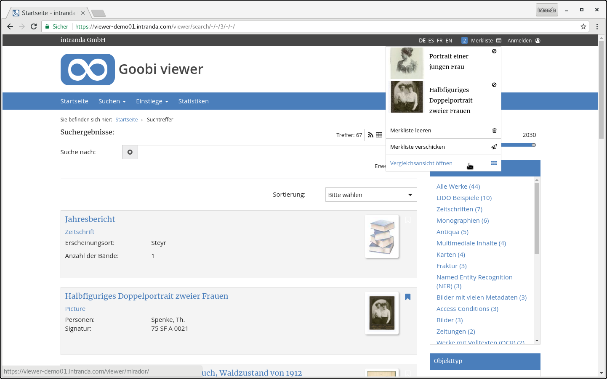
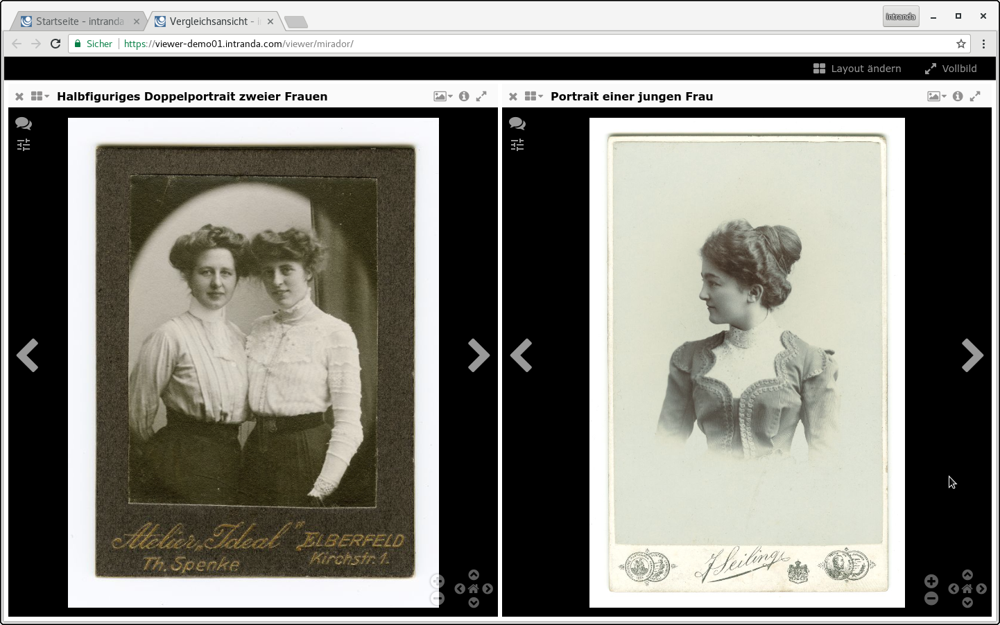

# Juli

Bedingt durch die Sommerferien hat sich die Entwicklungsgeschwindigkeit des Goobi viewers im Juli verlangsamt. Dazu haben Arbeiten mehr "unter der Haube" stattgefunden, aber auch an der Oberfläche gibt es Neuerungen zu zeigen.

Außerdem hat das Projekt den [ersten Pull-Request](https://github.com/intranda/goobi-viewer-core/pull/1) auf GitHub bekommen der dann auch in den Core eingeflossen ist. Bedingt durch die Arbeitsweise konnte er nicht direkt übernommen werden sondern wurde manuell eingepflegt. Wir arbeiten jedoch bereits an einer Umstellung der Arbeitsweise, so dass es in Zukunft einfacher wird Pull-Requests direkt zu übernehmen.

## Entwicklungen

### CMS

Für neue CMS Seiten ist nun nicht mehr die Standardsidebar beim Anlegen aktiviert, sondern gleich die individuelle Auswahl der anzuzeigenden Widgets. Dieses entspricht mehr der Arbeitsweise im täglichen Gebrauch. Außerdem ist viel Zeit in die Analyse der Datenbankanbindung geflossen um einen Bug zu beheben der unter bestimmten Konstellationen die Auslieferung von CMS Seiten verhinderte.

### Mirador

Der [Mirador](http://projectmirador.org/) wurde in den Goobi viewer integriert. Über die Merklisten ist es jetzt möglich eine Vergleichsansicht im Mirador zu öffnen. Die Funktionalität steht immer dann zur Verfügung, wenn mehr als ein Objekt auf der Merkliste enthalten ist. Im gleichen Zug wurden die Merklisten vom Quelltext her refaktorisiert. Dadurch integrieren Sie sich nun optisch besser in den Rest des Goobi viewers.

### 3D Objektanzeige

Das JavaScript für die Bildanzeige wurde in den letzten Wochen kontinuierlich zwischen den verschiedenen Stellen innerhalb von Goobi angeglichen und vereinheitlicht. Innerhalb von Goobi workflow wird sie nun konsistent im Metadateneditor und in den Plugins für den LayoutWizzard und die Qualitätskontrolle verwendet. Der Goobi viewer profitiert von diesen Arbeiten und ist nun ebenfalls in der Lage 3D Objekte anzuzeigen. Unterstützt werden die Formate OBJ, X3D und glTF.

### Automatische Tests

Bereits seit längerem werden bei jedem Commit im Goobi viewer Core Repository automatische Unit-Tests auf [Travis](https://travis-ci.org/intranda/goobi-viewer-core/) ausgeführt. Damit wird geprüft, dass die Applikation weiterhin kompiliert und die getestete Logik gleich bleibt. Bisher wurden dabei nur einfache automatische Tests geprüft. Im Juli wurden nun auch alle Unit-Tests die eine Datenbank benötigen aufgenommen. Zusätzlich werden Tests für Quelltext der in Javascript geschrieben wurde mit Jasmine in den Browsern Firefox und Chrome getestet.

Die Ausgabe der Tests ist unter den folgenden URLs zu finden:

* [JUnit](https://intranda.github.io/goobi-viewer-core/goobi-viewer-core/test-reports-html/)
* [Jasmine](https://intranda.github.io/goobi-viewer-core/goobi-viewer-core/test-reports-karma/)

### Code Cleanup

Durch die Arbeiten an der Dokumentation sind verschiedene Schalter in der Konfiguration aufgefallen, die nicht mehr in Verwendung waren. Diese wurden aus dem Quelltext entfernt. Für Entwickler wurde eine neue ViewerConfigurationException eingeführt die anzeigt, wenn wichtige Einträge in der Konfigurationsdatei fehlen.

Bedingt durch die Einführung der französischen Übersetzung kam es zu Fehlern bei der Verwendung von Anführungszeichen `"` und halben Anführungszeichen `'`. Der Quelltext wurde eingehend geprüft, damit die Verwendung einfacher Anführungszeichen in der französischen Sprache keine Problemen bei der Seitenanzeige verursachen.

