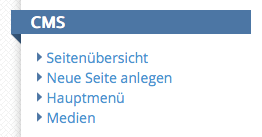

# 7. Dokumentation des Content Management Systems des Goobi viewers

Seit der Version 3.0 verfügt der Goobi viewer über ein integriertes Content Management System, im Folgenden CMS genannt, mit dem es Benutzern möglich ist statische Inhalte wie Seiten oder Navigationsmenüs anzulegen und nachträglich zu bearbeiten. Dafür muss der Benutzer über administrative Rechte verfügen und im Goobi viewer angemeldet sein.

Die Funktionen des CMS erreicht man über das Admin-Backend des viewers über den Link Administration im Hauptmenü. Die in vier Punkte aufgeteilten Hauptfunktionen des CMS lauten `Seitenübersicht`, `Neue Seite anlegen`, `Hauptmenü` und `Medien`. Diese werden in den folgenden Kapiteln detailliert beschrieben.

