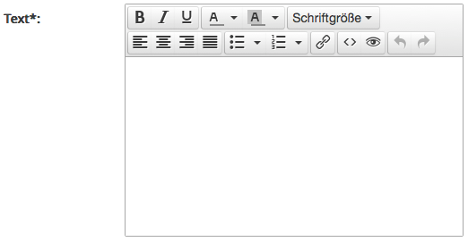
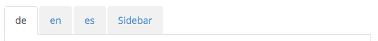
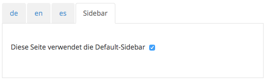
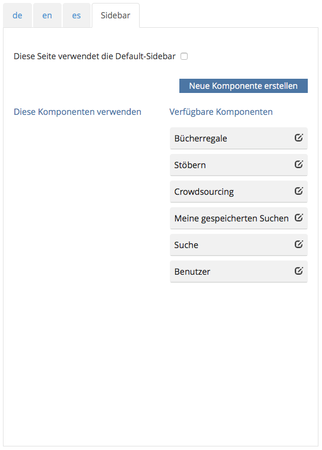
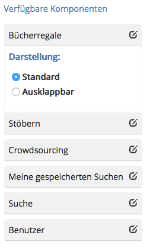
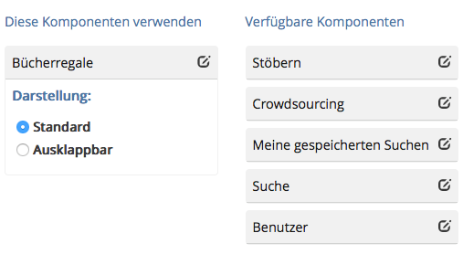

# 7.2.1 Seiteninhalte

Die Templates sind so konfiguriert, dass es Pflichtfelder und optionale Eingabefelder gibt. Die Pflichtfelder sind mit einem Sternchen \* markiert. So muss zum Beispiel immer ein Titel und ein Menütitel für die Seite vergeben werden. Die Text- oder Bildeingaben können variieren, je nach dem wie das Template gestaltet wurde.

Textfelder können mit einem mitgelieferten Richtext-Editor bearbeitet werden, der automatisch für entsprechende Felder geladen wird. Dieser Editor liefert reines HTML aus, welches später in der Seite angezeigt wird. Die Bedienelemente sind Standardformatierungen, wie man sie aus diversen anderen Texteditoren kennt.

Die Inhaltserfassung ist zusätzlich noch in unterschiedliche Reiter aufgeteilt.  

Mit den Reitern `de`, `en`, `es` kann die Seite übersetzt werden. Dazu trägt man im Reiter ebenfalls die Inhalte der Seite in der entsprechenden Sprache ein. Erst wenn eine weitere Sprache eingetragen und die Seite gespeichert wurde, steht die Übersetzung zur Verfügung und die Seite kann über die Sprachumschaltung im viewer gewechselt werden. Ist keine Übersetzung vorhanden, so wird als Standard immer die deutsche Seite genommen. Ob eine Seite übersetzt ist, kann der Benutzer auch in der Seitenübersicht einsehen \(siehe dazu 7.1\).

Mit dem Reiter `Sidebar` wird die Seitenleiste für die Seite konfiguriert. In der Standardeinstellung werden festgelegte Widgets in der Seitenleiste verwendet \(Default-Sidebar\).

Deaktiviert der Benutzer den Haken, so bekommt er die Möglichkeit eigene Widgets für die Seitenleiste zu definieren.

In der Spalte `Verfügbare Komponenten` werden alle verfügbaren Widgets aufgelistet, die für die Seite zur Verfügung stehen. Mit einem Klick auf das Symbol `Widget Editor` kann der Benutzer einstellen, wie sich das Widget in der Seitenleiste verhalten soll. Zum einen kann es standardmäßig oder als ausklappbares Widget angezeigt werden. Hierzu muss die entsprechende Auswahl getroffen werden.

Möchte man eines der Widgets aktivieren, so muss es per Drag-and-Drop in die linke Spalte `Diese Komponenten` verwenden gezogen werden.

Um die Konfiguration der individuellen Seitenleiste abzuschließen, muss der Benutzer die Seite noch speichern. Über die Vorschau kann nun das Ergebnis überprüft werden.

