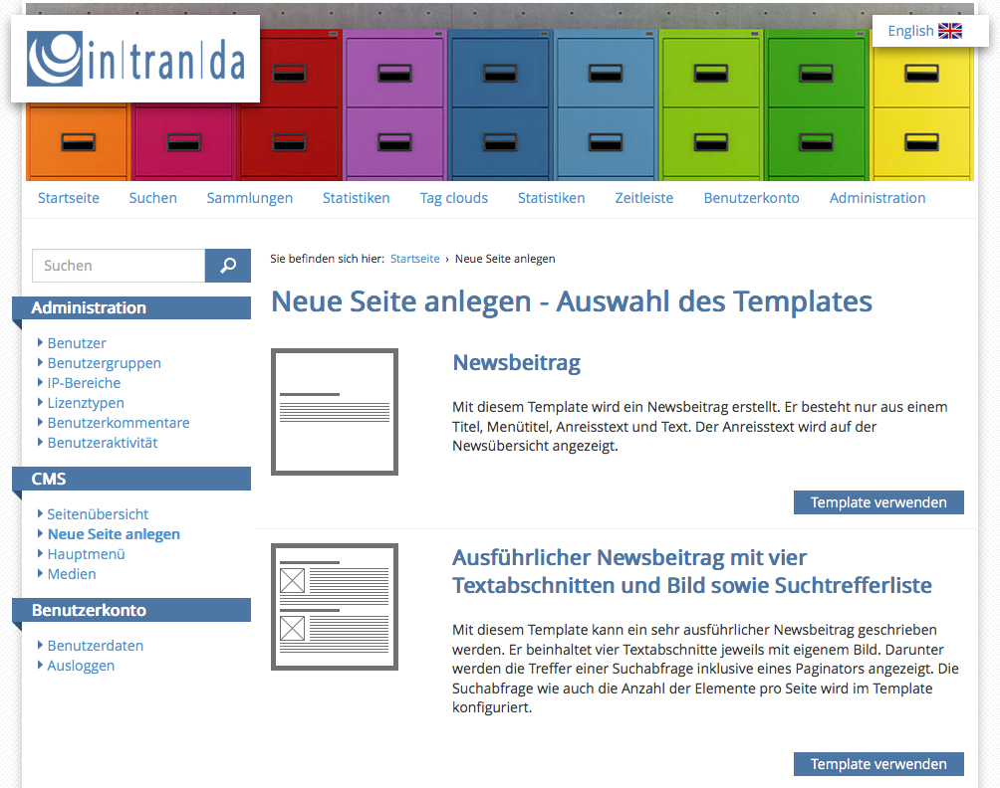
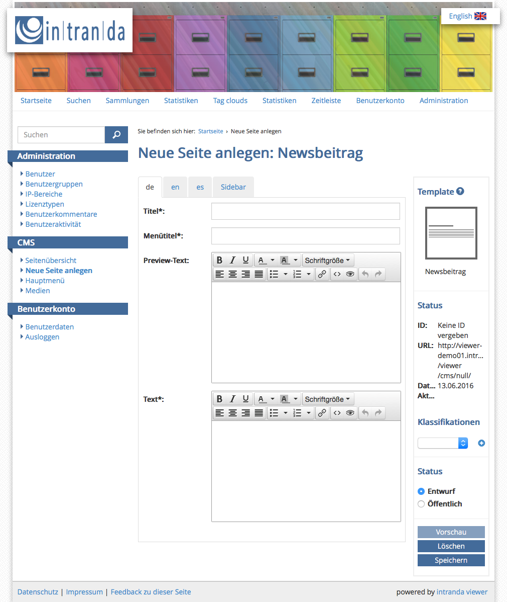
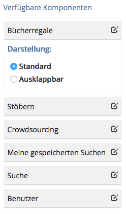
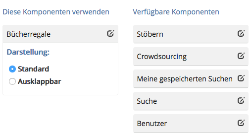

# 7.2. CMS - Neue Seite anlegen

#### Auswahl des Templates {#HAuswahldesTemplates}

Die Seitenauswahl listet die zur Verfügung stehenden Templates auf, die für das CMS eingerichtet und konfiguriert sind. Für jedes Template gibt es ein Symbol, welches die grobe Seitenstruktur abbildet, einen Titel und eine Kurzbeschreibung. Mit einem Klick auf die Schaltfläche `Template verwenden` kann der Benutzer das Template auswählen und für seine Seite verwenden.

#### Neue Seite anlegen {#HNeueSeiteanlegen}

Die Eingabemaske zur Generierung einer neuen Seite ist in zwei Bereiche unterteilt. Auf der linken Seite befinden sich die Eingabefelder für die Seiteninhalte. Die rechte Seite zeigt Informationen und Einstellmöglichkeiten für die Seite. Hier sind auch die Schaltflächen zum Generieren einer Vorschau, zum Löschen und zum Speichern der Seite vorhanden.

Möchte man eines der Widgets aktivieren, so muss es per Drag-and-Drop in die linke Spalte `Diese Komponenten` verwenden gezogen werden.  

Um die Konfiguration der individuellen Seitenleiste abzuschließen, muss der Benutzer die Seite noch speichern. Über die Vorschau kann nun das Ergebnis überprüft werden.  

