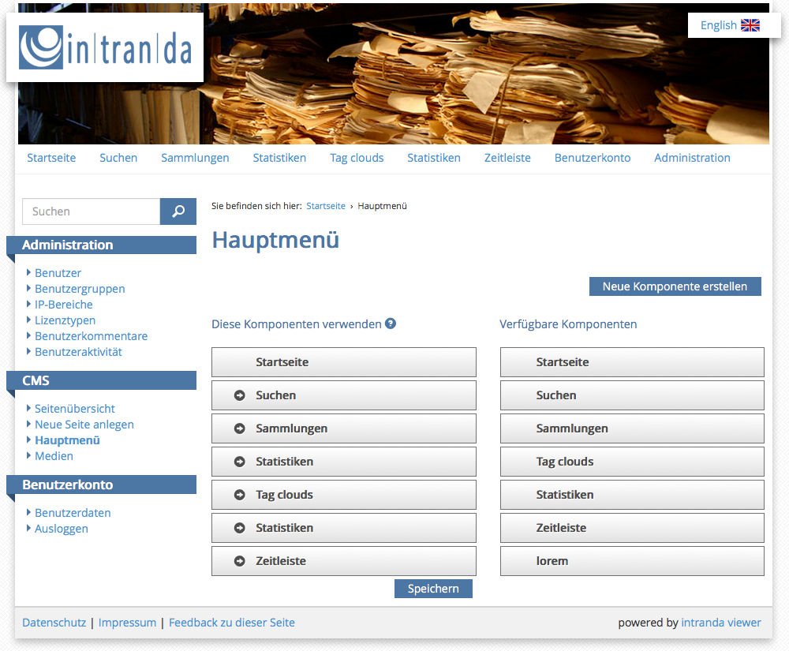
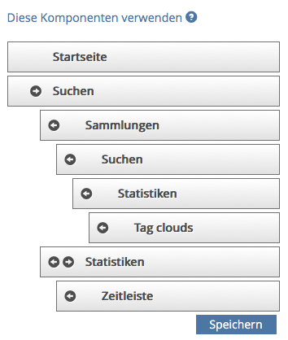

# 7.3 Hauptmenü

Um das Navigationsmenü des Goobi viewer zu konfigurieren, bietet das CMS die Möglichkeit die Menüpunkte festzulegen und Untermenüs zu erstellen.  

Die Auswahl ist in zwei Spalten aufgeteilt. In der rechten Spalte `Verfügbare Komponenten` werden die verfügbaren Menüpunkte aufgelistet und in der Spalte `Diese Komponenten verwenden`die angezeigten Menüpunkte aufgelistet.  
  
Um Menüpunkte zu den verwendeten hinzuzufügen, müssen diese per Drag-and-Drop von der rechten Spalte in die linke gezogen werden. Die Pfeile neben den Menüpunktnamen stellen die Hierarchieebene des Menüpunkts dar. Es ist möglich, Untermenüs bis zu einer Tiefe von vier Verschachtelungen zu erstellen.  

Damit die Einstellungen für das Menü auch greifen, muss nach der Konfiguration noch auf die Schaltfläche `Speichern` geklickt werden.  

