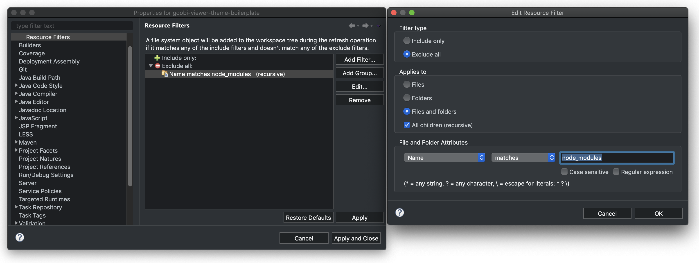

# 8.2.1 Theme Umstellung zu Maven

## First Things First


Bevor die Umstellung eines Themes vollzogen wird, sollte ein Sicherungs-Branch des aktuellen Themes erstellt werden.

In Eclipse funktioniert das wie folgt: 

`Rechtsklick auf Projekt -> Team -> Switch to -> New Branch`

Als Konvention sollte der Name **pre-maven-stable** gelten.

Anschließend den Branch in das Repository pushen mit 

`Rechtsklick auf Projekt -> Team -> Push Branch 'pre-maven-stable'`

Jetzt wieder in den master wechseln mit

`Rechtsklick auf Projekt -> Team -> Switch to -> master`

`Natürlich funktioniert das auch mit jedem anderen Git Verwaltungs-Tool.`


## Neue Struktur

Als Basis für die Umstellung dient das Repository der Theme Boilerplate. Sie kann sich von GitHub über die URL [https://github.com/intranda/goobi-viewer-theme-boilerplate](https://github.com/intranda/goobi-viewer-theme-boilerplate.git) geklont werden.


Es wird davon ausgegangen, dass die Entwicklungsumgebung auf Eclipse basiert. Diese IDE benötigt eine feste Ordner- und Dateistruktur. Wie eine Entwicklungsumgebung mit Eclipse einzurichten ist, kann unter [8.6 Entwicklungsumgebung](../8.6.md) nachgelesen werden.


Die neue Struktur sieht nun so aus:

```text
/.metadata
/.settings
/WebContent
    /META-INF
    /resources
        /themes (Dateien für das Theme)
            /boilerplate
            face-config.xml
            theme-url-mappings.xml
    /WEB-INF
.classpath
.gitignore
.project
Gruntfile.js
package.json
pom.xml
```

Diese Struktur ist bindend und **muss** in jedem Theme-Projekt vorhanden sein.

## Migration eines Themes zu Maven

Bei einer Migration wird davon ausgegangen, dass bereits ein Theme existiert und dieses auf Maven umgestellt werden soll. Dazu sind folgende Schritte durchzuführen.

* Der komplette Ordner `/WebContent` wird aus der Boilerplate kopiert und in die oberste Ebene des Theme-Repos eingefügt. Der Unterordner `/WebContent/resources/themes/` wird gelöscht.
* Der alte Theme-Ordner `/src/META-INF/resources/resources/themes/` wird in den Ordner `/WebContent/resources/` verschoben und anschließend der komplette Inhalt des Ordners `/src` gelöscht. Der Ordner `/src` kann bestehen bleiben.
* Im Ordner `/.settings` der Boilerplate befindet sich die Datei **org.eclipse.wst.common.project.facet.core.xml**. Diese wird kopiert und in den Ordner `/.settings` des Themes kopiert. Die vorhandene Datei wird durch die neue überschrieben.
* Jetzt einen Rechtsklick auf das Theme-Projekt machen und es zu einem Maven-Projekt konvertieren. Dazu den Weg über `Configure -> Convert to Maven Project` gehen. Die Einstellungen können dabei auf Standard bleiben und den Dialog über `Finish` beenden.
* Auf der obersten Ebene des Boilerplate-Repos liegt die Datei **pom.xml**. Diese wird kopiert und an die selbe Stelle im Theme-Repo eingefügt. Die vorhandene Datei wird überschrieben.
* An der **pom.xml** müssen noch Anpassungen gemacht werden, die wie folgt aussehen.



```markup
<artifactId>theme-themeName</artifactId>
...
<name>goobi-viewer-theme-themeName</name>
<url>https://github.com/intranda/goobi-viewer-theme-themeName</url>
...
```



* Die Pfade in der Datei **Gruntfile.js** müssen angepasst werden. Dazu dient die Datei `Gruntfile.js` aus dem Boilerplate-Repo als Vorlage.
* Die Datei **build.xml** kann aus dem Theme-Repo gelöscht werden. Sie wird nicht länger benötigt.
* Die Änderungen an der Datei **pom.xml** werden aktiv, indem das Projekt aktualisiert wird. Das geschieht über den Weg `Rechtsklick auf das Projekt -> Maven -> Update Project...`.
* Jetzt kann das Maven-Projekt installiert werden. Das geschieht,  indem ein `Rechtsklick auf das Projekt` gemacht wird und `Run as -> Maven install` ausgeführt wird. Die Konsole von Eclipse gibt nach Erfolg eine entsprechende Meldung aus.
* Das Projekt kann nun in dem internen Tomcat von Eclipse gestartet werden. Dazu `Rechtsklick auf das Projekt -> Run as -> Run on Server` auswählen. Den installierten Tomcat anklicken und mit `Finish` bestätigen. Wenn der Goobi viewer unter den Standardeinstellungen läuft, dann ist er nun unter [http://localhost:8080/viewer/](http://localhost:8080/viewer/) zu erreichen. Es darf immer nur ein Projekt im Tomcat laufen, da es ansonsten zu Konflikten kommt.

## Allgemeine Einstellungen Eclipse

### Ordner `node_modules` ausklammern

Sobald die NPM-Module in das Theme-Projekt über die **package.json** geladen wurden, kann es zu diversen Fehlermeldungen in Eclipse kommen, da dessen Validator einiges anzumeckern hat. Diese Meldungen können allerdings getrost ignoriert werden, da sie die Arbeit mit dem Theme nicht beeinflussen. Damit sie nicht weiter stören können sie wie folgt ausgeklammert werden.

`Rechtsklick auf Projekt -> Properties -> Resource -> Resource Filters -> Add Filter`

Es werden nun folgende Einstellungen getätigt:

* `Exclude all` aktivieren
* `Files and Folders` aktivieren
* `All children` aktivieren
* Als `Filter Name | matches | node_modules` eintragen
* `Ok` klicken

Den Dialog mit `Apply and close` verlassen.



### XML-Validierung ausbremsen

An manchen Stellen ist Eclipse etwas zu genau was die XML-Validierung angeht. Das führt ebenfalls zu unschönen Fehlermeldungen, die die Funktionalität des Themes nicht beeinflussen. Sie irritieren hingegen und können durch die folgende Maßnahme eingeschränkt werden.

`Rechtsklick auf Projekt -> Properties -> Validation -> XML Syntax`

Es werden nun folgende Einstellungen getätigt:

* `Enable project specific settings` aktivieren
* `Referenced file contains errors` auf **Warning** stellen
* `Honour all XML schema locations` deaktivieren

Den Dialog mit `Apply and close` verlassen.


