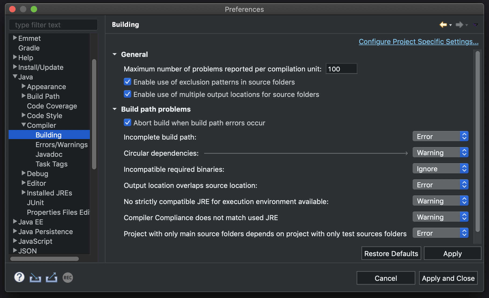
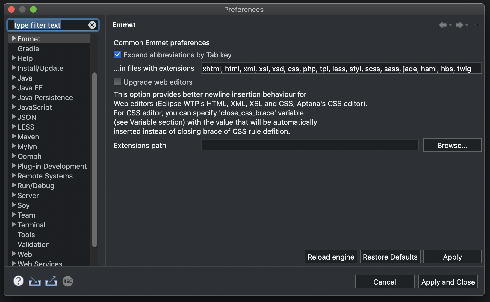
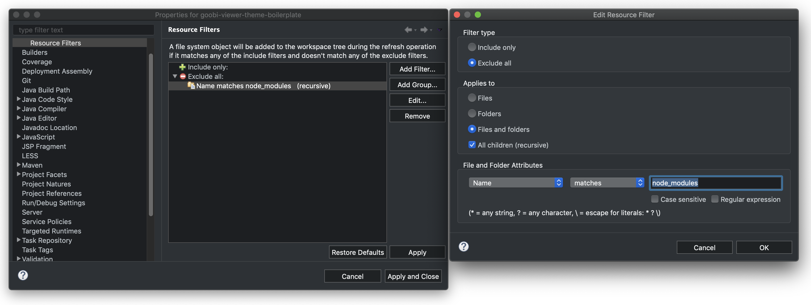
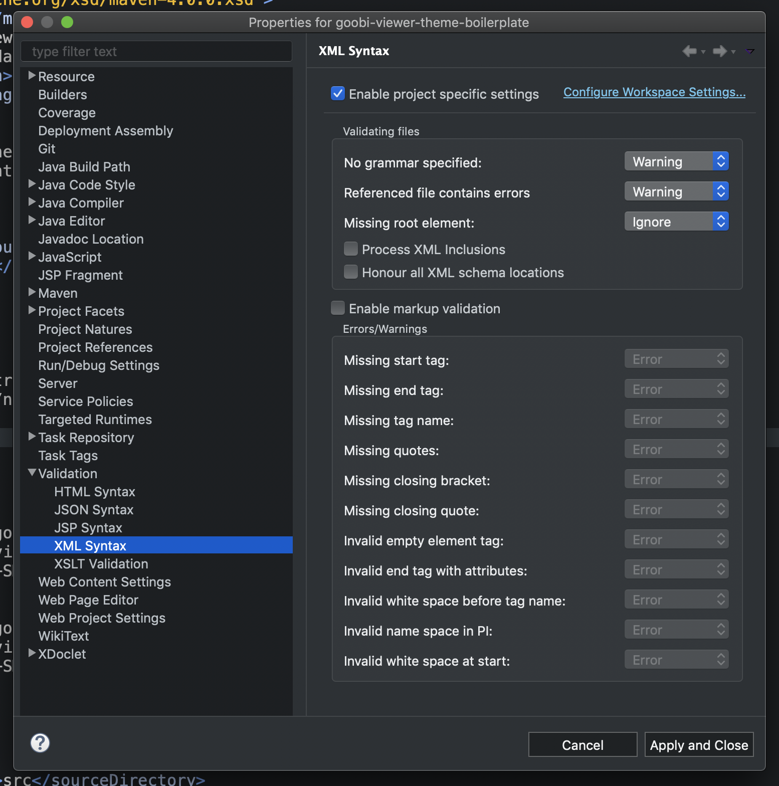
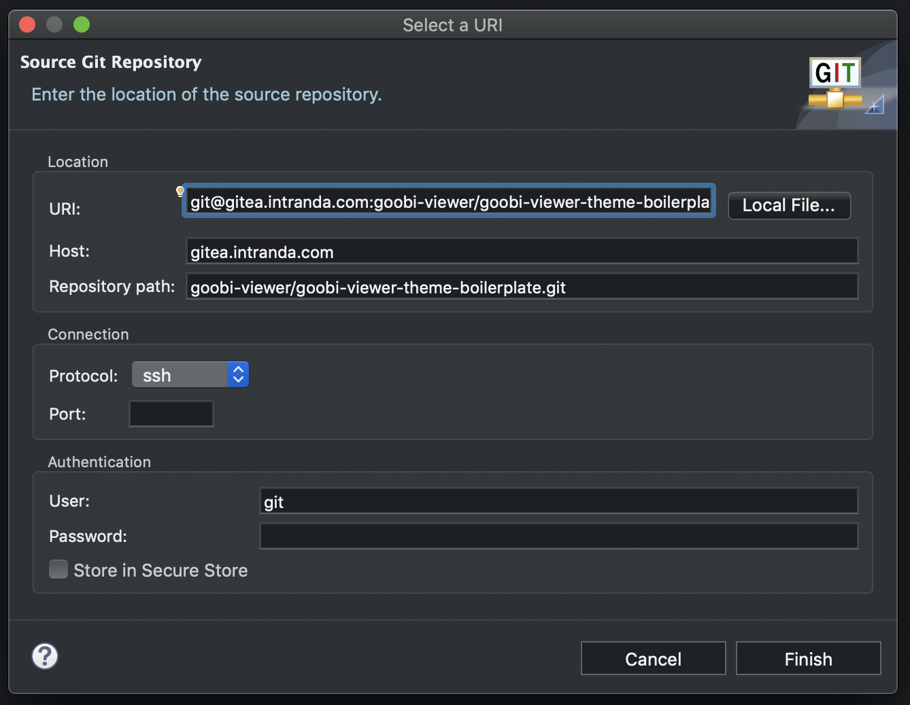

# 8.6.1 Allgemeine Einstellungen Eclipse

## Circular Dependencies anpassen

Um zu verhindern, dass beim Bauen des Goobi viewers Fehler auftreten ist folgende Einstellung zu tätigen.

`Preferences > Java > Compiler > Building > Build path problems > Circular dependencies` 

auf **Warning** stellen.

## LESS Nature verhindern

Wenn das [LESS-Plugin](http://www.normalesup.org/~simonet/soft/ow/eclipse-less.html) installiert ist, wird man beim erstmaligen Öffnen einer LESS-Datei gefragt, ob man dem Projekt eine LESS Nature hinzufügen möchte. Das ist unbedingt mit **No** zu beantworten, da ansonsten die Validierung der LESS-Datein fehlschlägt und hunderte von Fehlern die Konsole fluten würden. Das LESS-Plugin ist nur dazu gedacht eine Möglichkeit in Eclipse zu haben LESS-Dateien vernünftig zu bearbeiten.

Hat man doch versehentlich mal auf **Yes** geklickt, dann lässt sich das wie folgt wieder rückgängig machen.

`Rechtsklick auf Projekt -> Configure -> Remove LESS nature`

## Emmet für XHTML-Dateien aktivieren

Wenn das Plugin [Emmet](https://github.com/emmetio/emmet-eclipse) installiert ist, dann muss man diesem noch beibringen, wie es auch in XHTML-Dateien seine Fähigkeiten einsetzen kann. Dazu ist folgende Einstellung zu tätigen.

`Preferences -> Emmet -> ...in files with extensions` noch **xhtml** eintragen und mit `Apply and Close` den Dialog verlassen.

## Ordner `node_modules` ausklammern

Sobald die NPM-Module in das Theme-Projekt über die **package.json** geladen wurden, kann es zu diversen Fehlermeldungen in Eclipse kommen, da dessen Validator einiges anzumeckern hat. Diese Meldungen können allerdings getrost ignoriert werden, da sie die Arbeit mit dem Theme nicht beeinflussen. Damit sie nicht weiter stören können sie wie folgt ausgeklammert werden.

`Rechtsklick auf Projekt -> Properties -> Resource -> Resource Filters -> Add Filter`

Es werden nun folgende Einstellungen getätigt:

* `Exclude all` aktivieren
* `Files and Folders` aktivieren
* `All children` aktivieren
* Als `Filter Name | matches | node_modules` eintragen
* `Ok` klicken

Den Dialog mit `Apply and close` verlassen.

## XML-Validierung ausbremsen

An manchen Stellen ist Eclipse etwas zu genau was die XML-Validierung angeht. Das führt ebenfalls zu unschönen Fehlermeldungen, die die Funktionalität des Themes nicht beeinflussen. Sie irritieren hingegen und können durch die folgende Maßnahme eingeschränkt werden.

`Rechtsklick auf Projekt -> Properties -> Validation -> XML Syntax`

Es werden nun folgende Einstellungen getätigt:

* `Enable project specific settings` aktivieren
* `Referenced file contains errors` auf **Warning** stellen
* `Honour all XML schema locations` deaktivieren

Den Dialog mit `Apply and close` verlassen.

## Remote Einstellungen für Repo ändern

Bei einem Umzug von Git-Repositories muss die Remote-Einstellung am Projekt geändert werden, um weiterhin mit der Versionierungskontrolle arbeiten zu können. Diese Einstellung ändert man wie folgt.

`Rechtsklick auf Projekt -> Team -> Remote -> Configure Push to Upstream... -> Change`

Jetzt können die URLs zum Repo geändert werden und mit `Finish -> Save` der Dialog geschlossen werden.

