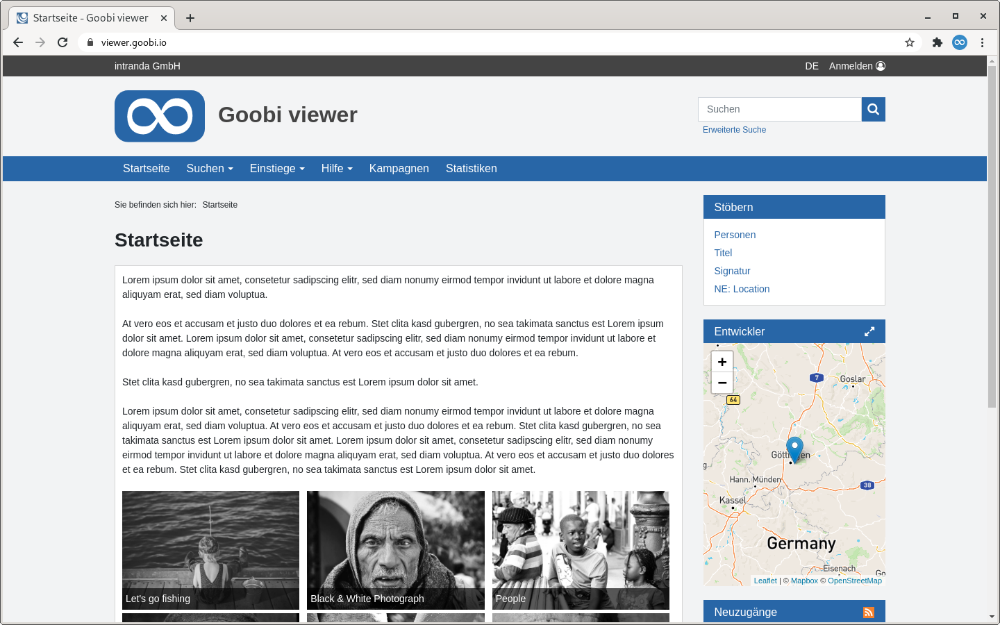

# Was ist der Goobi viewer?

Der Goobi viewer ist die zentrale Basis für Ihre digitale Bibliothek. Er übernimmt die gesamte Visualisierung Ihrer digitalen Inhalte. Um einen genauen Überblick und eine reibungslose Nutzung des Goobi viewers zu erhalten, beschreibt Ihnen das vorliegende Dokument alle wichtigen Details zu den unterschiedlichen Konfigurationen.

Diese Dokumentation unterteilt sich in insgesamt drei große Teile. Der erste Teil widmet sich konkret der Konfiguration der Software Goobi viewer mit allen dazugehörenden Parametern für die Aktivierung, Deaktivierung oder Justierung von einzelnen Funktionen. Der zweite Teil erläutert die Konfiguration für die Steuerung der Metadaten-Indexierung für die verwendete Suchmaschine Apache Solr. Der dritte Teil erörtert abschließend, wie die OAI-Schnittstelle des Goobi viewers konfiguriert wird.

Bitte beachten Sie, dass die vorliegende Dokumentation nicht verändert oder in veränderter Form weitergegeben werden darf. Eine kommerzielle Nutzung dieser Dokumentation ist nicht gestattet.

