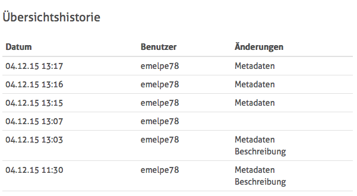

# 5.2.4 Historie

Zusätzlich zu den Editieroptionen bietet die Übersichtsseite im Goobi viewer auch eine tabellarische Auflistung der getätigten Änderungen am Werk.

Hier werden die Aktivitäten der Nutzer angezeigt, zum Beispiel welcher Benutzer welche Änderung zu welchem Zeitpunkt vorgenommen hat.

