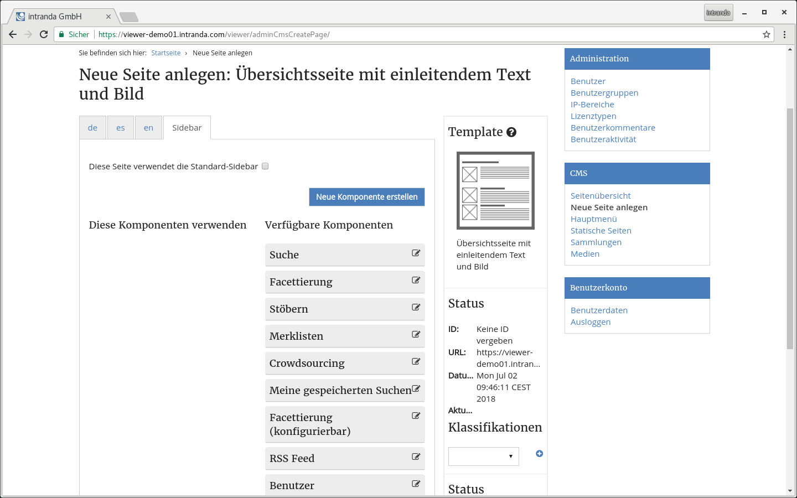

# 6.4.2 Inhalte der Dateien

**6.4.2.1. Template-Datei**

Die Template-Datei ist eine XML-Datei, die alle Meta-Informationen zu dem Template beinhaltet, außerdem eine Liste der möglichen benutzerdefinierten Inhalte. Diese Inhalte werden in der Layout-Datei referenziert, teilweise auch in Layout-Dateien anderer Templates, die dieses Template als Teil einer Liste enthalten.


Die Template-Datei hat dabei stets einen beispielhaften Aufbau:  


```markup
<cms_page_template id="example_template" version="2015-02-03">
     <name>BeispielTemplate</name>
     <description>Dies ist eine Beschreibung des Templates</description>
     <icon>cms_template_example.png</icon>
     <html>cms_template_example.xhtml</html>
     <content>
            <item id="A1" label="Überschrift" type="TEXT" mandatory="true" />
            <item id="A2" label="Text" type="HTML" mandatory="true" />
            <item id="image01" label="Bild" type="MEDIA" />
            <item id="queryList01" label="Werke" type="SOLRQUERY" />
            <item id="pageList01" label="News-Einträge" type="PAGELIST" />
     </content>
</cms_page_template>
```

Die einzelnen Elemente im Überblick:  


<table>
  <thead>
    <tr>
      <th style="text-align:left">Option</th>
      <th style="text-align:left">Beschreibung</th>
    </tr>
  </thead>
  <tbody>
    <tr>
      <td style="text-align:left"><b>cms_page_template/id</b>
      </td>
      <td style="text-align:left">Ein einzigartiger Identifier-String des Templates, der intern zur Identifikation
        des Templates verwendet wird</td>
    </tr>
    <tr>
      <td style="text-align:left"><b>cms_page_template/version</b> 
      </td>
      <td style="text-align:left">Das Datum der letzten Änderung oder eine andere Versionierung. Wird vom
        Goobi viewer nicht verwendet.</td>
    </tr>
    <tr>
      <td style="text-align:left"><b>name </b>
      </td>
      <td style="text-align:left">Der Name des Templates, wie er beim Erstellen neuer Seiten angezeigt wird.</td>
    </tr>
    <tr>
      <td style="text-align:left"><b>description</b> 
      </td>
      <td style="text-align:left">Eine Beschreibung des Templates, wie sie beim Erstellen neuer Seiten angezeigt
        wird.</td>
    </tr>
    <tr>
      <td style="text-align:left"><b>icon</b> 
      </td>
      <td style="text-align:left">Der Dateiname des Icons, das dieses Template beim Erstellen neuer Seiten
        und beim Bearbeiten vorhandener Seiten repräsentiert; ohne Pfadangabe.</td>
    </tr>
    <tr>
      <td style="text-align:left"><b>html</b>
      </td>
      <td style="text-align:left">Der Dateiname der Layout-Datei für dieses Template; ohne Pfadangabe.</td>
    </tr>
    <tr>
      <td style="text-align:left"><b>content</b>
      </td>
      <td style="text-align:left">
        <p>Eine Liste von <code>&lt;item&gt;</code>-Elementen. Jedes dieser Elemente
          bekommt einen eigenen Editorbereich beim Anlegen/Bearbeiten von CMS-Seiten
          auf Basis dieses Templates. Die Art des Editorbereichs hängt ab von der
          Art des Items (Siehe Inhaltstypen). Jedes Item hat folgende Attribute:</p>
        <ul>
          <li><b>id: </b> Ein für dieses Template einzigartiger Identifier-String, mit
            dem dieser Inhalt in der Layout-Datei referenziert wird.</li>
          <li><b>label</b>: Die Bezeichnung dieses Inhaltes im Editorbereich der Seitenbearbeitung.</li>
          <li><b>type</b> : Der Typ des Inhaltes, einer von TEXT, HTML, MEDIA, PAGELIST
            und SOLRQUERY (siehe Inhaltstypen).</li>
          <li><b>mandatory</b> : Ist dieses Attribut gesetzt und hat den Wert true, muss
            dieses Item mit Inhalt gefüllt werden, bevor eine Seite veröffentlicht
            werden kann.</li>
        </ul>
      </td>
    </tr>
  </tbody>
</table>**6.4.2.2. Layout-Datei**

Die Layout-Datei ist eine \(X\)HTML-Datei, die mit der Java-Facelets Technologie in eine Webseite übersetzt wird. Sie ist aufgebaut wie eine übliche viewer-Webseite, benötigt jedoch einige spezielle Annotationen, um CMS-Inhalte anzeigen zu können:

Am Anfang der Seite \(vor irgendwelchen CMS-Inhalten\) muss folgende Zeile eingefügt sein:

```markup
<ui:param name="cmsPage" value="#{cmsBean.currentPage}" />
```

Dies setzt den Parameter `page`, aus dem alle CMS-Inhalte ausgelesen werden. Um einen beliebigen in der Template-Datei definierten Inhalt einzufügen, verwendet man die folgende Notation:

```text
"#{cmsPage.getContent('content01')}"
```

Dabei stellt `content01` die `id` eines in der Template-Datei definierten Inhalts-Items dar. Der Inhalt wird automatisch je nach Typ des Inhalts-Items eingefügt \(siehe Inhaltstypen\).

Die Sidebar der Seite muss im Tag `<ui:define name=“sidebar“/>` definiert werden. Zur Verwendung benutzderdefinierter Sidebars muss sie folgende Form haben:

```markup
<ui:define name="sidebar">
      <c:forEach var="element" items="#{cmsBean.getSidebarElements(true)}">
            <widgetComponent:widget_bookshelves widget="#{element}"/>
            <widgetComponent:widget_browsing widget="#{element}"/>
            <widgetComponent:widget_crowdsourcing widget="#{element}"/>
            <widgetComponent:widget_mySearches widget="#{element}"/>
            <widgetComponent:widget_searchField widget="#{element}"/>
            <widgetComponent:widget_user widget="#{element}"/>
            <widgetComponent:widget_custom widget="#{element}"/>
      </c:forEach>
</ui:define>
```

Jedes möglicherweise vorkommende Sidebar-Widget muss in der Liste als `<widgetComponent>` enthalten sein; der Name des Widgets muss dabei dem Dateinamen der Widget-Komponente entsprechen. Beispielsweise ruft `<widgetComponent:widget_user>` das in der Datei `/components/widget_user.xhtml` definierte Widget auf.



**6.4.2.3. Template-Icon**

Hierbei handelt es sich um eine einfache Bilddatei zur Repräsentation des Templates. Das Bild muss quadratische Abmessungen haben. Üblicherweise werden 128x128 Pixel große PNG-Bilder verwendet.  


