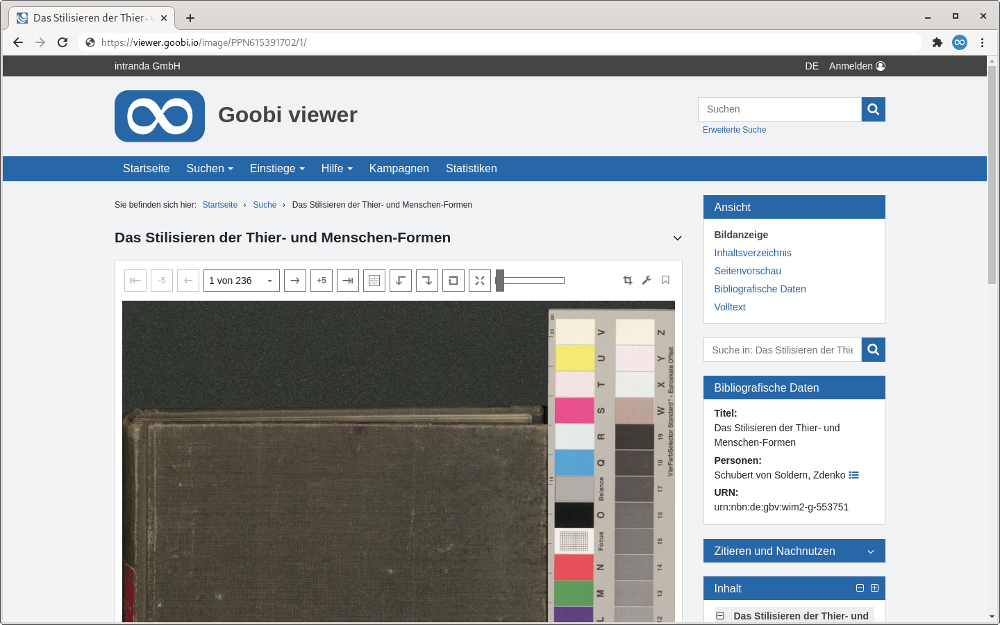

# 1.11.1 Erweitertes Blättern in der Bildanzeige

In der Bildanzeige besteht die Möglichkeit die Navigation oberhalb des Bildes anzupassen.



Zusätzlich zu den üblichen Blätterfunktionen in der Bildanzeige, können weitere Schaltflächen per Konfiguration hinzufügt werden, um mehrere Seiten auf einmal zu blättern. Dazu dient der folgende Konfigurationsblock:



```markup
<viewer>
    <pageBrowse>
        <enabled>false</enabled>
        <pageBrowseStep>5</pageBrowseStep>
        <pageBrowseStep>10</pageBrowseStep>
    </pageBrowse>
</viewer>
```



Das Element `<enabled>` schaltet die zusätzlichen Schaltflächen in der Bildanzeige an oder aus. Die Elemente `<pageBrowseStep>` legen jeweils eine Schrittgröße fest, wobei Schrittgrößen von 0 ignoriert werden. In der obigen Beispielkonfiguration wird eine Schaltfläche zum Blättern um 5 und eine zum Blättern von 10 Seiten gleichzeitig angezeigt. Mehr als drei Elemente `<pageBrowseStep>` werden nicht ausgewertet.



```markup
 <viewer>
     <pageSelectionFormat>{order} {msg.of} {numpages}</pageSelectionFormat>
 <viewer>
```



In `<pageSelectionFormat>` können die Labels im Dropdown Menü mit der Seitenauswahl konfiguriert werden. Dazu gibt es Platzhalter, die automatisch durch den entsprechenden Wert ersetzt werden. Zusätzlich können Message Keys verwendet werden, die automatisch in die aktuelle Sprache übersetzt werden. Mögliche Platzhalter sind:

| Platzhalter | Beschreibung |
| :--- | :--- |
| **{order}** | laufende Bildnummer |
| **{orderlabel}** | Seiten-Label |
| **{numpages}** | Anzahl der Seiten im Werk |
| **{msg.foo}** | Message key \(hier: `foo`\) |

Alle anderen Zeichen werden direkt ausgegeben.

```text
<viewer>
    <pageSelectDropdownDisplayMinPages>3</pageSelectDropdownDisplayMinPages>
</viewer>
```

`<pageSelectDropdownDisplayMinPages>` definiert, wie viele Seiten das geöffnete Werk mindestens besitzen muss, damit ein Drop-Down zur direkten Seitenauswahl angezeigt wird. Standardwert ist 3.

