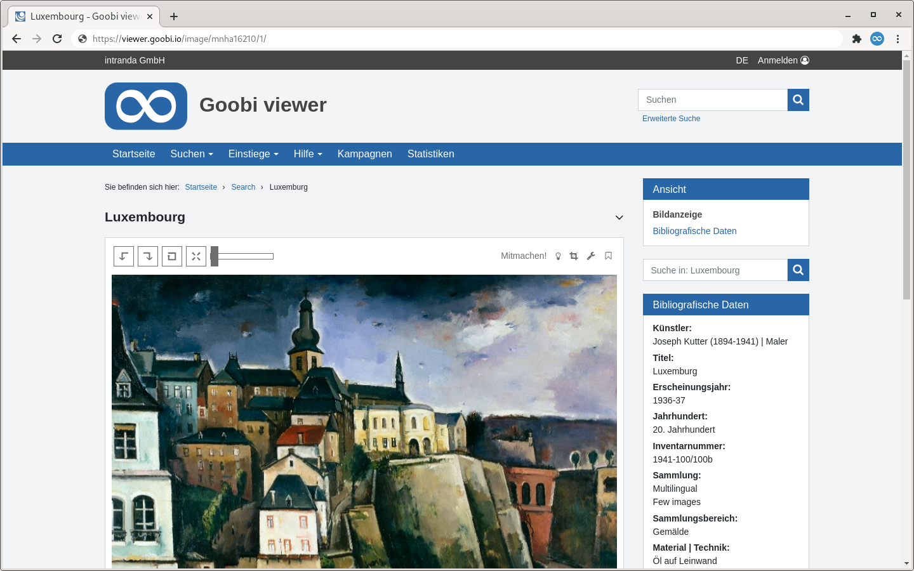

# 1.11 Bild Optionen

In diesem Abschnitt werden Ihnen die verfügbaren Optionen zur Beschränkung beziehungsweise Manipulation der Bildanzeige im Goobi viewer erklärt.

Mit dem Element `<viewStyleClass />` ist es möglich dem #viewObject Element im Browser eine zusätzliche CSS Klasse mit zu geben. Dabei können Variablen nach dem Schema {record.SOLR-FELDNAME} verwendet werden. Der Wert des Solr-Feldes wird dabei - wenn existent - in Kleinbuchstaben umgewandelt und alle Zeichen neben Buchstaben und Zahlen in Unterstriche umgewandelt. Mit der CSS-Klasse ist es möglich unterschiedlichen Publikationstypen ein unterschiedliches Styling zu ermöglichen.
