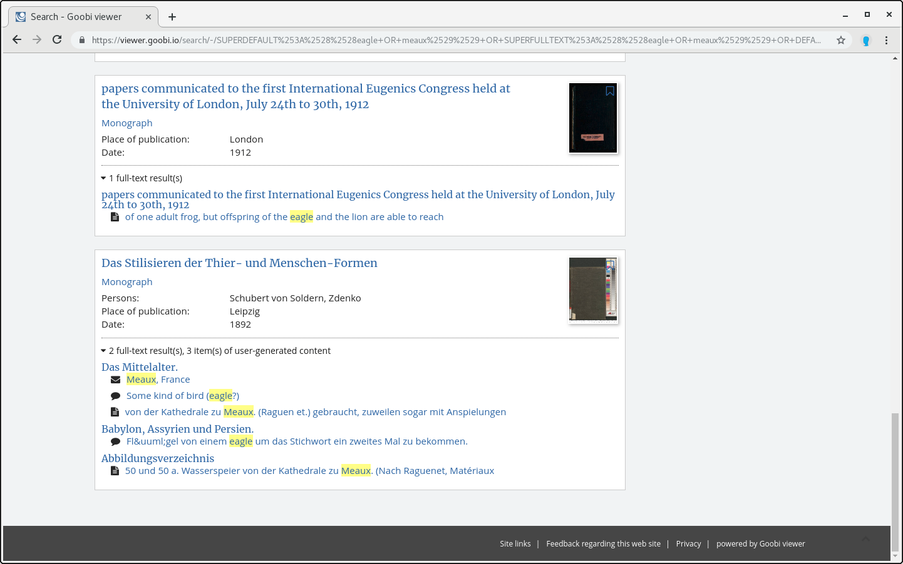

# 1.17.8 aggregierte Suchtrefferanzeige

Der Goobi viewer listet in der Suchtrefferanzeige Werke mit dazugehörigen Untertreffern auf.



Dieses Verhalten lässt sich mit dem folgenden Schalter deaktivieren:



```markup
<search>
    <aggregateHits>true</aggregateHits>
</search>
```



Die Anzeige der Untertreffer kann weiter gesteuert werden. Mit dem Element `<enabled>` können die Untertreffer an- und abgestellt werden. Der Standardwert ist `true`. Bestimmte Felder können darüber hinaus explizit ignoriert oder übersetzt werden. Dafür stehen die Elemente `<ignoreField>` und `<translateField>` zur Verfügung. Die komplette Sektion ist zum Beispiel:



```markup
<search>
    <displayAdditionalMetadata>
        <enabled>true</enabled>

        <ignoreField>DC</ignoreField>
        <ignoreField>DOCTYPE</ignoreField>
        <ignoreField>ISANCHOR</ignoreField>
        <ignoreField>ISWORK</ignoreField>
        <ignoreField>MD_FIRSTNAME</ignoreField>
        <ignoreField>MD_LASTNAME</ignoreField>
        <ignoreField>MD_VALUE</ignoreField>
        <ignoreField>NORMDATATERMS</ignoreField>
        <ignoreField>PI_ANCHOR</ignoreField>
        <ignoreField>PI_TOPSTRUCT</ignoreField>
        <ignoreField>UGCTERMS</ignoreField>
        <ignoreField>YEARMONTH</ignoreField>
        <ignoreField>YEARMONTHDAY</ignoreField>

        <translateField>DOCSTRCT</translateField>
    </displayAdditionalMetadata>
</search>
```



