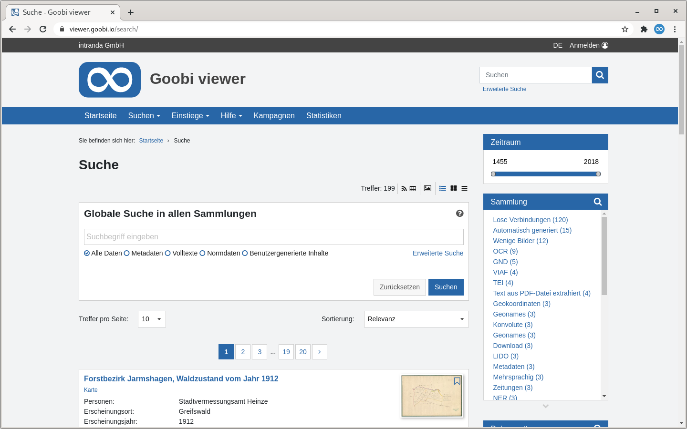

# 1.17 Suche

Die Suche im Goobi viewer erlaubt eine kombinierte Suche sowohl in den Metadaten als auch in den Volltexten. Je nach Auswahl kann eine Suche ebenfalls lediglich auf die Metadaten oder die Volltexte der digitalen Sammlungen eingeschränkt werden. Verknüpfungen von Suchbegriffen, eine Suche mit Rechts- oder Linkstrunkierung oder auch eine Phrasensuche sind ebenfalls realisierbar.



Abhängig von der Präzision der Suchabfrage und der Anzahl der indexierten Werke können sich sehr viele Suchtreffer ergeben. Diese werden über mehrere Seiten verteilt dargestellt. Dem Nutzer steht ein DropDown Menü zur Verfügung, in der er die Anzahl der pro Seite angezeigten Suchtreffer auswählen kann. Diese Liste kann wie folgt konfiguriert werden:


```markup
<search>
    <hitsPerPage>
        <value default="true">10</value>
        <value>25</value>
        <value>50</value>
        <value>100</value>
    </hitsPerPage>
    <fulltextFragmentLength>120</fulltextFragmentLength>
</search>
```


Das Element `fulltextFragmentLength` definiert die ungefähre länge der Volltext-Ausschnitte für die Suchtrefferanzeige. Standardwert ist 200.

Um die Suchbereiche der einfachen Suche zu definieren steht der folgende Konfigurationsblock zur Verfügung:


```markup
<search>
    <filters>
        <filter>filter_ALL</filter>
        <filter>filter_DEFAULT</filter>
        <filter>filter_FULLTEXT</filter>
        <!-- <filter>filter_NORMDATATERMS</filter> -->
        <!-- <filter>filter_UGCTERMS</filter> -->
    </filters>
</search>
```


Jeder filter-Eintrag erzeugt einen neuen Radiobutton unterhalb der einfachen Suche.

