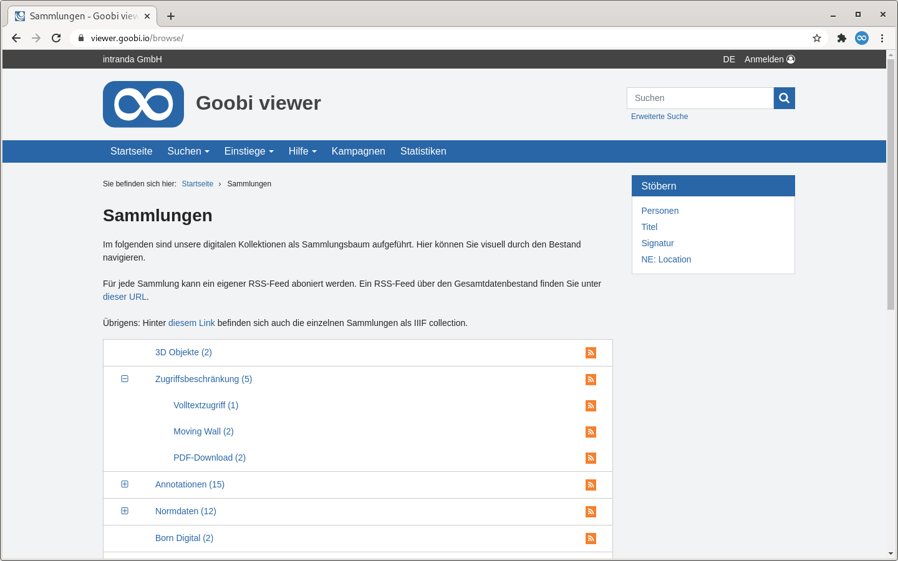

# 1.18.1 Untersammlungen

Eine Sammlung kann mehrere Stufen an Untersammlungen enthalten.



Jedes Werk kann einer beliebigen Anzahl von Sammlungen angehören. Auch keine Sammlungszugehörigkeit ist möglich. 

Ist ein Werk mindestens einer Sammlung zugewiesen, so wird diese Information im Index im Feld `DC` \(**D**igital**C**ollection\) hinterlegt. Die Einträge in diesem Feld bestehen stets aus einem Textstring, der gegebenenfalls durch ein Trennzeichen in mehrere Stufen für die Untersammlungen unterteilt ist:


```text
science.mathematics.algebra.algebra1800to1900
```


Die als Trennzeichen interpretierte Zeichenkette \(im obigen Beispiel ein Punkt\) kann für jedes hierarchische Feld individuell über das folgende Konfigurationselement geändert werden:


```markup
<collections>
    <collection field="DC">
        <splittingCharacter>.</splittingCharacter>
    </collection>
</collections>
```


Dabei ist zu beachten, dass die Namen der einzelnen Stufen selbst das Trennzeichen nicht enthalten dürfen, da an diesen Stellen sonst ebenfalls eine Unterteilung stattfindet.

Die Übersetzung des oben gegebenen Beispiels für einen Sammlungsbaum in den messages Dateien sieht wie folgt aus:


```text
science=Science
science.mathematics=Mathematics
science.mathematics.algebra=Algebra
science.mathematics.algebra.algebra1800to1900=Algebra 1800 to 1900
```


