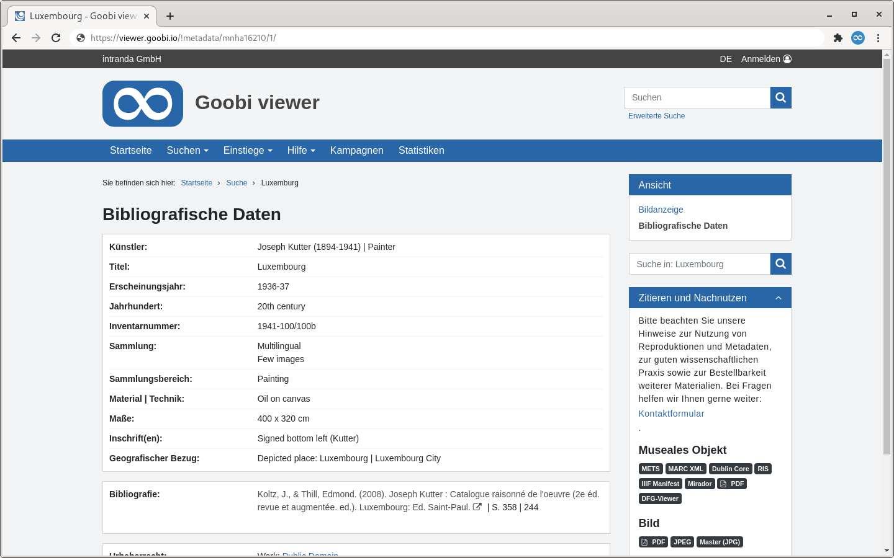

# 1.19.1 Haupt-Metadaten

Die Haupt-Metadaten werden auf der Seite "Bibliographische Daten" angezeigt.



Sie können wie folgt konfiguriert werden:



```markup
<metadata>
    <metadataView index="0" label="metadata" url="" condition="">
        <template name="_DEFAULT">
            <metadata label="MD_TITLE" hideIfOnlyMetadataField="true">
                <param type="field" key="MD_TITLE" />
            </metadata>
            <metadata label="MD_AUTHOR" value="MASTERVALUE_WIKINORM" group="true">
                <param type="field" key="MD_VALUE" />
                <param type="wikifield" key="MD_VALUE" />
                <param type="normdatauri" key="NORM_URI" />
                <param type="normdatasearch" key="NORM_IDENTIFIER" />
            </metadata>
            <metadata label="DC">
                <param type="translatedfield" key="DC" topstructOnly="true" />
            </metadata>
            <metadata label="DOCSTRCT_TOP">
                <param type="translatedfield" key="DOCSTRCT_TOP" />
            </metadata>
            <metadata label="DOCSTRCT_SUB" hideIfOnlyMetadataField="true">
                <param type="translatedfield" key="DOCSTRCT_SUB" />
            </metadata>
            <metadata label="URN">
                <param type="field" key="URN" />
            </metadata>
            <metadata label="MD_COPYRIGHT">
                <param type="field" key="MD_COPYRIGHT">
                    <replace string="[year]">2019</replace>
                    <replace char="X">Y</replace>
                    <replace regex="..."></replace>
                </param>
            </metadata>
            <metadata label="MD_LICENSELABELFIELD">
                <param type="translatedfield" key="MD_LICENSELABELFIELD">
                    <replace condition="-MDNUM_PUBLICRELEASEYEAR:[* TO NOW/YEAR]" regex=".+">MESSAGE_LICENCEINFORMATION</replace>
                </param>
            </metadata>
            <metadata label="DATECREATED">
                <param type="millisfield" key="DATECREATED" />
            </metadata>
            <metadata label="label__citation_style_apa-6th-edition" citationTemplate="apa-6th-edition">
                <param type="citeproc" dest="title" key="MD_TITLE"/>
                <param type="citeproc" dest="author" key="MD_AUTHOR"/>
                <param type="citeproc" dest="publisher" key="MD_PUBLISHER"/>
                <param type="citeproc" dest="placepublish" key="MD_PLACEPUBLISH"/>
                <param type="citeproc" dest="issued" key="MD_YEARPUBLISH"/>
                <param type="citeproc" dest="isbn" key="MD_ISBN"/>
                <param type="field" key="MD_RELATED_RECORD_ID" value="MASTERVALUE_RELATED_RECORD_LINK" condition="PI:{0}"/>
        </metadata>
        </template>
        <template name="monograph">
            <metadata label="MD_TITLE" >
                <param type="field" key="MD_TITLE" />
            </metadata>
            <metadata label="MD_AUTHOR" value="MASTERVALUE_WIKINORM" group="true">
                <param type="field" key="MD_VALUE" />
                <param type="wikifield" key="MD_VALUE" />
                <param type="normdatauri" key="NORM_URI" />
                <param type="normdatasearch" key="NORM_IDENTIFIER" />
            </metadata>
        </template>
    </metadataView>
    <metadataView index="1" label="label__metadata_special" url="_special" condition="DC:specialcollection">
            <metadata label="MD_SPECIAL" >
                <param type="field" key="MD_SPECIAL" />
            </metadata>
    </metadataView>
</metadata>
```



Es können beliebig viele `<metadataView>` Elemente definiert werden. Jedes Element erzeugt eine eigenständige Metadaten-Seite mit eigenem Link in der Seitenleiste.

Folgende Attribute sind enthalten:

| **Attribut** | Beschreibung |
| :--- | :--- |
| **index** | Reihenfolge des Views innehalb der Auflistung. Fehlende Werte werden implizit auf `0` gesetzt. Sind mehrere Views konfiguriert, muss jeder allerdings einen einzigartigen Wert besitzen. |
| **label** | Optionaler Message Key für die Bezeichnung dieses Metadatenfeldes \(die Übersetzung für diesen Key muss in der jeweiligen messages.properties vorhanden sein\). |
| **url** | URL Pattern für die Seite. Der Wert wird als Suffix an das Standard-Pattern `/metadata` drangehängt. Sind mehrere Views konfiguriert, darf maximal ein Element einen leeren Wert dieses Attributs besitzen, alle anderen benötigen jeweils einen einzigartigen Wert. |
| **condition** | Optionale Bedingung für die Anzeige der Verlinkung in der Seitenleiste. Erlaubt sind entweder ein Solr-Feldname \(`"MD_FOO"`\) oder ein Feld-Wert-Paar \(`"MD_FOO:bar"`\), das das Hauptelement des geöffneten Werkes besitzen muss. |

Innerhalb eines Views können abhängig von dem angezeigten Strukturtyp unterschiedliche Konfigurationen verwendet werden. Die Konfigurationen werden dabei jeweils in einem Element `<template>` platziert. Im obigen Beispiel ist für den Strukturtyp monograph eine eigene Metadatenliste konfiguriert.

Metadaten für LIDO-Events werden ebenfalls über diese Liste konfiguriert. Gewünschte Event-Metadaten müssen hier also ebenfalls aufgelistet sein.

Jedes Element `<metadata>` beschreibt ein Metadatenfeld, das angezeigt werden soll. Die Reihenfolge der Auflistung entspricht dabei der Reihenfolge, in der diese Metadaten \(falls vorhanden\) angezeigt werden. Das Element hat folgende Attribute:

| **Attribut** | Beschreibung |
| :--- | :--- |
| **label** | Der Key für die Bezeichnung dieses Metadatenfeldes \(die Übersetzung für diesen Key muss in der jeweiligen messages.properties vorhanden sein\) |
| **value** | Standardwert des Metadatums. Dieser Wert kann etwa eine URL sein, die in der messages.properties definiert ist und Platzhalter enthält, die durch tatsächliche Werte aus dem Metadatum ersetzt werden \(siehe die Konfiguration von `MD_AUTHOR` im obigen Beispiel\). Für einfache Metadaten sollte dieses Attribut leer gelassen werden \(siehe die Konfiguration von `MD_TITLE` im obigen Beispiel\). |
| **type** | Der Wert des Attributs `type` enthält die Nummer des Widgets oder Blöcke, in dem das Metadatum angezeigt werden soll \(beginnend mit 0\). Fehlt dieses Attribut, wird automatisch der Wert 0 verwendet. |
| **group** | Optionales Attribut das angibt, ob es sich um ein gruppiertes Metadatum handelt. Standard ist `false`. |
| **citationTemplate** | Optionales Attribut das nur für die Anzeige von Zitierempfehlungen benötigt wird. Hier wird dann ein für Citeproc valider Zitierstil angegeben. |
| **hideIfOnlyMetadataField** | Metadaten, die hier mit `true` gekennzeichnet sind, gelten als entbehrlich. Sind in einem Strukturelement nur Metadatenfelder vorhanden, die dieses Attribut besitzen, wird der ganze Metadatenblock für dieses Strukturelement ausgeblendet. Ist hingegen mindestens ein Metadatenfeld vorhanden, welches den Attributwert `false` hat, wird der Block mit allen Metadaten angezeigt \(auch Metadate, mit Attributwert `true` werden dann angezeigt\). Standardwert ist `false`. |

Titel für die einzelnen Widgets oder Blöcke werden in der `messages_*.properties` nach dem Muster `metadataTab<Nummer>` konfiguriert:



```text
metadataTab0=Beschreibung
metadataTab1=Inhalt
metadataTab2=Weitere Informationen
```




Metadaten aus LIDO Events werden automatisch in zusätzlichen Widgets pro Event dargestellt.


Jedes Element `<metadata>` muss mindestens ein Element `<param>` enthalten. Diese definieren die Quelle der tatsächlichen Werte für diesen Metadatentyp. Folgende Attribute sind dabei zu konfigurieren:

<table>
  <thead>
    <tr>
      <th style="text-align:left"><b>Attribut</b>
      </th>
      <th style="text-align:left">Beschreibung</th>
    </tr>
  </thead>
  <tbody>
    <tr>
      <td style="text-align:left"><b>type</b>
      </td>
      <td style="text-align:left">
        <p>Der Typ des Werts beschreibt die Art, ob und wie der Wert behandelt wird.
          M&#xF6;gliche Typen sind:</p>
        <ul>
          <li><code>field</code>- Der Wert wird so wie er ist &#xFC;bernommen</li>
          <li><code>translatedfield</code>- Der Wert wird in die aktuelle Sprache &#xFC;bersetzt,
            falls eine &#xDC;bersetzung existiert</li>
          <li><code>unescapedfield</code>- es wird kein HTML-Unescaping am Wert vorgenommen</li>
          <li><code>wikifield</code>- Anpassung des Werts f&#xFC;r eine Suchanfrage
            bei Wikipedia: Klammern werden entfernt, Leerzeichen durch Unterstriche
            ersetzt</li>
          <li><code>wikipersonfield</code>- Wie wikifield, aber wenn der Wert ein Komma
            enth&#xE4;lt, werden zus&#xE4;tzlich die Strings vor und nach dem Komma
            vertauscht, so dass Personennamen in das Muster first name_last name f&#xFC;r
            korrektes Wikipedia Resolving &#xFC;berf&#xFC;hrt werden</li>
          <li><code>urlescapedfield</code>- Hierbei werden speziell f&#xFC;r URLs codierte
            Zeichen wie der Slash Unicode-Escaped</li>
          <li><code>normdatauri</code>- Es wird ein Button gerendert, der mithilfe der
            hier enthaltenen Normdaten-URI die Normdaten einholt und &#xF6;ffnet</li>
          <li><code>normdatasearch</code>- Es wird ein Button gerendert, der mit dem
            konfigurierten Indexefeld in key eine Suche startet, die alle Werke mit
            dieser Feld:Wert-Kombination auflistet (zum Beispiel NORM_IDENTIFIER).</li>
          <li><code>hierarchicalfield</code> - Erzeugt einen Link f&#xFC;r jedes Hierarchielevel.
            F&#xFC;r die Verwendung mit dem Solr Feld <code>DC</code> gedacht.</li>
          <li><code>millisfield</code> - Formatiert Millisekunden-Zeitstempel als Datum
            (dd.MM.yyyy wenn Locale = DE, ansonsten MM/dd/yyyy).</li>
          <li><code>citeproc</code> - Zeigt an, dass eine Zitierempfehlung mittels Citeproc
            erstellt werden soll.</li>
        </ul>
      </td>
    </tr>
    <tr>
      <td style="text-align:left"><b>key</b>
      </td>
      <td style="text-align:left">Das Feld im Solr Index, dass den gew&#xFC;nschten Wert enth&#xE4;lt</td>
    </tr>
    <tr>
      <td style="text-align:left"><b>prefix</b>
      </td>
      <td style="text-align:left">Zeichenkette, die unmittelbar vor dem Wert des Metadatums stehen soll
        (Leerzeichen werden mit _SPACE_ kodiert).</td>
    </tr>
    <tr>
      <td style="text-align:left"><b>suffix</b>
      </td>
      <td style="text-align:left">Zeichenkette, die unmittelbar nach dem Wert des Metadatums stehen soll
        (Leerzeichen werden mit _SPACE_kodiert).</td>
    </tr>
    <tr>
      <td style="text-align:left"><b>value</b>
      </td>
      <td style="text-align:left">
        <p>Das Attribut <code>value</code> in <code>&lt;param&gt;</code> bietet optional
          die M&#xF6;glichkeit, f&#xFC;r den jeweiligen Parameter zus&#xE4;tzlich
          ein Master Value (Zeichenkette oder Message Key) zu definieren, in das
          der Wert des Parameters eingesetzt ist (zum Beispiel <code>value=&quot;foo {0} bar&quot;</code>).
          Der Gesamte Ausdruck wird dann in den jeweiligen Platzhalter des Master
          Values des gesamten Metadazums eingesetzt (wenn der Parameter den Index
          0 hat, wird der gesamte Ausdruck in den Platzhalter <code>{0}</code> des
          Metadatums eingesetzt). Ist ein <code>value</code>-Attribut definiert, werden
          evtl. gesetzte <code>prefix</code>- und <code>suffix</code>-Parameter ignoriert.</p>
        <p>Beispiel:</p>
        <p><code>&lt;metadata label=&quot;MD_LOREMIPSUM&quot; value=&quot;LOREMIPSUM_MASTER_KEY&quot;&gt;</code>
        </p>
        <p> <code>&lt;param type=&quot;field&quot; key=&quot;MD_LOREM&quot; value=&quot;LOREM_MSG_KEY&quot; /&gt;</code>
        </p>
        <p> <code>&lt;param type=&quot;field&quot; key=&quot;MD_DOLOR&quot; /&gt;</code>
        </p>
        <p><code>&lt;/metadata&gt;</code>
        </p>
        <p>messages.properties:</p>
        <p><code>MD_LOREMIPSUM=LI</code>
        </p>
        <p><code>LOREMIPSUM_MASTER_KEY={0} ipsum {1} sit amet.</code>
        </p>
        <p><code>LOREM_MSG_KEY=&lt;a href=&quot;https://example.com/?search={0}&gt;{0}&lt;/a&gt;</code>
        </p>
        <p>Ausgabe:</p>
        <p>LI: <a href="https://example.com/?search=Lorem">Lorem</a> ipsum dolor sit
          amet.</p>
      </td>
    </tr>
    <tr>
      <td style="text-align:left"><b>topstructOnly</b>
      </td>
      <td style="text-align:left">Wenn das Attribut den Wert <code>true</code> hat, werden Metadaten, die
        in allen Strukturelementen vorkommen nur beim Hauptwerk aufgelistet. Das
        ist in der Regel bei dem Feld DC, in dem die Sammlungen gespeichert sind,
        der Fall. Standard ist <code>false</code>
      </td>
    </tr>
    <tr>
      <td style="text-align:left"><b>dest</b>
      </td>
      <td style="text-align:left">Wird nur im Zusammenhang mit dem <code>type=&quot;citeproc&quot;</code> ben&#xF6;tigt
        und gibt dann an, wohin die Werte aus den im <code>key=&quot;&quot;</code> Attribut
        konfigurierten Solr-Feld innerhalb von Citeproc gemappt werden sollen.</td>
    </tr>
    <tr>
      <td style="text-align:left"><b>condition</b>
      </td>
      <td style="text-align:left">Optional kann in <code>condition</code> f&#xFC;r den Parameter eine einfache
        Solr-Query definiert werden. In dem Fall wird der Wert nur verwendet, wenn
        die Abfrage Treffer ergibt. Dabei wird der Platzhalter <code>{0}</code> in
        der Query durch den Wert des Parameters (in der Regel der Wert des Feldes
        im Parameter <code>key</code>) ersetzt. Folgendes Beispiel zeigt die Verlinkung
        zu einem anderen Werk (mit dem Identifier in <code>MD_RELATED_RECORD_ID</code>)
        nur an, wenn dieses Werk auch im Index existiert: <code>&lt;param type=&quot;field&quot; key=&quot;MD_RELATED_RECORDID&quot; value=&quot;MASTERVALUE_RELATED_RECORD_LINK&quot; condition=&quot;PI:{0}&quot; /&gt;</code>
      </td>
    </tr>
  </tbody>
</table>

Unterhalb von einem `<param>` Element können `<replace />` Regeln definiert werden. Über die Attribute `string`, `char` oder `regex` lassen sich Werte definieren die aus dem Metadatum extrahiert und dann durch den im replace Block angegeben Wert ersetzt werden sollen. Über das Attribut `conditions` kann eine optionale Solr Query formuliert werden. In dem Fall werden nur Metadaten von Werken, auf die die Bedingungen zutreffen, entsprechend behandelt.

Im folgenden Beispiel wird in Monographien in dem Metadatum aus dem Feld `MD_COPYRIGHT` der Platzhalterstring `[year]` gesucht und durch `2019` ersetzt:



```markup
<metadata>
    <mainMetadataList>
        <template name="_DEFAULT">
            <metadata label="MD_COPYRIGHT">
                <param type="field" key="MD_COPYRIGHT">
                    <replace string="[year]" conditions="DOCSTRCT:monograph">2019</replace>
                </param>
            </metadata>
        </template>
    </mainMetadataList>
</metadata>
```



Die Reihenfolge der `<param>` Elemente entspricht der Reihenfolge, in der die Platzhalter im Standardwert \(falls konfiguriert\) ersetzt werden.

Beispiel:



```text
MASTERVALUE_WIKINORM={1} <a href\="http\://de.wikipedia.org/wiki/{3}" target\="_blank" title\="Wikipedia" alt\="Wikipedia" data-trigger\="hover" data-placement\="top" data-toggle\="tooltip"><i class\="fa fa-wikipedia-w" aria-hidden\="true"></i></a> {5}
```



Der Key `MASTERVALUE_WIKINORM` enthält ein vollständiges HTML Fragment mit einer Wikipedia URL, die wiederum zwei Platzhalter `{1}` und `{3}` enthält. Am Ende wird der Platzhalter für den dann automatisch generierten Link zur GND konfiguriert.

Die Metadaten-Konfiguration für `MD_AUTHOR` \(siehe erstes Beispiel\) enthält drei `<param>` Elemente: ein `field`, ein`wikifield` und ein `normdatauri`. Der unveränderte Wert in field ersetzt dabei `{1}` \(der angezeigte Name\). Derselbe Wert als wikifield wird für Wikipedia Konformität formatiert und ersetzt `{2}` \(Teil der URL\). Das Ergebnis besteht dann aus dem Namen des Autors, gefolgt von einem Wikipedia Icon, das nach folgender URL verlinkt:

```text
http://en.wikipedia.org/wiki/Georges_Grosjean
```


Die Parameter werden mit `{0}`, `{1}`, ... angesprochen. Ist allerdings `group="true"` gesetzt, dann sind es `{1}`, `{3}`, ...


Optional kann auch eine Bedingung angegeben werden um Metadatenwerte zu ersetzen. Damit ist es zum Beispiel möglich wenn ein Werk öffentlich mit einer Moving Wall beschränkt ist aber intern an einem Leseplatz betrachtet werden kann für den Zeitraum der Moving Wall eine alternative Lizenz anzuzeigen. Die Syntax der Bedingung ist hier die gleiche Solr-Syntax wie sie auch als Bedingung bei der Definition von Lizenzen verwendet werden kann:



```markup
<metadata>
    <mainMetadataList>
        <template name="_DEFAULT">
            <metadata label="MD_LICENSELABELFIELD">
                <param type="translatedfield" key="MD_LICENSELABELFIELD">
                    <replace condition="-MDNUM_PUBLICRELEASEYEAR:[* TO NOW/YEAR]" regex=".+">MESSAGE_LICENCEINFORMATION</replace>
                </param>
            </metadata>
        </template>
    </mainMetadataList>
</metadata>
```



