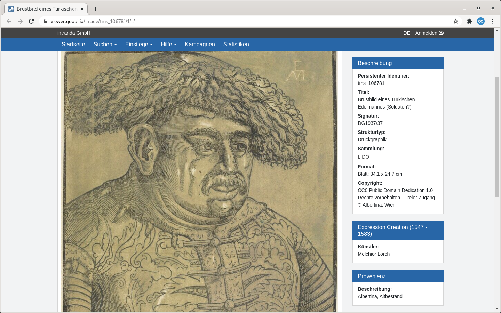

# 1.19.6 Metadaten-Anzeige aus LIDO Events

Metadaten aus LIDO Events werden in Sidebar-Widgets dargestellt. Dabei wird pro Event ein Widget gerendert.



Um die Metadaten nach eigenem Bedarf auf unterschiedliche Reiter zu verteilen, gibt es in der Konfiguration der [Haupt-Metadaten](1.md) das Attribut `type` im Element `<metadata>`:



```markup
<metadata>
   <mainMetadataList>
         <metadata label="MD_TITLE" value="" type="0">
               <param type="field" key="MD_TITLE" />
         </metadata>
         <metadata label="MD_AUTHOR" value="LINK_WIKIPEDIA" type="0">
               <param type="field" key="MD_AUTHOR" />
               <param type="wikifield" key="MD_AUTHOR" />
         </metadata>
         <metadata label="MD_LOCATION" value="" type="2">
               <param type="field" key="MD_LOCATION" />
         </metadata>
   </mainMetadataList>
</metadata>
```




