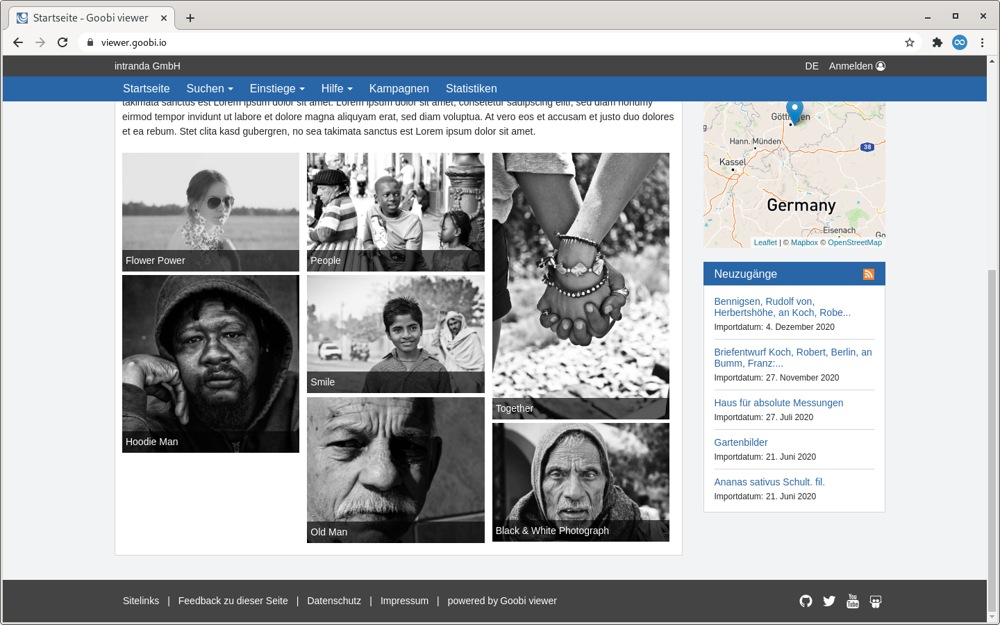

# 1.25 RSS Feed

Der Goobi viewer bietet die Möglichkeit, die letzten Importe in einem RSS Feed zur Verfügung zu stellen. Zusätzlich kann in der Sidebar eine Übersicht über die letzten fünf Neuzugänge angezeigt werden.



Für die Konfiguration steht der folgende Abschnitt zur Verfügung:



```markup
<rss>
    <numberOfItems>50</numberOfItems>
    <title>Goobi viewer RSS Feed</title>
    <description>new objects</description>
    <copyright>(c) the unicorn universe</copyright>
</rss>
```



Die Parameter sind in der folgenden Tabelle im einzelnen erklärt:

| Option | Bedeutung |
| :--- | :--- |
| **numberOfItems** | Die Anzahl der Einträge im RSS Feed \(Standardwert `50`\): |
| **title** | Der Titel des RSS Feeds |
| **description** | Beschreibungstext für den RSS Feed |
| **copyright** | Copyright Text für den RSS Feed |

