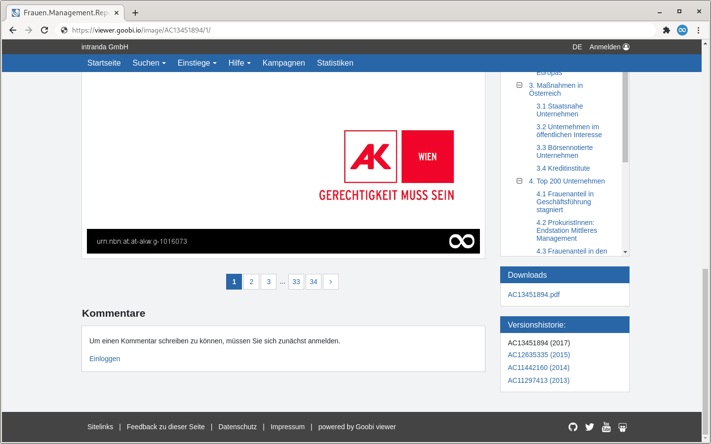

# 1.30 Originalinhalte

Ihr Goobi viewer bietet die Möglichkeit, Dateien zu einem Werk direkt als Download zur Verfügung zu stellen. Dies können zum Beispiel Originalversionen von Born-Digital Dokumenten sein.

Dazu muss zunächst der Ordner für Originalinhalte `origContentFolder` konfiguriert werden \(siehe [Kapitel 2.3 Ordnerkonfiguration](3.md)\). Die Dateien werden innerhalb dieses Ordners in Unterordnern abgelegt, die den Identifier des betreffenden Werkes als Ordnername haben \(beispielsweise `/opt/digiverso/viewer/source/PPN123456789/born_digital.pdf`\). Für jede in diesem Unterordner liegende Datei wird ein Download Link in der Werkansicht generiert.



Es ist weiter möglich bestimmte Dateien von der Auflistung in der Sidebar auszuschließen. Es handelt sich hierbei um eine rein visuelle Anpassung, der Zugriff und der Download ist weiterhin möglich. 

Die Funktionalität kann in der Konfigurationsdatei mit den folgenden Schaltern gesteuert werden:


```markup
<sidebar>
     <sidebarWidgetDownloads visible="true">
          <hideFileRegex>(EXAMPLE_.*|HIDDEN_.*)</hideFileRegex>
     </sidebarWidgetDownloads>
</sidebar>
```



Es ist aktuell nicht möglich aus Goobi workflow oder dem Goobi viewer heraus die Dokumente auch wieder zu löschen. Das geht nur manuell direkt im Dateisystem.


