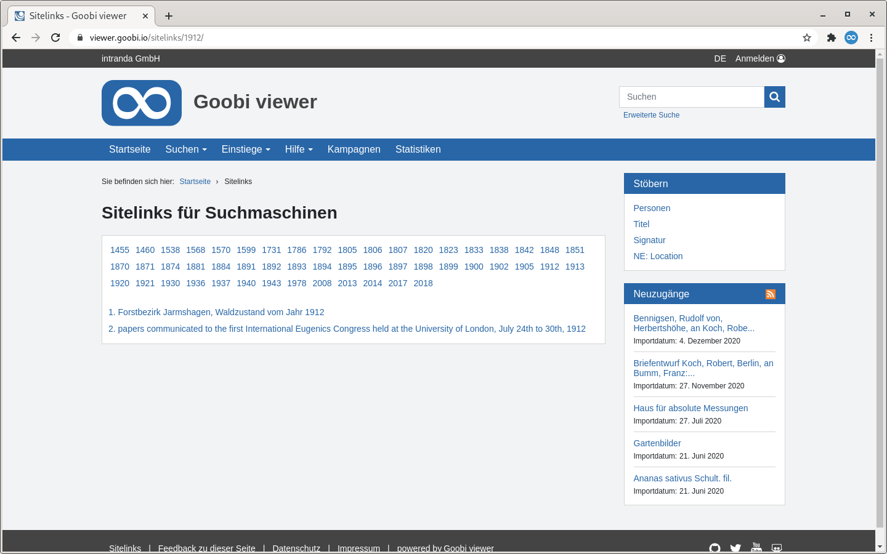

# 1.32 Sitelinks

Für Suchmaschinen wird eine Übersicht der nach Jahren exportierten Werke generiert.



Die Konfiguration dafür erfolgt in dem Element `<sitemap>`




```markup
<sitemap>
    <sitelinksField>YEAR</sitelinksField>
    <sitelinksFilterQuery>ISWORK:true</sitelinksFilterQuery>
</sitemap>
```




Die Sitelinks sind unter der folgenden Adresse abrufbar:

```text
https://viewer.example.org/viewer/sitelinks/
```

