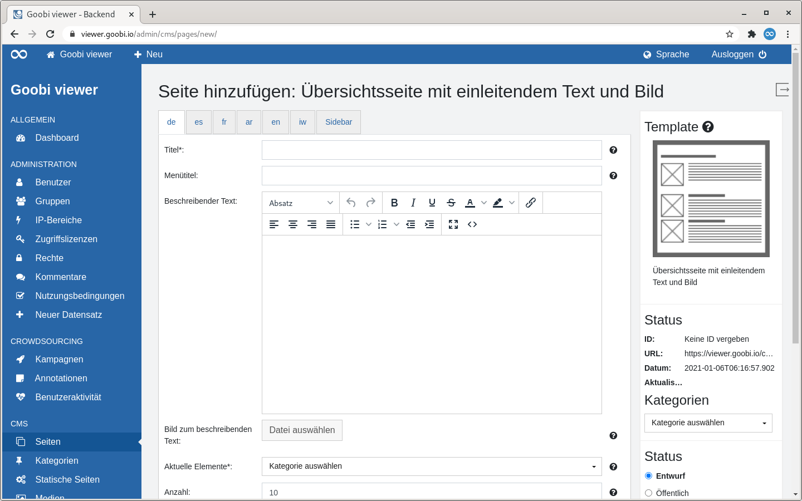
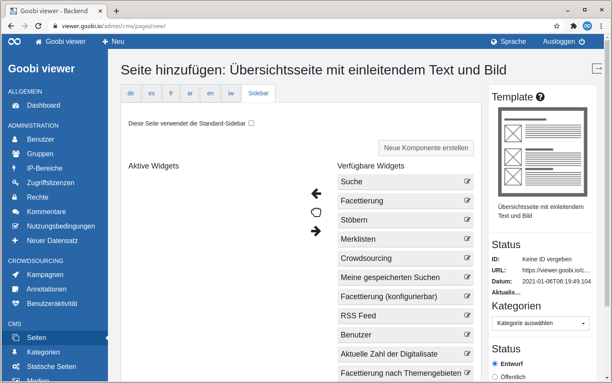

# 6.1.2 Inhalte der Dateien

## **Template-Datei**

Die Template-Datei ist eine XML-Datei, die alle Meta-Informationen zu dem Template beinhaltet, außerdem eine Liste der möglichen benutzerdefinierten Inhalte. Diese Inhalte werden in der Layout-Datei referenziert, teilweise auch in Layout-Dateien anderer Templates, die dieses Template als Teil einer Liste enthalten.



Die Template-Datei hat dabei stets einen beispielhaften Aufbau:

```markup
<cms_page_template id="example_template" version="2015-02-03">
     <name>Beispiel Template</name>
     <description>Dies ist eine Beschreibung des Templates.</description>
     <icon>cms_template_example.png</icon>
     <html>cms_template_example.xhtml</html>
     <content>
            <item id="A1" label="Überschrift" type="TEXT" mandatory="true" />
            <item id="A2" label="Text" type="HTML" mandatory="true" />
            <item id="image01" label="Bild" type="MEDIA" />
            <item id="queryList01" label="Werke" type="SOLRQUERY" />
            <item id="pageList01" label="News-Einträge" type="PAGELIST" />
            <item id="document" label="Dokument" type="MEDIA" filter=".*(.docx|.rtf|.htm|.html|.xhtml)" />
     </content>
</cms_page_template>
```

Die einzelnen Elemente im Überblick:

<table>
  <thead>
    <tr>
      <th style="text-align:left">Option</th>
      <th style="text-align:left">Beschreibung</th>
    </tr>
  </thead>
  <tbody>
    <tr>
      <td style="text-align:left"><b>cms_page_template/id</b>
      </td>
      <td style="text-align:left">Ein einzigartiger Identifier-String des Templates, der intern zur Identifikation
        des Templates verwendet wird</td>
    </tr>
    <tr>
      <td style="text-align:left"><b>cms_page_template/version</b>
      </td>
      <td style="text-align:left">Das Datum der letzten &#xC4;nderung. Wird vom Goobi viewer Core nicht
        verwendet sondern dient dem internen Tracking von &#xC4;nderungen.</td>
    </tr>
    <tr>
      <td style="text-align:left"><b>name</b>
      </td>
      <td style="text-align:left">Der Name des Templates. Dieser wird beim Erstellen neuer Seiten in der
        Oberfl&#xE4;che angezeigt.</td>
    </tr>
    <tr>
      <td style="text-align:left"><b>description</b>
      </td>
      <td style="text-align:left">Eine Beschreibung des Templates. Diese wird beim Erstellen neuer Seiten
        in der Oberfl&#xE4;che angezeigt.</td>
    </tr>
    <tr>
      <td style="text-align:left"><b>icon</b>
      </td>
      <td style="text-align:left">Der Dateiname des Icons, das dieses Template beim Erstellen neuer Seiten
        und beim Bearbeiten vorhandener Seiten repr&#xE4;sentiert; ohne Pfadangabe.</td>
    </tr>
    <tr>
      <td style="text-align:left"><b>html</b>
      </td>
      <td style="text-align:left">Der Dateiname der Layout-Datei f&#xFC;r dieses Template; ohne Pfadangabe.</td>
    </tr>
    <tr>
      <td style="text-align:left"><b>content</b>
      </td>
      <td style="text-align:left">
        <p>Eine Liste von <code>&lt;item&gt;</code>-Elementen. Jedes dieser Elemente
          bekommt einen eigenen Editorbereich beim Anlegen/Bearbeiten von CMS-Seiten
          auf Basis dieses Templates. Die Art des Editorbereichs h&#xE4;ngt ab von
          der Art des Items. Jedes Item hat folgende Attribute:</p>
        <ul>
          <li><b>id:</b> Ein f&#xFC;r dieses Template einzigartiger Identifier-String,
            mit dem dieser Inhalt in der Layout-Datei referenziert wird.</li>
          <li><b>label</b>: Die Bezeichnung dieses Inhaltes im Editorbereich der Seitenbearbeitung.</li>
          <li><b>order</b>: Bestimmt die Reihenfolge in der der Anzeige. Muss Zahlen
            enthalten. Ist das Attribut nicht gesetzt wird nach der ID sortiert.</li>
          <li><b>type</b>: Der Inhaltstyp, siehe <a href="3.md">Kapitel 6.4.3</a>.</li>
          <li><b>mandatory</b>: Optionales. Wenn gesetzt und der Wert <code>&quot;true&quot;</code> dann
            ist das Feld ein Pflichtfeld.</li>
          <li><b>filter</b>: Optional. Regul&#xE4;rer Ausdruck (regex), um die Medienauswahl
            auf bestimmte Dateiendungen zu beschr&#xE4;nken.</li>
          <li><b>mode</b>: Optional. Schaltet bei bestimmten Inhaltstypen besondere
            Optionen bei der Seitenerstellung f&#xFC;r dieses Item frei. Folgende Modi
            sind implementiert:
            <ul>
              <li><b>simple</b>: Kein besonderes Verhalten. Default-Wert</li>
              <li><b>expanded</b>: Nur f&#xFC;r Inhaltstyp <code>COLLECTION</code>. Erlaubt
                erweiterte Einstellungen zur Darstellung der Sammlungsanzeige.</li>
              <li><b>paginated</b>: Nur f&#xFC;r Inhaltstyp <code>PAGELILST</code>. Erlaubt
                eine Paginierung der Seitenliste.</li>
            </ul>
          </li>
        </ul>
      </td>
    </tr>
  </tbody>
</table>

## **Layout-Datei**

Die Layout-Datei ist eine XHTML-Datei die das Layout mit JSF beschreibt. Sie ist wie eine übliche Goobi viewer Core Seite aufgebaut, benötigt jedoch für die Anzeige von CMS-Inhalten einige spezielle Annotationen. So muss am Anfang der Seite vor etwaigen CMS-Inhalten die folgende Zeile zwingend existieren:

```markup
<ui:param name="cmsPage" value="#{cmsBean.currentPage}" />
```

Dies setzt den Parameter `page`, aus dem alle CMS-Inhalte ausgelesen werden. Um einen beliebigen in der Template-Datei definierten Inhalt einzufügen, verwendet man die folgende Notation:

```text
"#{cmsPage.getContent('content01')}"
```

Dabei stellt `content01` die `id` eines in der Template-Datei definierten Inhaltstyps dar. Der Inhalt wird automatisch je nach Typ eingefügt.

Die Sidebar der Seite muss im Tag `<ui:define name=“sidebar“/>` definiert werden. Zur Verwendung benutzderdefinierter Sidebars muss sie folgende Form haben:

```markup
<ui:define name="sidebar">
      <c:forEach var="element" items="#{cmsBean.getSidebarElements(true)}">
            <widgetComponent:widget_bookshelves widget="#{element}"/>
            <widgetComponent:widget_browsing widget="#{element}"/>
            <widgetComponent:widget_crowdsourcing widget="#{element}"/>
            <widgetComponent:widget_mySearches widget="#{element}"/>
            <widgetComponent:widget_searchField widget="#{element}"/>
            <widgetComponent:widget_user widget="#{element}"/>
            <widgetComponent:widget_custom widget="#{element}"/>
      </c:forEach>
</ui:define>
```

Jedes möglicherweise vorkommende Sidebar-Widget muss in der Liste als `<widgetComponent>` enthalten sein; der Name des Widgets muss dabei dem Dateinamen der Widget-Komponente entsprechen. Beispielsweise ruft `<widgetComponent:widget_user>` das in der Datei `/components/widget_user.xhtml` definierte Widget auf.



## **Template-Icon**

Hierbei handelt es sich um eine einfache Bilddatei zur Repräsentation des Templates. Das Bild muss quadratische Abmessungen haben. Üblicherweise werden 128x128px große PNG-Dateien verwendet.

