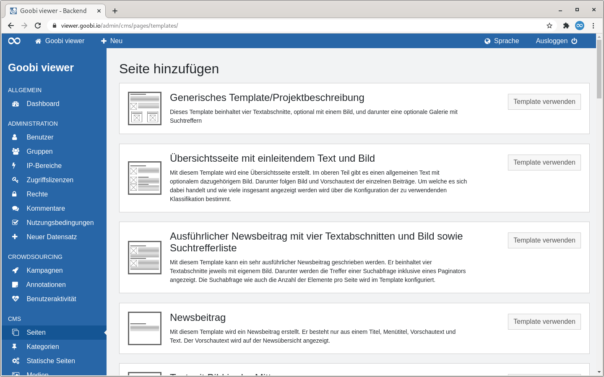

# 6.1 CMS-Templates

Der Goobi viewer verfügt über eine CMS-Funktionalität. Diese basiert auf der vorherigen Erstellung von frei konfigurierbaren Templates, die dann innerhalb des CMS-Bereiches beliebig oft Verwendung finden können.

