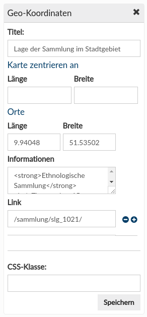
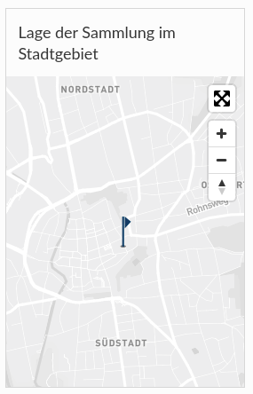

# November

Im November haben zwei Goobi viewer Instanzen ein Update auf die aktuelle stabile Version bekommen:

* [http://hauspublikationen.mak.at](http://hauspublikationen.mak.at/)
* [https://haab-digital.klassik-stiftung.de](https://haab-digital.klassik-stiftung.de/)

Die digitale Landesbibliothek Oberösterreich hat basierend auf dem Masonry-Template und vielen verschiedenen Medien-Dateien eine abwechslungsreiche, neue Startseite kreiert:

* [http://digi.landesbibliothek.at](http://digi.landesbibliothek.at/)

## Entwicklungen

### CMS

Es gibt ein neues CMS-Widget für die Anzeige von Geokordinaten.





Ein neues CMS-Widget ermöglicht andere CMS-Seiten als Liste in der Sidebar aufzuführen. 

Alle CMS-Widgets können nun eigene, individuelle Titel mitbringen. Dafür gibt es ein neues, optionales Titelfeld in jedem Widget.

Die Templates von CMS Seiten wurden weiter angepasst, um noch mehr Integrationsmöglichkeiten zu haben. So kann zum Beispiel die Seite auf der am Ende die Objekte einer einer Solr-Query angezeigt werden nun auch mit der Übersichtsseite kombiniert werden. Außerdem werden Bilder mit einer höheren Auflösung abgerufen um unschäften zu vermeiden.

Die Feedback Seite wurde in eine Komponente ausgegliedert und für die Integration in das CMS vorbereitet. 

Für Bilder die auf einer Masonry-Template basierten CMS-Seite angezeigt werden gibt es nun eine erweiterte Randomisierung der Inhalte. Beim Upload der Mediendateien kann eine Reihenfolge angegebenen werden in der die Kacheln angezeigt werden sollen. Haben ein oder mehrere Kacheln die gleiche Reihenfolge, dann erfolgt die Auslieferung zufällig. Dadurch lassen sich schöne Effekte mit ständig wechselnden Bildern, zum Beispiel auf der Startseite, erziehlen.   


### Suche

Im Kontext Suchtrefferanzeige gab es zwei Neuerungen. Die Erste, dass nun auch Normdaten angezeigt werden, sofern diese für den Suchtreffer relevant sind. Wird also ein Werk gefunden weil dafür in den indexierten, alternativen Schreibweisen des Autors ein Treffer gefunden wurde, wird diese alternative Schreibweise mit angezeigt. Da diese Informationen technisch bedingt anders gespeichert werden, war das bisher nicht Möglich.

Die zweite Neuerung ist, dass nun aus Normdatentreffern eine weitergehende Suche im Datenbestand ausgelöst werden kann. Dadurch werden die Stöbern-Möglichkeiten und die Vernetzbarkeit im Datenbestand stark erweitert.

### API

Die REST Schnittstelle hat neue Endpoints für ALTO und FULLTEXT bekommen. Dadurch ist es nun möglich unter berücksichtigung aller bekannten und konfigurierten Zugriffsbeschränkungen auf die im Goobi viewer vorhandenen Volltexte zuzugreifen. Der Zugriff erfolgt über die folgenden URLs:

```text
  viewer/rest/content/alto/PI/PAGENO/
  viewer/rest/content/text/PI/PAGENO/
```

### Übersetzung

Die Arbeiten den Goobi viewer auf französisch zu Übersetzen haben begonnen. Die ersten message Keys sind fertig übersetzt und im Repository zu finden:  
[https://github.com/intranda/goobi-viewer-core/blob/master/goobi-viewer-core/src/de/intranda/digiverso/presentation/messages/messages\_fr.properties](https://github.com/intranda/goobi-viewer-core/blob/master/goobi-viewer-core/src/de/intranda/digiverso/presentation/messages/messages_fr.properties)

