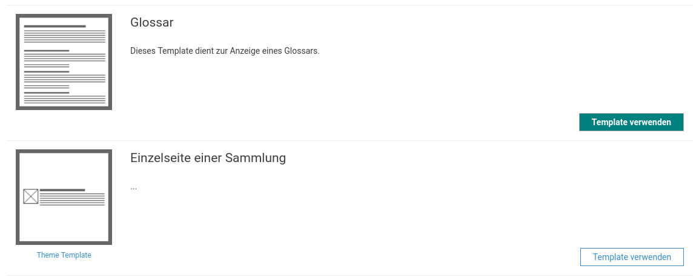

# Januar

Die Arbeit des Januars war im Goobi viewer Team vor allem mit der Entwicklung und Umsetzung von individuellen Kundenwünschen geprägt. Online gegangen ist das Crowdsourcing Modul in der HLB Fulda. Willkommen in der Crowdsourcing Community!

Des Weiteren erstrahlen die digitalen Sammlungen der Universitätsbibliothek der Humboldt-Universität zu Berlin in neuem Glanz. Die aktualisierte Webpräsenz ist unter der folgenden URL zu finden:

* [http://www.digi-hub.de/](http://www.digi-hub.de/)

## Entwicklungen

### CMS

Die größten Änderungen im CMS-Bereich sind nicht sichtbar, da sie die Code-Qualität "unter der Haube" betreffen. Kleinere Teile wurden aufgeräumt oder neu implementiert um gerade im Backend eine bessere Stabilität zu erreichen.

Als Features kam die Migration der einfachen und der erweiterten Suche in das CMS-Backend hinzu. 

Eine Änderung gab es auch bei den CMS-Templates in denen die Seiten definiert sind. Hier sind wir im Team einen Lernprozess gegangen. Am Anfang hatte jedes Theme seine eigenen Templates. Schnell haben wir aber herausgefunden, dass sich die Anwendungszwecke überschneiden und wir uns durch die Pflege der Templates in den Themes nur sehr viel Arbeit machen. Daraufhin haben wir die Templates selbst in den Goobi viewer Core migriert. Schnell stellte sich aber heraus, dass es immer wieder auch Kundenwünsche gibt, die individuell sind und das Theme im Core für alle nicht richtig aufgehoben ist. Deswegen bestand die Möglichkeit weiterhin Templates im Theme abzulegen. Allerdings wurden dann nur die CMS-Templates aus dem Theme geladen. Das führte dazu, dass wir immer das bestimmte Core-Template auch in das Theme kopiern mussten damit der Kunde es zur Verfügung hatte. Damit waren wir wieder am Anfang: Wir müssten Core-Templates in den einzelnen Kundenthemes warten.

Deswegen wurde der Lademechanismus neu gebaut und erlaubt nun eine Liste an CMS Templates aus dem  Core und eine aus dem Theme zu laden. Beide Listen werden auf der Seite der verfügbaren Templates angezeigt. Templates, die individuell für den Kunden entwickelt wurden, werden dabei visuell hervorgehoben.



### mehrsprachige Metadaten

Liegen für ein Werk Metadaten in verschiedenen Sprachen vor, so konnten diese in der Objektanzeige bisher angezeigt werden. Über einen eigenen Sprachumschalter konnte die Sprache der Metadaten gewechselt werden. Neu hinzugekommen ist nun die Möglichkeit die angezeigte Sprache in Abhängigkeit der gesamten Oberfläche zu setzen. Wurde zum Beispiel der Titel eines Werkes in mehreren Sprachen erfasst, ist es nun möglich jedem Besucher den Titel in seiner Sprache anzuzeigen. Der dafür neu gefügte Schalter lautet:

```markup
<useViewerLocaleAsRecordLanguage>true</useViewerLocaleAsRecordLanguage>
```

Übrigens: Um ein Metadatum, zum Beispiel einen Titel in mehreren Sprachen vorzuhalten muss dem Indexfeld der Suffix LANG\_XX angehängt werden, wobei XX der zweisprachige Sprachcode ist. Beispiel:

```text
MD_TITLE_LANG_DE = "Selbstbildnis"
MD_TITLE_LANG_EN = "Self-Portrait"
MD_TITLE_LANG_FR = "Autoportrait"
```

### API

Die REST-Schnittstelle hat neue Endpoints für TEI und CMDI Dateien bekommen.

### Intern

Intern gab es eine Umstellung auf die Version 2.3 des eingesetzten Templating-Frameworks JSF 2.3. Damit einher gingen sogenannte Refaktorisierungsarbeiten wobei die Kommunikation einzelner Teile der Applikation untereinander auf einen alternativen Mechanismus umgestellt wurde.

### Anzeige von Metadaten

An dieser Stelle gab es gleich zwei spannende Neuerungen. Die erste ist eine Möglichkeit, um Metadaten mit einer Bedingung unterschiedlich anzuzeigen. Ein typisches Anwendungsszenario ist die Anzeige von Lizenzen. Der Titel der Lizenz soll immer angezeigt werden \(z.B. "CC BY-SA 4.0", "Public domain", ...\). Existiert dafür allerdings ein weiteres Metadatum mit einer URL, so soll der Titel angezeigt werden, aber anklickbar sein, und der Link öffnet sich. Die Anzeige der Metadaten ist also immer "hübsch" und manchmal - sofern vorhanden - mit einem Link hinterlegt.

Um dieses Ziel zu erreichen wurde die Möglichkeit geschaffen in der Metadatenkonfiguration den globalen VALUE bedingt unter der Voraussetzung dass ein Parameter existiert mit einem alternativen VALUE zu überschreiben. Hier ein Beispiel dafür:



```markup
<metadata label="LABEL_LICENSE" value="">
    <param type="field" key="MD_LICENCETITEL"/>
    <param type="field" key="MD_LICENCEURL" value="VAL_LICENCEURL"/>
</metadata>
```





```text
LABEL_LICENSE=Lizenz
VAL_LICENCEURL=<a href="{1}" target="_blank">{0}</a>
```



Standardmäßig wird ein Metadatum "Lizenz" mit dem Inhalt des Solr-Feldes MD\_LICENCETITEL angezeigt. Existiert aber für das Werk auch das Feld MD\_LICENCEURL, so werden beide Felder an den Wert VAL\_LICENCEURL aus der messages Datei übergeben, der über die bekannten Platzhalter die Werte in einen String einfügt.

Die zweite Neuerung bei der Anzeige von Metadaten betrifft die Anzeige von Werten aus strukturierten Bäumen. Der Goobi viewer kann Werke in verschiedene, individuelle Bäumen strukturieren. Das sind zum Beispiel Sammlungen oder Wissensgebiete. Auf der Seite mit den Bibliographischen Daten wurde bisher immer nur die letzte Unterkollektion angezeigt. Neu ist die Möglichkeit hier auch den kompletten Pfad anzeigen zu lassen, inklusive einer Verlinkung der einzelnen Abschnitte auf den jeweiligen Abschnitt. Der neu eingeführte Feldtyp für den Parameter lautet "hierarchicalfield".

