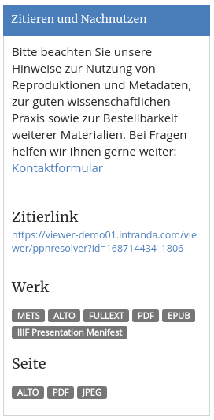
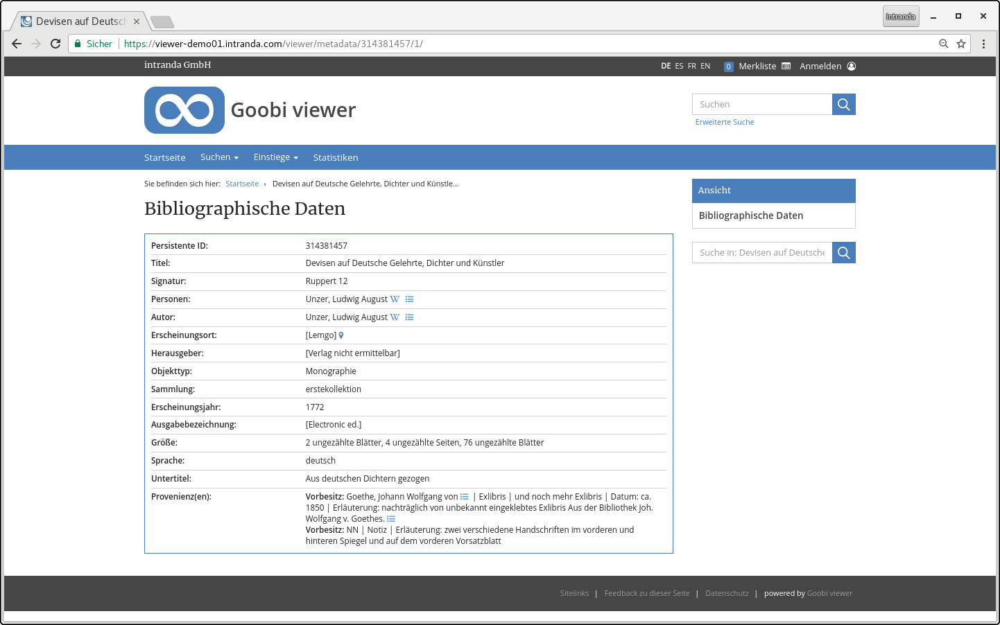

# November

Im November ist der Goobi viewer der Wiener Library in London online gegangen. In dem Portal werden auf Basis von METS/MODS und TEI Dokumenten Augenzeugenberichte und Reportagen von der Pogromnacht 1938 präsentiert. Die Instanz ist unter der folgenden Adresse zu finden:

* [https://www.pogromnovember1938.co.uk/viewer/](https://www.pogromnovember1938.co.uk/viewer/)

In der Oberösterreichischen Landesbibliothek gab es eine Veranstaltung zu den im dortigen Goobi viewer präsentierten Verlustlisten. Immer wieder toll, wie die analogen und digitalen Welten bei solchen Gelegenheiten zusammenkommen und sich gegenseitig bereichern: 

* [https://www.landesbibliothek.at/veranstaltungen/detail/news/detail/News/froehliche-wissenschaft-geschichte](https://www.landesbibliothek.at/veranstaltungen/detail/news/detail/News/froehliche-wissenschaft-geschichte)

## Entwicklungen

### Widget mit Lizenz- und Nutzungshinweisen

In der Werksanzeige gibt es verschiedene Neuerungen. Ein bereits sehr lange gewünschtes Feature hat endlich Einzug in den Goobi viewer gefunden: ein Widget, um Lizenzinformationen und Möglichkeiten zum Nachnutzen konzentriert anzuzeigen:

Das Widget zeigt sofern vorhanden auch Links zu Volltexten und ALTO Dateien an. Im Gesamtwerk können alle ALTO oder alle Volltext Dateien als ZIP-Datei heruntergeladen werden.

### DropDown zur direkten Seitennavigation

In der Werksanzeige steht oberhalb des Bildes ein DropDown Menü zur Verfügung mit dem direkt eine Seite im Werk angesprungen werden kann. Der Aufbau war bisher stets "Bildnummer: Paginierungslabel" also zum Beispiel "`8: IV`".

Die Anzeige in diesem DropDown Menü ist nun konfigurierbar. Mit Platzhaltern können jetzt auch Anzeigen wie nur  "`8`" oder "`8 von 17`" realisiert werden. Die Funktionalität ist im Kapitel [2.11.1](../../2/2.11/2.11.1.md) beschrieben.

### Normdatenanzeige / Provenienzen

Auch im Kontext Werksanzeige steht die neue Möglichkeit die Anzeige der Normdaten jetzt zu konfigurieren. Diese Entwicklung wurde für die Darstellung von Provenienzangaben innerhalb des Goobi viewers umgesetzt. War die Anzeige bisher starr vorgegeben, können die Felder einzeln konfiguriert und in der Reihenfolge festgelegt werden. Die Funktionalität ist in Kapitel [2.19.5](../../2/2.19/2.19.5.md) beschrieben.

Geändert hat sich der Feldtyp für die NORM\_URI Einträge in der config\_viewer.xml. Diese sind jetzt vom neuen Typ `normdatauri`. Bitte dafür auch die [Hinweise](../../9/9.1.md#2018-11-19) für [Core Changes](../../9/9.1.md) für Administratoren beachten.

### Watermark IDs

Es besteht schon immer die Möglichkeit unter einem Bild einen Footer anzuzeigen. Dieser kann in Abhängigkeit eines Wertes eines Feldes im Solr Suchindex unterschiedlich sein. Neu ist die Möglichkeit den Wert `<watermarkIdField>` mehrfach zu definieren. Verwendet wird dann für die Bildfooter-ID der Wert aus dem ersten Feld, das nicht leer ist. Siehe auch Kapitel [2.11.9](../../2/2.11/2.11.9.md)

### Überschreiben von Lizenzen

Besitzt ein Werk mehrere zugriffsbeschränkende Access Conditions \(Lizenztypen\), reicht es nun, dass der Benutzer für _eine_ dieser Lizenztypen eine Zugriffsberechtigung besitzt. Vorher musste für jeden Lizenztyp eine Zugriffsberechtigung vorliegen.

Dafür gibt es nun in der Maske zum Anlegen von Lizenztypen ein neues multiselect Menü, dass es ermöglicht die überschreibenden Lizenztypen auszuwählen.

### Paginator bei Werken mit wenigen Bildern

Der Paginator für Seiten mit wenigen Bildern wurde weiter angepasst. So wird nun zum Beispiel das DropDown Menü für die direkte Seitenauswahl wie auch die Möglichkeit zur ersten oder zur letzten Seite zu springen erst angezeigt, wenn mehr als zwei Bilder vorliegen.

### Sortierung und LIDO Events

Der Goobi viewer Indexer wurde um eine neue Konfiguration ermöglicht, die es erlaubt Metadatenfelder aus LIDO Events in das Hauptelement zu schreiben. Damit kann dann nach Metadatenfeldern aus dem Event sortiert werden. Siehe Kapitel [3.7.2](../../3/3.7.md#3-7-2-parameter-addsortfieldtotopstruct).

