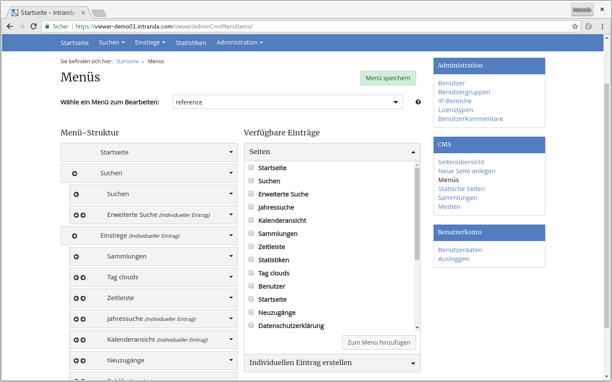
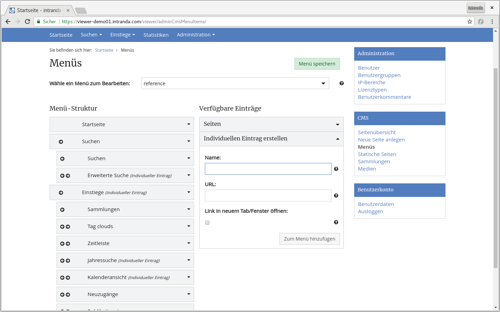

# Oktober

Im Oktober freuen wir uns über die Veröffentlichung der digitalisierten Nachlässe von Kurt W. Rothschild und Josef Steindl der WU Wien unter der folgenden Adresse:

* [https://viewer.wu.ac.at](https://viewer.wu.ac.at)




Aktualisiert wurde auch der Goobi viewer der Bauhaus Universität Weimar:

* [https://digitalesammlungen.uni-weimar.de](https://digitalesammlungen.uni-weimar.de)

Bereits im letzten Monat wurde die Scipta Paedagogica Online der Bibliothek für Bildungsgeschichtliche Forschung und die Digitalen Sammlungen der HAAB Weimar aktualisiert:

* [http://goobiweb.bbf.dipf.de](http://goobiweb.bbf.dipf.de)
* [https://haab-digital.klassik-stiftung.de](https://haab-digital.klassik-stiftung.de)

Alle Einrichtungen stellen damit automatisch Ihren gesamten frei verfügbaren Datenbestand über die IIIF Image API und als IIIF Presentation Manifeste für die Digital Humanities zur Verfügung.

## Entwicklungen

### CMS

Überarbeitet wurde der Bereich zur Bearbeitung des Hauptmenüs im CMS-Backend. Dort können nun auch Menüs für Subthemes erstellt werden. Im gleichen Zuge wurde die Bedienbarkeit verbessert: 



Neu hinzugekommen ist die Option Links direkt in einem neuen Tab / Fenster zu öffnen.



Bisher war der Menütitel in CMS-Seiten ein Pflichtfeld. Das wurde geändert. Enthält eine Seite keinen Menütitel, wird sie auch nicht mehr in der Liste der für das Hauptmenü verfügbaren Seiten aufgelistet. Dadurch wird der Bereich deutlich übersichtlicher.

### SEO

In der Sitemap werden nun Seiten aus GROUP Dokumenten wie zum Beispiel Konvoluten als Inhaltsverzeichnis aufgelistet.

### Suche

Im Kontext Suche hat es zwei Veränderungen gegeben. Einmal einen Bugfix der die erweiterte Suche betrifft. War dort ein Wert in einem Dropdown Menü ausgewählt und wurde eine neue Zeile hinzugefügt dann wurde der Wert aus dem Dropdown Menü wieder zurück gesetzt. Dieser Fehler wurde behoben.

Außerdem wurde die Liste der Strukturelemente Whitelist abgelöst. In dieser Liste wurden die Strukturelemente aufgelistet, die in den digitalen Sammlungen angezeigt werden sollten. Allerdings hat es immer wieder zur Verwirrung geführt, dass die Dokumenttypen selbst noch einmal explizit definiert werden mussten. Die Liste wird von jetzt an automatisch generiert und die Konfiguration entfällt ersatzlos.

### XHTML Seiten

Alle Buttons die es in der Oberfläche gibt wurden analysiert und auf wenige unterschiedliche Definitionen \(wie zum Beispiel btn--default, btn--success, btn--danger, btn--clean....\) vereinheitlicht. Da es gute 230 Stellen im Quelltext des Goobi viewer Core gibt an denen Buttons definiert sind, war das eine recht aufwendige Arbeit. Im Ergebnis ist das Button Design nun einheitlich und konsistent und an zentraler Stelle geregelt.

### Dokumentation

In der Dokumentation sind diesen Monat zwei Dinge hinzugekommen. Zum Einen wurde in der Sektion FAQ die Frage beantwortet: "[Wie kann ich meinen gesamten Datenbestand im Goobi viewer neu indexieren?](../../7.md#wie-kann-ich-meinen-gesamten-datenbestand-im-goobi-viewer-neu-indexieren)". Zum Anderen ist in den Anwendungsszenarien [Kapitel 6.13](../../6/6.11.md) neu hinzu gekommen in dem die Prozess- und Konfigurationskette beschrieben ist, wie von Goobi workflow angefangen über die Indexierung bis hin zur Anzeige im Goobi viewer Untersammlungen konfiguriert werden müssen.

### Indexer

Im Goobi viewer Indexer gab es verschiedene Bugfixes und kleinere Entwicklungen. Herauszuheben ist die Möglichkeit nun ein boolean Feld zu definieren um nach Werken mit Bildern und ohne Bildern Facettieren zu können. Die Konfiguration ist wie folgt:



```markup
<BOOL_CONTAINSIMAGE>
    <list>
        <item>
            <xpath>string(boolean(mets:fileSec/mets:fileGrp[@USE="PRESENTATION"]))</xpath>
            <addToDefault>false</addToDefault>
            <addSortField>true</addSortField>
        </item>
    </list>
</BOOL_CONTAINSIMAGE>
```



