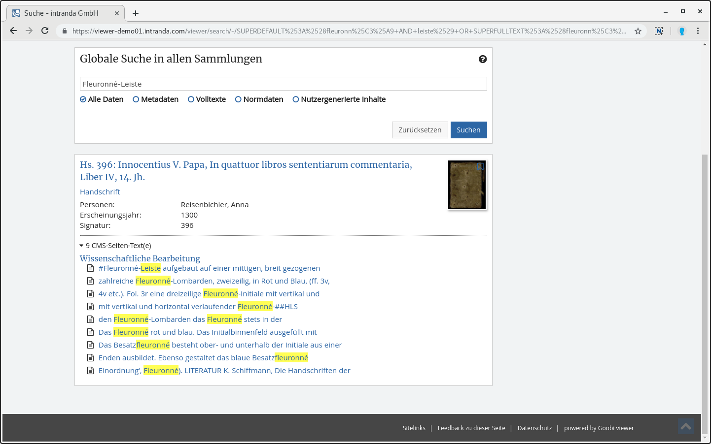

# Februar

Im Februar wurde die Goobi viewer Instanz der Arbeiterkammer in Wien aktualisiert. Im Rahmen dieses Updates wurde weiter an den Subtheme-Möglichkeiten rund um das CMS gefeilt um so viele Dinge wie möglich direkt aus der Oberfläche heraus bearbeiten und anpassen zu können. Die aktualisierte Instanz ist unter der folgenden Adresse zu finden: [https://emedien.arbeiterkammer.at](https://emedien.arbeiterkammer.at)

Außerdem ist das [Digitale Kultur- und Wissensportal Thüringen](http://www.kuwi-thueringen.de/) online gegangen. Wir sind stolz darauf über die IIIF Schnittstellen des Goobi viewers dorthin Daten zu liefern.



Da es in der Vergangenheit immer mal wieder Fragen gab welche Webbrowser vom Goobi viewer unterstützt werden, haben wir dazu einen Eintrag in die FAQ hinzugefügt:

* [https://docs.intranda.com/goobi-viewer-de/faq\#welche-webbrowser-werden-vom-goobi-viewer-unterstuetzt](https://docs.intranda.com/goobi-viewer-de/faq#welche-webbrowser-werden-vom-goobi-viewer-unterstuetzt)

## Entwicklungen

### Admin-Backend

Wie bereits im September letzten Jahres auf dem Goobi Anwendertreffen angekündigt, wollen wir das Design im Admin-Backend vereinheitlichen. Unser Ziel ist es dort unabhängig von dem jeweiligen CI der Einrichtung zu sein. Mit dem neuen Design wollen wir Schritt für Schritt die Inline-Hilfe erweitern und die Bedienbarkeit verbessern. Am Ende soll das komplette Backend inklusive Screenshots auch in der Dokumentation beschrieben sein.

Der Auftakt zu diesen Arbeiten war das Einholen von Feedback zum Status Quo. Im [Goobi Community Forum](https://community.goobi.io) haben wir zu einem Treffen und weiterer Beteiligung eingeladen. An dem Termin wurde im Goobi viewer Team zusammen mit zwei Anwendern Ideen gesammelt und das Feedback das über das Forum, via Email oder per Telefon bei uns eingegangen war konstruktiv diskutiert und klassifiziert. Dieses Thema wird uns auch in den kommenden Monate noch intensiv begleiten.

Der erste Schritt wurde dann auch schon gleich im Februar gegangen und eine erste Version des unabhängigen Designs in den stabilen Master eingepflegt. Alle Funktionen sind gleich geblieben, aber das Design hat sich verändert. Eine direkte Auswirkung in der Praxis ist, dass bereits ab jetzt deutlich mehr Platz zur Verfügung steht. Hier ein paar Impressionen:

### CMS Übersichtsseiten

Eine große Änderung hat es auch bei den Übersichtsseiten gegeben. Die Funktionalität wurde komplett in den CMS-Bereich verschoben. Diese Arbeit hat unterschiedlichste positive Effekte. So gibt es zum Beispiel nur noch eine Stelle an der Inhalte bearbeitet werden können. Das erhöht die Wartbarkeit und entfernt Redundanzen im Quellcode. Gleichzeitig wurde die initiale Unterstützung für die Suche in CMS-Seiten implementiert. Aus jeder CMS-Seite die einem Werk zugewiesen ist, werden beim Speichern die Texte indexiert und stehen in der aggregierten Suchtrefferanzeige zur Verfügung.

Neu geschaffen wurde auch die Möglichkeit im Medien Bereich nicht nur Bilder, sondern jetzt auch DOCX, RTF und HTML Dateien hochzuladen. Diese Dateien können in dem neuen CMS-Template für die Wissenschaftliche Bearbeitung eingebunden werden. DOCX und RTF Dateien werden dabei für die Anzeige automatisch zu HTML konvertiert. Die Inhalte der Dateien werden ebenfalls für die Suche indexiert.

Um alle Funktionen der ehemaligen Übersichtsseite abbilden zu können steht für Templates nun eine weitere Komponente zur Verfügung: Metadaten des Werkes anzeigen. Dabei kann aus einer Liste aller potentiellen Metadatenfeldern eine Auswahl getroffen werden. Je nachdem welchem Werk die CMS-Seite zugeordnet ist, werden dann aus der Liste die Einträge angezeigt, für die auch Werte vorliegen.

Damit die Seiten im Werkskontext angezeigt werden, muss beim Bearbeiten der Seite in dem Reiter "Sidebar" der Haken für "Diese Seite verwendet die Standard-Sidebar" aktiviert werden. Das ist standardmäßig nicht gesetzt.

CMS-Seiten die einem Werk zugewiesen sind können neben den üblichen URLs `/viewer/cms/PAGEID/` auch über die URL `/viewer/page/WERKSIDENTIFIER/PAGEID/`aufgerufen werden. Natürlich kann auch weiterhin eine alternative URL mit eigenem Pfad vergeben werden.

### CMS Facettierungswidget

Für CMS Seiten auf denen Sammlungen oder Suchtreffer angezeigt werden gibt es ein Widget um individuelle Facettierungen zur Verfügung zu stellen. Dieses Widget kann nun auf jeder CMS-Seite eingesetzt werden und leitet von dort automatisch auf eine Suchtrefferseite weiter. Damit kann zum Beispiel bereits auf der Startseite eine Facettierung nach Sammlungen, Zeiträumen, Orten oder anderen Feldern als Einstieg in die Inhalte angeboten werden.

### IIIF

Bei der Konfiguration der IIIF Presentation API ist es nun möglich einem Metadatum im Manifest ein anderes Label zu geben als in der Goobi viewer Oberfläche. Außerdem können auch Metadaten aus LIDO Events abgerufen werden. Siehe auch [Kapitel 2.33.2](../../konfiguration-core/web-api/iiif.md).

### Authentifizierung gegen Littera webOPAC

Neu hinzugekommen ist die Möglichkeit der Benutzerauthentifizierung gegen einen Littera webOPAC. Dafür wurde ein weiterer Authenticationprovider implementiert. Siehe auch [Kapitel 2.5.5](../../konfiguration-core/benutzeraccounts/littera.md).

### Werke in Sammlungsanzeige wieder konfigurierbar

Im Oktober haben wir die Strukturelemente-Whitelist gegen eine automatische Auflistung der Dokumententypen ersetzt. Unsere Intention dahinter war die vielen Fragen der Anwender obsolet zu machen, warum nach dem Einpflegen eines neuen Dokumententyps in Goobi workflow diese nach dem Export nicht auch im Goobi viewer auftauchen. Dieser Schritt fand nicht nur Zustimmung, da auch Logik entfallen ist die von verschiedenen Einrichtungen genutzt und gewünscht war. Aus diesem Grund steht jetzt wieder eine Konfigurationsoption in angepasster Form zur Verfügung. Anstelle einer Liste von Strukturelementen die aufgelistet werden, kann eine Solr-Query formuliert werden, mit der die Dokumenttypen und Strukturelemente definiert werden können. Siehe auch [Kapitel 2.18.7](../../konfiguration-core/digitale-kollektionen/strukturelement-whitelist.md).

### Stöbern

Manchmal dauert das Stöbern in einem großen Datenbestand ganz schön lange. Um hier die Performance zu verbessern kann eine optionale Solr-Query übergeben werden um zum Beispiel nur in Strukturelementen nach Inhalten zu suchen. Mit dieser Anpassung konnte die Zeit für das Generieren der Stöbern-Seite auf einem Kundensystem um drei viertel reduziert werden. Siehe auch [Kapitel 2.19.8](../../konfiguration-core/metadaten/stoebern.md).

### Dokumentation

Bei dem Brainstorm-Treffen zum Admin-Backend kam heraus, dass nicht bekannt war wie die Mehrsprachigkeit von Themes verwaltet und gesteuert werden kann. Nach kurzer Prüfung ist uns aufgefallen, dass das auch gar nicht dokumentiert war. Das haben wir direkt nachgeholt, für alle die es interessiert sei an dieser Stelle auf die Dokumentation, [Kapitel 6.12](../../anwendungsszenarien/mehrsprachigkeit.md) verwiesen.

