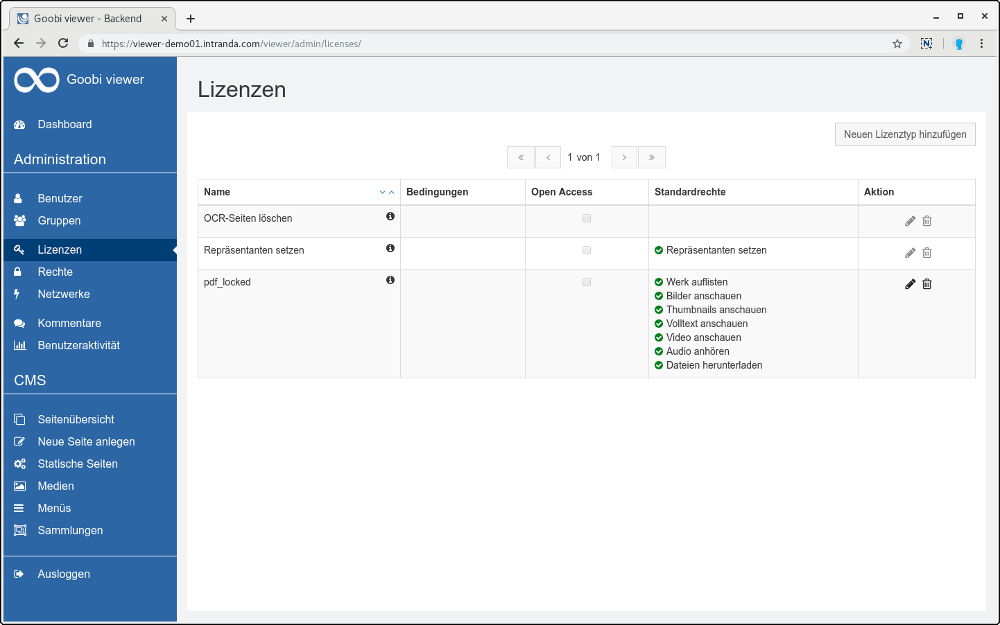
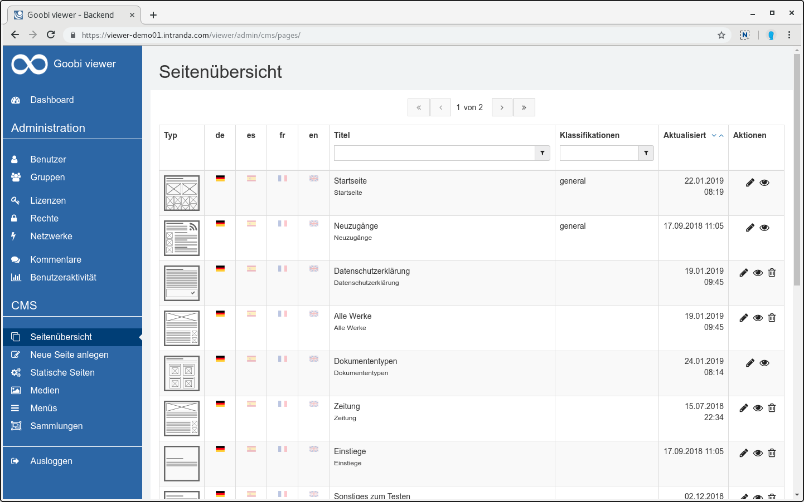
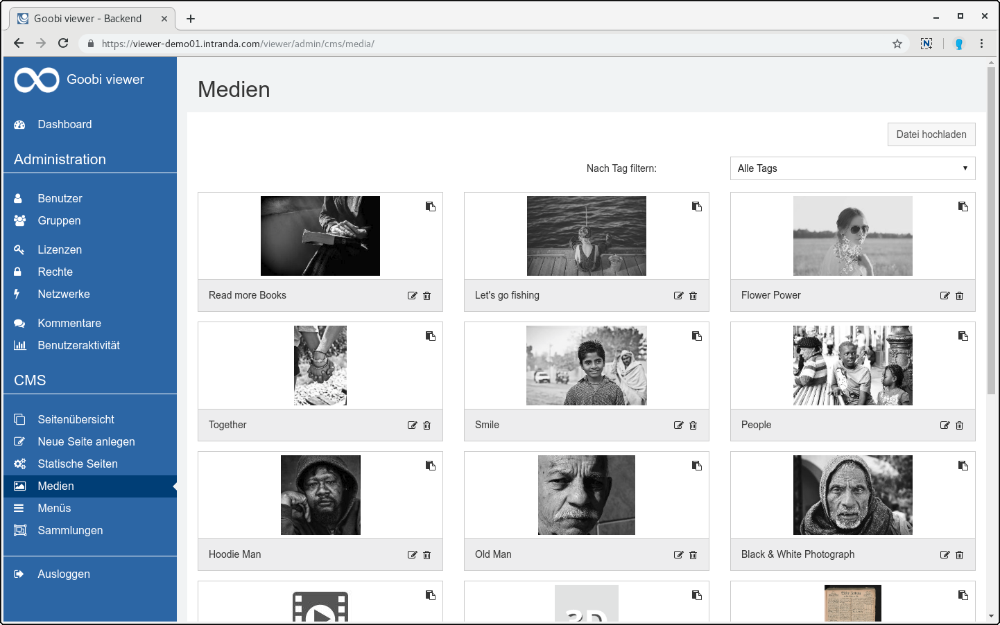
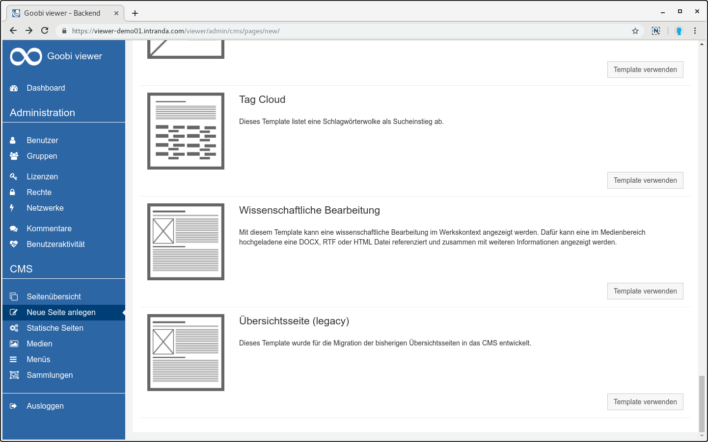
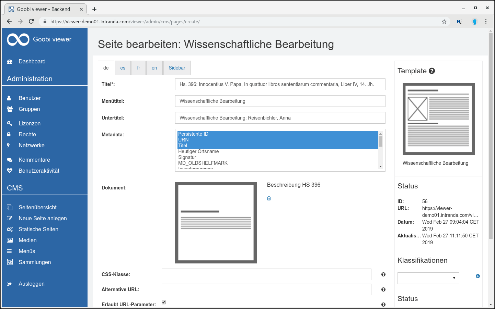

# Februar

Im Februar wurde die Goobi viewer Instanz der Arbeiterkammer in Wien aktualisiert. Im Rahmen dieses Updates wurde an den Subtheme-Möglichkeiten rund um das CMS weiter gefeilt um so viele Dinge wie möglich direkt aus der Oberfläche heraus bearbeiten und anpassen zu können. Die aktualisierte Instanz ist unter der folgenden Adresse zu finden: [https://emedien.arbeiterkammer.at](https://emedien.arbeiterkammer.at)

Außerdem ist das Digitale Kultur- und Wissensportal Thüringen online gegangen. Wir sind stolz darauf über die IIIF Schnittstellen des Goobi viewers dort ebenfalls Daten einzuspielen.



Da es in der Vergangenheit immer mal wieder Fragen gab welche Webbrowser vom Goobi viewer unterstützt werden, haben wir dazu einen Eintrag in die FAQ hinzugefügt:

* [https://docs.intranda.com/goobi-viewer-de/faq\#welche-webbrowser-werden-vom-goobi-viewer-unterstuetzt](https://docs.intranda.com/goobi-viewer-de/faq#welche-webbrowser-werden-vom-goobi-viewer-unterstuetzt)

## Entwicklungen

### Admin-Backend

Wie bereits auf dem Goobi Anwendertreffen im September letzten Jahres angekündigt wollen wir das Design im Admin-Backend vereinheitlichen. Unser Ziel ist es ein Design zu etablieren, das unabhängig von dem jeweiligen CI der Einrichtung ist. Mit dem neuen Design wollen wir dann Schritt für Schritt die Inline-Hilfe und Bedienbarkeit verbessern. Am Ende soll auch das komplette Backend inklusive Screenshots in der Dokumentation beschrieben sein.

Der Auftakt zu diesem Prozess war das Einholen von Feedback zum Status Quo. Im Community Forum haben wir zu einem Treffen und Beteiligung eingeladen. Bei dem Termin haben wir dann im Goobi viewer Team gemeinsam mit zwei Anwendern Ideen gesammelt und das Feedback das über das Forum, via Email oder per Telefon bei uns eingegangen ist konstruktiv diskutiert und klassifiziert. Das Thema wird uns auch in den kommenden Monate noch intensiv begleiten.

Jetzt sind wir den ersten Schritt gegangen und haben eine erste Version des unabhängigen Designs in den stabilen Master eingepflegt. Die Funktionalität ist gleich geblieben, aber das Design hat sich verändert. Als erster spürbarer Schritt steht bereits sehr viel mehr Platz zur Verfügung. Hier ein paar Impressionen:

### CMS Übersichtsseiten

Eine große Änderung hat es bei den Übersichtsseiten gegeben. Die Funktionalität wurde komplett in das CMS verschoben. Diese Arbeit hat ganz unterschiedliche positive Effekte. So haben wir im Goobi viewer nun nur noch eine Stelle an der Inhalte bearbeitet werden können. Das erhöht die Wartbarkeit und entfernt Redundanzen im Quellcode. Gleichzeitig wurde die initiale Unterstützung für die Suche in CMS-Seiten implementiert. Aus jeder CMS-Seite die einem Werk zugewiesen ist, werden nun beim Speichern die Texte indexiert und stehen in der aggregierten Suchtrefferanzeige zur Verfügung.

Neu geschaffen wurde auch die Möglichkeit im Medien Bereich nicht nur Bilder, sondern jetzt auch RTF, DOCX und HTM\(L\) Dateien hochzuladen. Diese Dateien können in dem neuen CMS-Template für die Wissenschaftliche Bearbeitung eingebunden werden. DOCX und RTF Dateien werden dabei automatisch zu HTML konvertiert und angezeigt. Die Inhalte werden ebenfalls für die Suche indexiert.

Um alle Funktionen der ehemaligen Übersichtsseite abbilden zu können steht für Templates nun eine weitere Komponente zur Verfügung, bei der Metadaten für die Anzeige ausgewählt werden können. Dabei steht eine Liste an allen potentiellen Metadatenfeldern zur Verfügung. Je nachdem welchem Werk die Seite zugeordnet ist, werden dann aus der ausgewählten Liste die Einträge angezeigt, für die auch Werte vorliegen.

Hiermit ist nun die Möglichkeit gegeben nicht nur Übersichtsseiten, sondern jegliche Art von CMS-Seiten direkt mit Werken zu verknüpfen und darin zu suchen. Wissenschaftliche Arbeiten die in Word verfasst wurden können nun direkt hochgeladen und angezeigt werden, ohne diese vorher umständlich konvertieren zu müssen.

Damit die Seiten im Werkskontext angezeigt werden, muss beim Bearbeiten der Seite in dem Reiter "Sidebar" der Haken für "Diese Seite verwendet die Standard-Sidebar" aktiviert werden. Das ist standardmäßig nicht gesetzt.

CMS-Seiten die einem Werk zugewiesen sind können neben den üblichen URLs `/viewer/cms/PAGEID/` auch über die URL `/viewer/page/WERKSIDENTIFIER/PAGEID/`aufgerufen werden. Natürlich kann auch weiterhin eine alternative URL mit eigenem Pfad vergeben werden.

### CMS Facettierungswidget

Für CMS Seiten auf denen Sammlungen oder Suchtreffer angezeigt werden gibt es ein Widget um individuelle Facettierungen zur Verfügung zu stellen. Dieses Widget kann nun auf jeder CMS-Seite eingesetzt werden und leitet dann automatisch auf eine Suchtrefferseite weiter. Damit kann zum Beispiel bereits auf der Startseite eine Facettierung nach Sammlungen, Zeiträumen, Orten oder anderen Feldern als Einstieg in die Inhalte angeboten werden.

### IIIF

Bei der Konfiguration der IIIF Presentation API ist es nun möglich einem Metadatum im Manifest ein anderes Label zu geben als in der Goobi viewer Oberfläche. Außerdem können jetzt auch Metadaten aus LIDO Events angezeigt werden. Siehe auch [Kapitel 2.33.2](../../konfiguration-core/web-api/iiif.md).

### Authentifizierung gegen Littera webOPAC

Neu hinzugekommen ist die Möglichkeit der Benutzerauthentifizierung gegen einen Littera webOPAC. Dafür wurde ein neuer Authenticationprovider implementiert. Siehe auch [Kapitel 2.5.5](../../konfiguration-core/benutzeraccounts/littera.md).

### Werke in Sammlungsanzeige wieder konfigurierbar

Im Oktober haben wir die Strukturelemente-Whitelist gegen eine automatische Auflistung der Dokumententypen ersetzt. Unsere Intention dahinter war die vielen Fragen der Anwender obsolet zu machen, warum nach dem Einpflegen eines neuen Dokumententyps in Goobi workflow diese nach dem Export nicht auch im Goobi viewer auftauchen. Für diesen Schritt wurden wir aber auch von verschiedenen Seiten kritisiert. Es ist nämlich auch Logik entfallen die von verschiedenen Einrichtungen genutzt wurde und gewünscht war. Aus diesem Grund steht seit diesem Monat nun wieder eine Konfigurationsoption in angepasster Form zur Verfügung. Anstelle einer Liste von Strukturelementen die aufgelistet werden, steht eine Solr-Query zur Verfügung mit der die Dokumenttypen und Strukturelemente definiert werden können. Siehe auch [Kapitel 2.18.7](../../konfiguration-core/digitale-kollektionen/strukturelement-whitelist.md).

### Stöbern

Manchmal dauert das Stöbern in einem großen Datenbestand ganz schön lange. Um hier die Performance zu verbessern kann nun eine optionale Solr-Query übergeben werden um zum Beispiel nur in Strukturelementen nach Inhalten zu suchen. Mit dieser Anpassung konnte die Zeit für das Generieren der Stöbern-Seite auf einem Kundensystem um drei viertel reduziert werden. Siehe auch [Kapitel 2.19.8](../../konfiguration-core/metadaten/stoebern.md).

### Dokumentation

Bei dem Brainstorm-Treffen zum Admin-Backend kam heraus, dass nicht bekannt war wie die Mehrsprachigkeit von Themes verwaltet und gesteuert werden kann. Nach kurzer Prüfung ist uns aufgefallen, dass das auch gar nicht dokumentiert war. Das haben wir direkt nachgeholt, für alle die es interessiert sei an dieser Stelle auf die Dokumentation, [Kapitel 6.14](../../anwendungsszenarien/6.14-mehrsprachigkeit.md) verwiesen.

