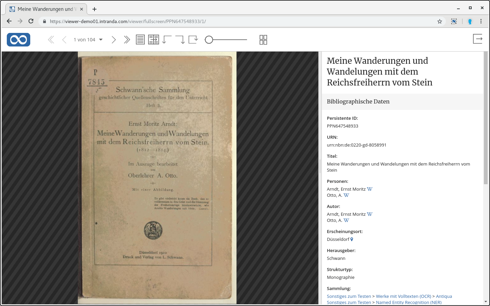
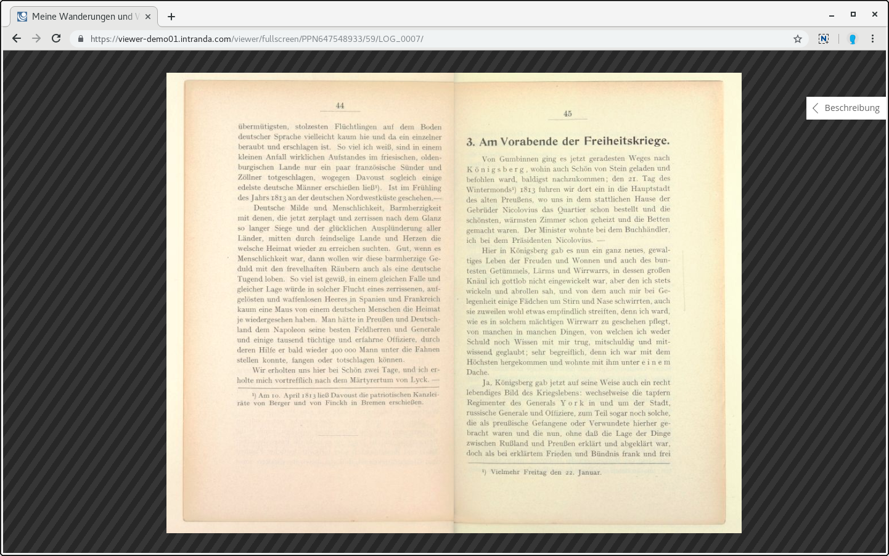
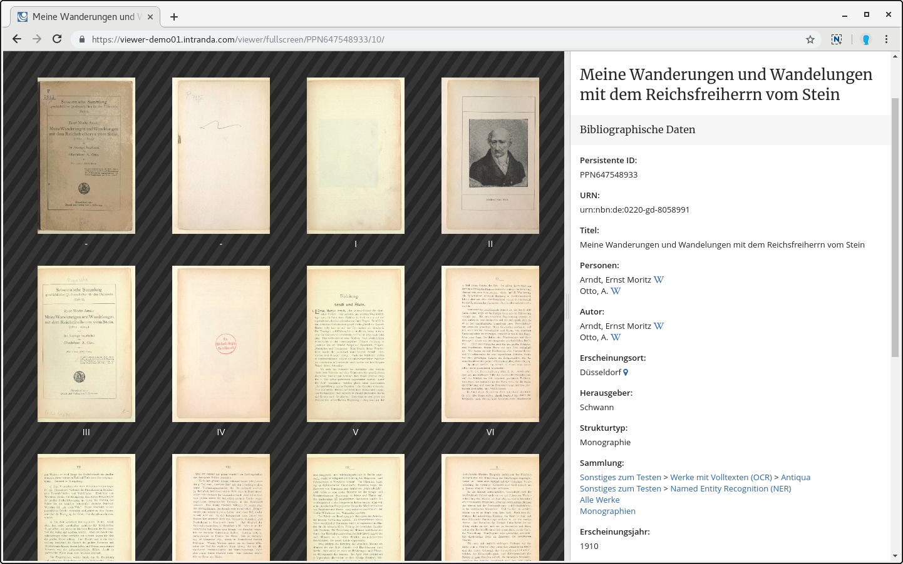
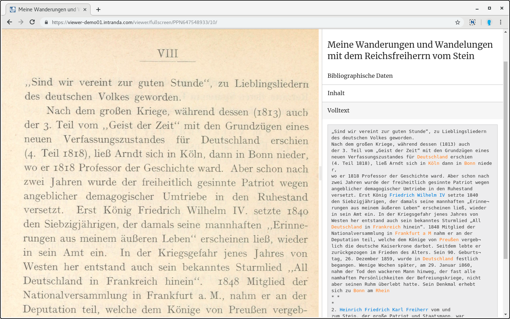
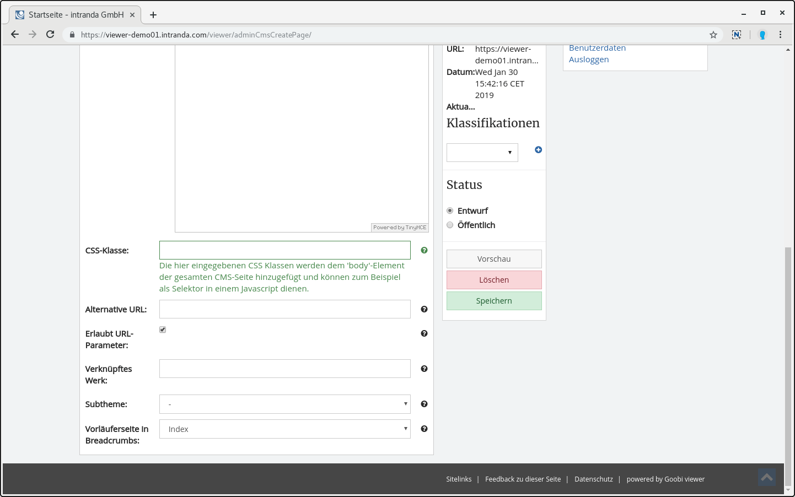

# Januar

Das neue Jahr ist mit frischer Energie in die Goobi viewer Entwicklung gestartet und es gibt im Januar so einiges zu Berichten.

Zuallererst möchten wir an dieser Stelle aber einmal die tolle Social Media Arbeit auf Twitter von dem Team hinter der Digitalen Landesbibliothek Berlin erwähnen. Ohne weiteren Kommentar eine uneingeschränkte \#followfriday \#ff Empfehlung für den Account der [@zlb\_digital](https://twitter.com/zlb_digital)!

Im Januar gab es zwei Updates von Goobi viewer Instanzen:

* Die digitalen Sammlungen des Ibero-Amerikanische Instituts Preußischer Kulturbesitz

  [https://digital.iai.spk-berlin.de/](https://digital.iai.spk-berlin.de/)

* SULB digital! - die Digitalisierungsplattform der Saarländischen Universitäts- und Landesbibliothek

  [http://digital.sulb.uni-saarland.de/](http://digital.sulb.uni-saarland.de/)

## Entwicklungen

### IIIF Change Discovery API

Der Goobi viewer implementiert nun neben der IIIF Image API und der IIIF Presentation API auch die IIIF Change Discovery API. Damit ist es nun möglich Änderungen an den Manifesten des Datenbestandes zu verfolgen. Die API steht unter der folgenden URL zur Verfügung:

* `/viewer/rest/iiif/discovery/activities`

Es gibt Abweichungen zur offiziellen Spezifikation. Ursache ist, dass sich diese noch im DRAFT Status befindet und dort bereits die Version 3 der IIIF Presentation API berücksichtigt. Der Goobi viewer hat bisher die stabile Version 2.1 der Presentation API implementiert. Deswegen gibt es drei kleinere Anpassungen in den einzelnen Seiten beim orderedItems.object:

| Spezifikation | Implementierung im Goobi viewer |
| :--- | :--- |
| `orderedItems.object.id` | `orderedItems.object.@id` |
| `orderedItems.object.type` | `orderedItems.object.@type` |
| `Manifest`  \(innerhalb von `orderedItems.object.@type`\) | `sc:Manifest` |

Sobald die IIIF Presentation API 3.0 stabil veröffentlicht wird, werden wir im Goobi viewer die Unterstützung sicherstellen und auch die Change Discovery API anpassen.

### IIIF Snippets

* Ein Presentation Manifest kann nun auch eine optionale Beschreibung enthalten. Dafür kann eine Liste an potentiellen Solr-Feldern definiert werden. Die Beschreibung selbst wird dann aus dem ersten gefüllten Feld genommen. Siehe auch [Kapitel 2.33.2](../../konfiguration-core/web-api/iiif.md).
* In der Vergleichsansicht werden die Annotationsicons ausgeblendet, da diese Funktionalität dort nicht zur Verfügung steht.
* Bei LIDO Objekten wird jetzt korrekt auf das LIDO Quelldokument verwiesen.

### neue Vollbildanzeige

Bereits vor einiger Zeit wurde ein Lesemodus für den Goobi viewer entwickelt. Mit der Zeit entwickelten sich verschiedene Varianten dieser Lösung und kamen in verschiedenen Themes zum Einsatz. Es blieben aber immer Insellösungen und sind nicht für alle in den stabilen Core eingeflossen. Das haben wir im Januar geändert.   
Der Lesemodus wurde komplett neu entwickelt und mit zusätzlichen Funktionen wie einer neuen Thumbnailanzeige ausgestattet. In der Seitenleiste sind neben den Bibliographischen Daten unter anderem auch der Strukturbaum und der Volltext der aktuellen Seite sichtbar. Dadurch ist es erstmals eine synoptische Anzeige von Bild und dazugehörigem Volltext möglich. Die obere Navigationsleiste blendet sich nach fünf Sekunden Inaktivität mit der Maus automatisch aus.   
Zur Übernahme der Entwicklung für alle Anwender haben wir uns dazu entschlossen den neuen Lesemodus als neue Vollbildanzeige zu integrieren. Dadurch steht dieses Feature mit einem Update sofort zur Verfügung.

Hier ein paar Impressionen:

### CMS

Im CMS-Bereich hat es folgende Änderungen gegeben:

* Bei einer FAQ Übersichtsseite ist es möglich direkt auf einen Beitrag zu verweisen. Dafür wird neben dem Titel ein Icon für eine URL angezeigt. Wird diese verwendet scrollt der Browser direkt zu dem Beitrag und klappt diesen auf.
* Die Inline-Hilfe die beim Anlegen oder Bearbeiten von CMS Seiten für die Funktionen im unteren Seitenbereich zur Verfügung stehen wurden überarbeitet
* Für eine CMS Seite kann nun optional eine CSS Klasse gesetzt werden um in einem Javascript eine CMS-Seite eindeutig identifizieren zu können.

### Browser Caching

Der im Goobi viewer verwendete ContentServer hat Unterstützung für besseres Browser Caching von Bildern bekommen. Diese werden nun mit einem ETag ausgeliefert. Fragt ein Web-Browser eine Bild-Ressource an schickt dieser - sofern bekannt - einen ETag mit. Ist diese dem ContentServer bekannt und hat sich das dazugehörige Bild nicht geändert antwortet der ContentServer ab jetzt mit einem HTTP 304 \(Not Modified\). Dann muss das Bild nicht neu geladen werden, sondern der Browser nimmt es aus seinem lokalen Cache. Das führt in der Praxis zu einem schnelleren Seitenaufbau.

### Sprachumschaltung und Übersetzungen

Bisher gab es bei der Sprachumschaltung im Werk verschiedene Einschränkungen, die jetzt behoben wurden. So wurden Metadaten nicht direkt nach der Sprachumschaltung mit übersetzt sondern man musste die Seite ein zweites Mal laden. Strukturelemente ohne Titel im Inhaltsverzeichnis wurden sogar gar nicht neu übersetzt, sondern sie behielten die Sprache, mit der das Werk geöffnet wurde. Der Fall, dass ein Nutzer permanent zwischen verschiedenen Sprachen hin- und herwechselt ist auch äußerst selten sondern das Tritt in der Regel nur während des Testens auf. Trotzdem freuen wir uns sehr über diesen Bugfix, der die Unterstützungen für mehrsprachige Struktur- und Metadaten noch einmal signifikant verbessert.

Außerdem wurden die Übersetzungen für Englisch und Spanisch überarbeitet und vervollständigt.

### Zugriffslizenzen

Bei den Zugriffslizenzen gab es eine speziellere Entwicklung bei der Definition von Bedingungen. Bisher konnten nur Solr-Queries als Bedingungen definiert werden um damit zum Beispiel eine Moving-Wall zu realisieren oder den PDF-Download auf bestimmte Dateinamen einzuschränken. Neuerdings kann als Bedingung hier auch mit `FILENAME:{REGEX}` ein regulärer Ausdruck definiert werden um in Kombination mit dem Recht "Dateien herunterzuladen" die Downloadmöglichkeit von Dateien anhand des Dateinamens zu steuern.

Liegt im \_source Ordner ein oder mehrere Dateien die mit INTERN beginnen, so können diese über die Bedingung `FILENAME:{INTERN_.*}` gegriffen und zum Beispiel nur aus dem internen Netz verfügbar gemacht werden. Siehe auch [Kapitel 6.9.1](../../anwendungsszenarien/konfiguration-der-zugriffsbeschraenkung/lizenztypen.md).

### Normalisierung von Sortierfelder

Der Goobi viewer Indexer kann nun Zahlenwerte in Zeichenketten normalisieren um diese für eine korrekte Sortierung aufzubereiten. Siehe auch [Kapitel 3.7.17](../../konfiguration-indexer/weitere-optionen.md#3-7-17-parameter-normalizevalue).

