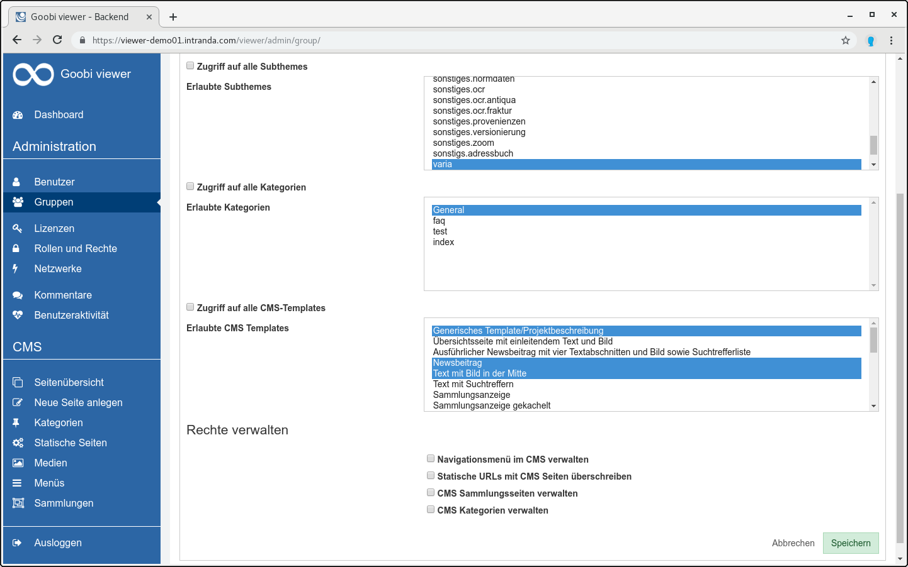
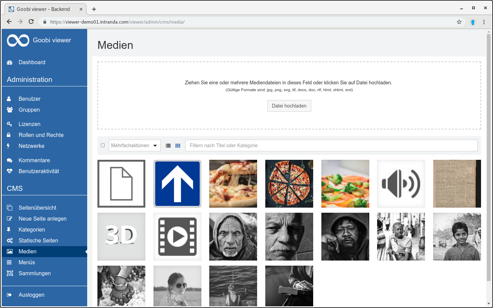
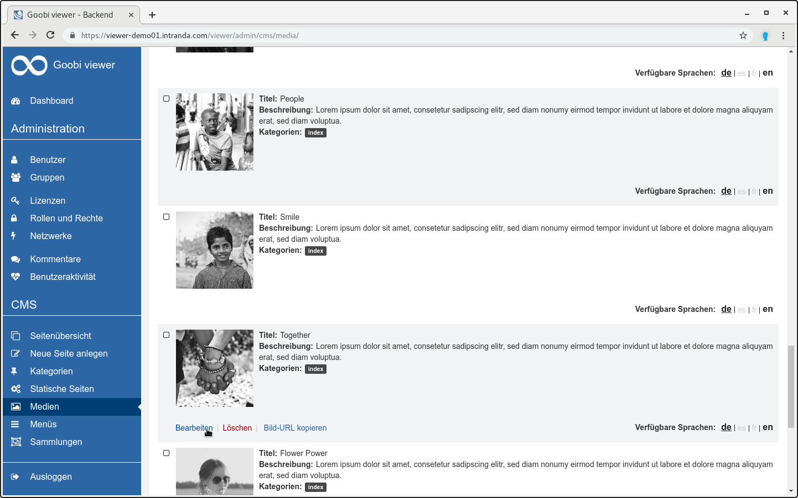
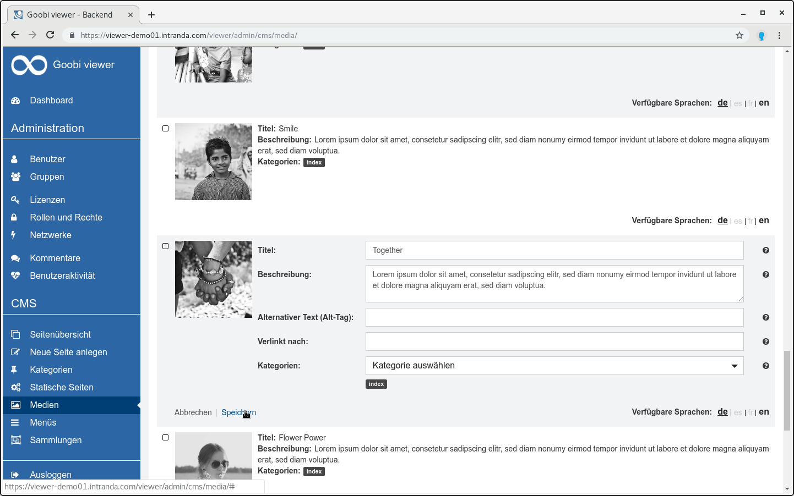
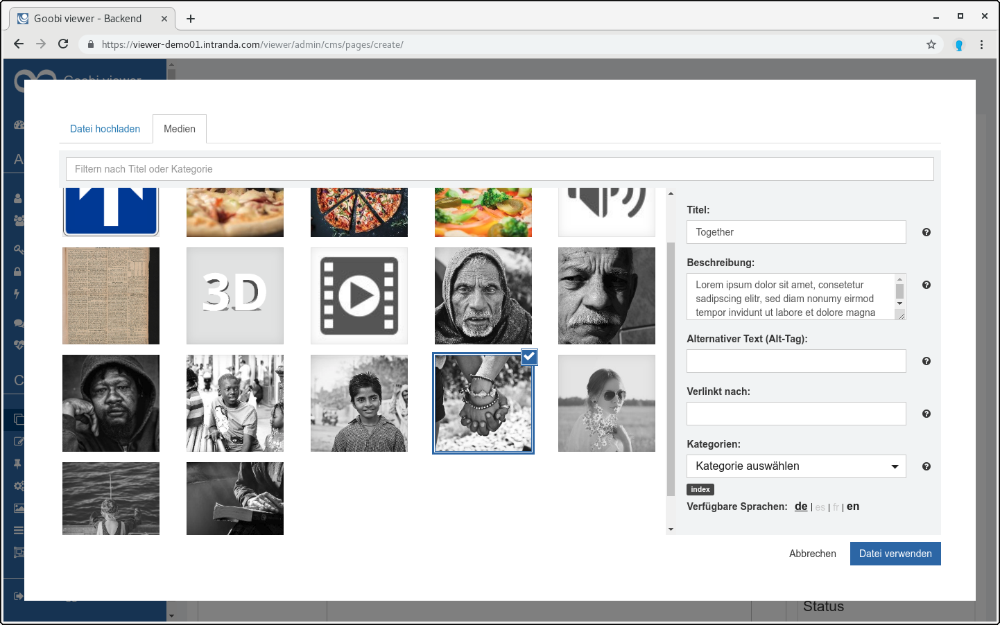
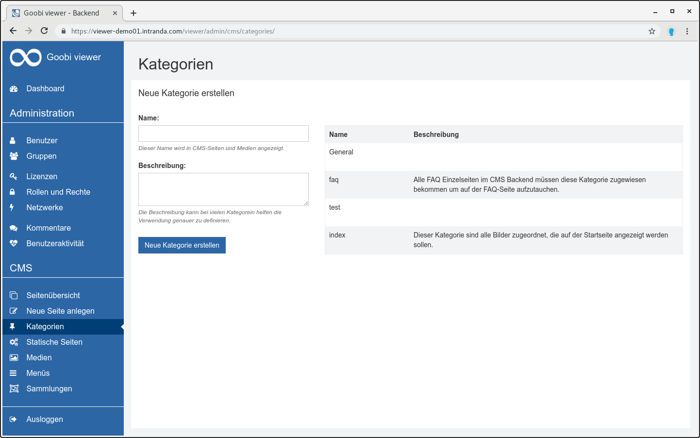
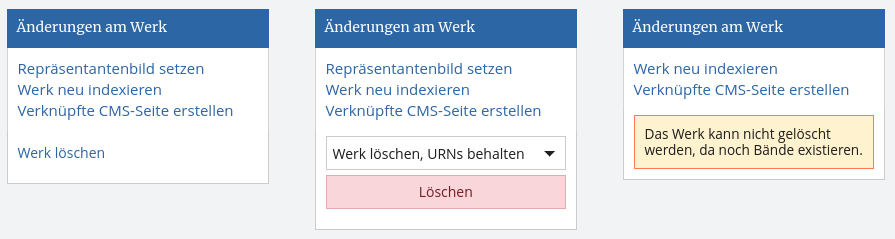

# März

Es ist wie immer viel passiert im vergangenen Monat. So wurde zum Beispiel der Goobi viewer der Universitätsbibliothek Stuttgart aktualisiert und die Installation der Vorarlberger Landesbibliothek in Bregenz in Betrieb genommen. Die beiden Instanzen können unter den folgenden URLs gefunden werden:

* **Digibus** der Universitätsbibliothek Stuttgart: [https://digibus.ub.uni-stuttgart.de](https://digibus.ub.uni-stuttgart.de)
* **volare texte** der Vorarlberger Landesbibliothek: [https://texte.volare.vorarlberg.at/viewer/](https://texte.volare.vorarlberg.at/viewer/)

Besonders erwähnenswert sind auch die Entwicklungen die rund um das CMS stattgefunden haben. Klassifikationen und Tags wurden zu Kategorien zusammengeführt und können direkt in der Weboberfläche bearbeitet werden. Der Medienbereich wurde neu gestaltet und endlich ist es möglich auch Dateien während der Bearbeitung einer Seite hochzuladen. Das Rollen- und Rechtekonzept wurde auf den CMS Bereich ausgedehnt, so dass die Bearbeitung von CMS-Seiten nicht mehr ausschließlich durch Administratoren erfolgen muss. Mehr dazu weitere spannende Dinge in den folgenden Abschnitten.

## Entwicklungen

### Authentifizierung

Benutzeraccounts können jetzt in Abhängigkeit der jeweiligen Authentifizierungsmethode automatisch zu Gruppen hinzugefügt werden.   
Ist zum Beispiel konfiguriert, dass der Goobi viewer gegen die Nutzerdatenbank des Bibliothekskatalogs authentifiziert, können alle Benutzer die einen Account im Katalog haben auch automatisch Mitglied einer bestimmten Gruppe im Goobi viewer werden. Im Zusammenspiel mit den Zugriffsbeschränkungen können dann zum Beispiel diesen Benutzern bestimmte Rechte zum Betrachten von Werken eingeräumt werden, die nicht Bibliotheksnutzern verwert bleiben.  
Siehe auch [Kapitel 2.5](../../konfiguration-core/benutzeraccounts/) und dazugehörige Unterkapitel.

### OpenSearch

Der Goobi viewer unterstützt jetzt den OpenSearch Standard. Damit ist es möglich einfacher in den Datenbeständen einer Instanz zu suchen. In der Omnibar von Google Chrome wird automatisch eine Suche angeboten wenn hinter dem Domainnamen Tab gedrückt wird. In Firefox signalisiert das kleine grüne Plus an der Lupe im Feld für die Suchmaschinen die Verfügbarkeit. Für die Konfiguration siehe auch [Kapitel 2.34](../../konfiguration-core/2.34-opensearch.md). 

### Inline-Hilfe und Validierung im CMS

Aus der Community kam der Hinweis, dass eine Validierung der Eingaben und eine überarbeitete Inline-Hilfe im Admin-Backend die Arbeit erleichtern würde. Deswegen haben wir diesen Monat mit der Umsetzung begonnen und an zwei Stellen eine automatische Validierung der Eingaben hinzugefügt. Auch erste Hilfetexte wurden überarbeitet. Überprüft wird ab jetzt, ob eine eingegebene Solr-Query valide ist und Treffer zurückliefert oder ob ein verknüpftes Werk auch existiert.

### Lizenzen vs. Rollen und Rechte

Der bisherige Bereich der Lizenzen wurde in zwei Punkte aufgesplittet:

1. **Lizenzen**: Konfiguration von Zugriffsbeschränkungen für einzelne Werke
2. **Rollen und Rechte**: Konfiguration von Rechten, die Funktionen in der Benutzeroberfläche freigeben

Diese Aufteilung ist der erste Schritt um in den Bereich weiter zu verändern. Wir haben Pläne um dort in den kommenden Monaten in Hinblick auf Struktur, Bedienbarkeit und Optik und Bedienbarkeit weiter zu arbeiten.

### CMS über Rechte steuerbar

Bisher war die Bearbeitung von CMS Inhalten nur Administratoren vorbehalten. Diese Einschränkung ist mit der Erweiterung des Rechtemanagements auf den CMS-Bereich aufgehoben. Benutzern und Nutzergruppen können ab jetzt mit Rechten für das CMS ausgestattet werden. Dabei besteht die Möglichkeit den gesamten Bereich freizugeben oder auch nur Teile in eingeschränkter Form.

Zur Verfügung stehen:

* Einschränken auf bestimmte Subthemes
* Einschränken auf bestimmte Kategorien
* Einschränken auf bestimmte CMS-Templates
* Verwalten des Navigationsmenüs
* Verwalten der statischen URLs
* Verwalten der Sammlungen
* Verwalten der Kategorien

### Medien

Komplett überarbeitet wurde der Medienbereich. Zielvorgabe war die Bedienbarkeit zu verbessern, Klicks zu reduzieren und schmerzlich vermisste Funktionen in dem Kontext zu entwickeln. Deswegen ist es zum Beispiel ab jetzt möglich mehrer Bilddateien auf einmal hochzuladen oder auch zu löschen. Außerdem können endlich direkt beim Bearbeiten einer CMS-Seite neue Bilder hochgeladen werden.

Hier ein paar Impressionen:

### Klassifikation + Tags = Kategorien

Bisher standen für Mediendateien Tags zur Verfügung. Nach diesen Tags konnte gefiltert oder alle Mediendateien mit bestimmten Tags auf einer CMS-Seite angezeigt werden. Die Namen der Tags war frei wählbar.   
Auf CMS-Seiten stand eine vergleichbare Funktionalität unter dem Namen Klassifikation zur Verfügung. Dabei wurden Klassifikationen aber nicht frei vergeben, sondern in der Goobi viewer Konfigurationsdatei eine Liste möglicher Werte hinterlegt.

Komplett neu ist jetzt der Bereich der Kategorien. Er löst die bisherigen Klassifikationen und Tags ab. Alte Einträge werden automatisch zu Kategorien migriert und umgewandelt.

Im Backend steht eine Seite zur Verfügung auf der die Kategorien verwaltet werden. 

### Werk löschen aus dem viewer

Werke können nun direkt aus der Goobi viewer Oberfläche gelöscht werden. Dafür steht in dem Widget "Änderungen am Werk" eine neue Option zur Verfügung. Wenn URNs existieren kann ausgewählt werden, ob das Werk entfernt und URNs beibehalten werden, oder das Werk vollständig gelöscht werden soll. Diese Funktionalität steht nur Administratoren zur Verfügung.

### Indexer: Buffer bei Data-Repositories

Neben verschiedenen Bugfixes hat der Goobi viewer Indexer eine neue Funktionalität bei den Data-Repositories erhalten. Bei der `RemainingSpaceStrategy` kann nun mit dem optionalen `buffer` Attribut ein Speicherpuffer definiert werden, der auf dem Speicherbereich ungenutzt bleiben soll. Siehe auch [Kapitel 3.2.6](../../konfiguration-indexer/verzeichnisse.md#3-2-6-parameter-datarepositories-datarepository).

