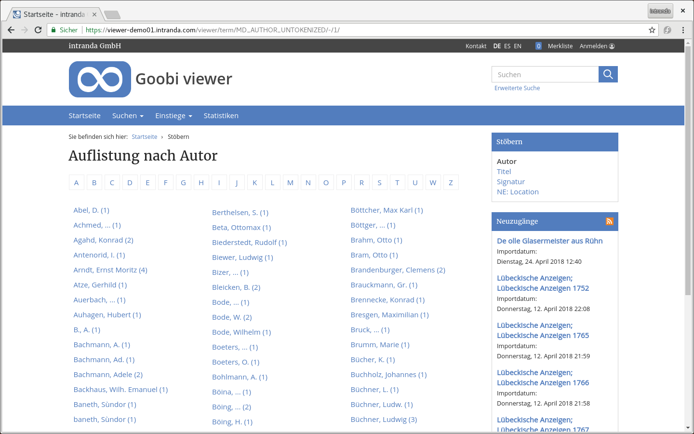

# 2.19.7 Stöbern

Die Stöbern-Funktion ermöglicht es, über ein bestimmtes Metadatum den gesamten Datenbestand aufgelistet zu bekommen, zum Beispiel den Titel oder Namen des Autors. Klickt man einen Link an, werden alle im Datenbestand vorhandenen Werte aufgelistet.



Beim Anklicken eines Wertes wird eine normale Suche ausgelöst, die alle Vorkommnisse dieses Wertes zurückliefert.

Folgende Konfigurationsmöglichkeiten stehen für die Stöbern-Funktion zur Verfügung:

```markup
<browsingMenu>
    <enabled>true</enabled>
    <hitsPerPage>70</hitsPerPage>
    <luceneField>MD_AUTHOR_UNTOKENIZED</luceneField>
    <luceneField sortField="SORT_TITLE" recordsAndAnchorsOnly=”true” docstructFilters="Monograph;Volume;PeriodicalVolume">MD_TITLE_UNTOKENIZED</luceneField>
    <luceneField>MD_SHELFMARK</luceneField>
</browsingMenu>
```

| **Option** | Beschreibung |
| :--- | :--- |
| **enabled** | Schaltet das Stöbern-Menü ein beziehungsweise ab \(Standardwert ist false\) |
| **hitsPerPage** | Anzahl der Werte, die pro Seite angezeigt werden sollen \(Standardwert ist 50\) |
| **luceneField** | Metadatenfelder aus dem Index, über die gestöbert werden darf. Pro Eintrag wird je ein neuer Link im Menü angezeigt \(Bezeichnung in `messages.properties` nicht vergessen\). Zu beachten ist außerdem, dass nur Solr Felder, die nicht als `tokenized` indexiert sind, verwendet werden dürfen, da ansonsten beispielsweise statt vollständiger Titel nur einzelne Wörter angezeigt werden\). |

Die Sortierung kann durch die Verwendung des optionalen Attributs `sortField` über ein separates Sortierfeld gemacht werden, um etwa für die Sortierung irrelevante Teile eines Titels nicht zu berücksichtigen. Wie für ein Metadatenfeld automatisch ein Sortierfeld generiert werden kann, wird in [Kapitel 3.5.1](../../konfiguration-indexer/weitere-optionen.md#3-5-1-parameter-addsortfield). beschrieben.

Zusätzlich kann für die Stöbern-Funktion über ein Feld ein Filter eingerichtet werden, bei dem nur Werte aus bestimmten Strukturtypen zugelassen werden \(etwa nur Titel von Hauptwerken\). Dazu wird das Attribut `docstructFilters` hinzugefügt, das gewünschte Strukturtypen \(jeweils durch ein Semikolon getrennt\) enthält. Die Groß-/Kleinschreibung des jeweiligen Strukturtyps muss der Schreibweise im Index entsprechen. Das Attribut `recordsAndAnchorsOnly=“true“` bewirkt, dass nur Begriffe aus obersten Strukturelementen sowie Anchor-Elementen gefunden wernen, was unter Umständen zu erheblichen Verbesserungen der Ladezeiten führen kann. Die Einschränkung über `docstructFilters` findet in diesem Fall zusätzlich statt.

Es kann auch nur in einzelnen Sammlungen gestöbert werden. Diese Option kann nicht konfiguriert, aber über die URL - zum Beispiel auf CMS Seiten - direkt gebaut werden. Der Aufbau der URL ist wie folgt:

```text
https://viewer.example.org/viewer/term/STOEBERNFELDNAME/DC:kollektionsname/-/1/
```

