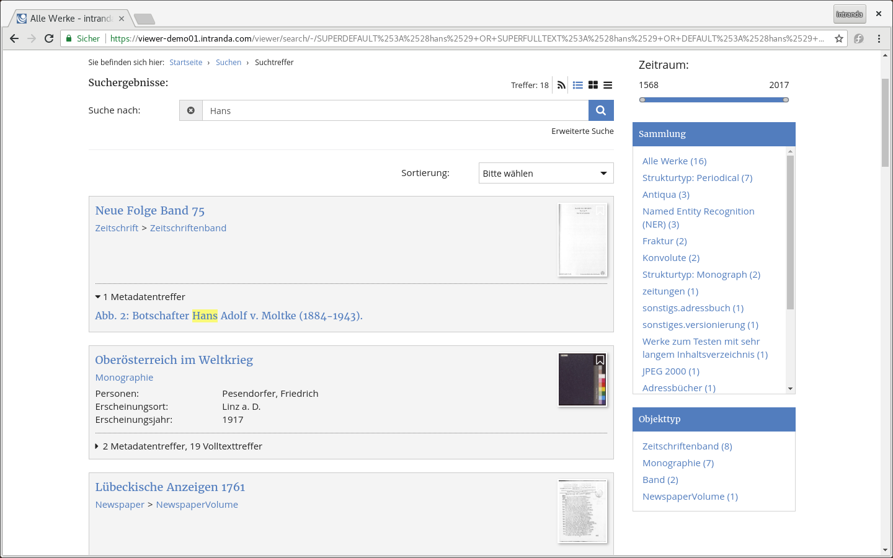

# 2.17.2 Facettierung

Es findet automatisch eine Facettierung über die Suchtreffer statt. Die Konfiguration ist wie folgt:

```markup
<search>
    <drilldown>
        <hierarchicalField initialElementNumber="4">DC</hierarchicalField>
        <field initialElementNumber="3">DOCSTRCT</field>
        <field initialElementNumber="3" sortOrder="alphabetical_asc">MD_CREATOR </field>
        <field initialElementNumber="3">MD_PLACEPUBLISH </field>
        <field initialElementNumber="3" sortOrder="numerical_desc">YEAR</field>
    </drilldown>
</search>
```

Es lassen sich über `<field>` Elemente beliebig viele zusätzliche Indexfelder für die Facettierung definieren. Zu beachten ist, dass hierfür Felder mit dem Präfix `FACET_` im Index existieren sollten, da diese aufgrund Ihrer Konfiguration hierfür effizienter verarbeitet werden. Felder mit dem Präfix `FACET_` werden während der Indexierung automatisch für alle `MD_*` Felder sowie für `DC`, `DOCSTRCT`, `CENTURY` und `YEAR` generiert. Konfiguriert sollten dennoch die regulären Feldbezeichnungen – die speziellen Facettierungsfelder werden intern automatisch verwendet. 

Felder, die hierarchisch dursucht werden \(zum Beispiel `DC`\) sollten als `<hierarchicalField>` konfiguriert werden. Das Attribut `initialElementNumber=""` definiert die Anzahl der nach einer Suche anfänglich angezeigten Facettierungswerte. Alle weiteren werden angezeigt, indem das betreffende Facettierungselement aufgeklappt wird.\). Über das Attribut `sortOrder=""` kann die initiale Sortierung innerhalb der Facettierung gesetzt werden. Mögliche Werte sind `alphabetical_asc`, `alphabetical_desc`, `numerical_asc` und `numerical_desc`. Ist keine sortOrder gesetzt, wird automatisch nach Vorkommen der Treffer absteigend sortiert. Die Reihenfolge in der Konfigurationsdatei spiegelt die Reihenfolge in der Oberfläche wieder. Wird das Feld YEAR definiert, so wird dieses in Form eines Sliders in der Oberfläche angezeigt.




