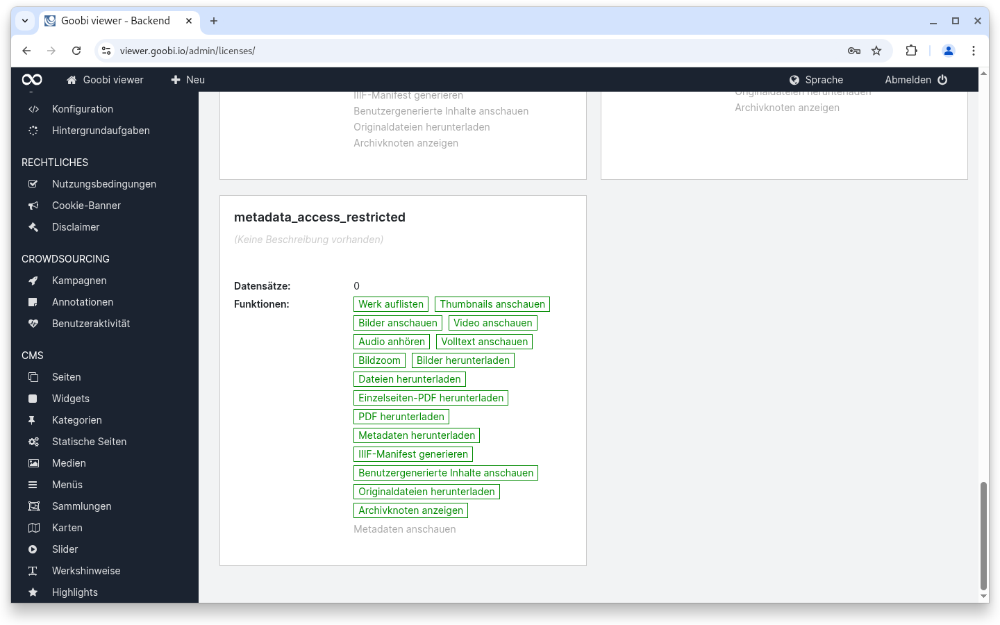
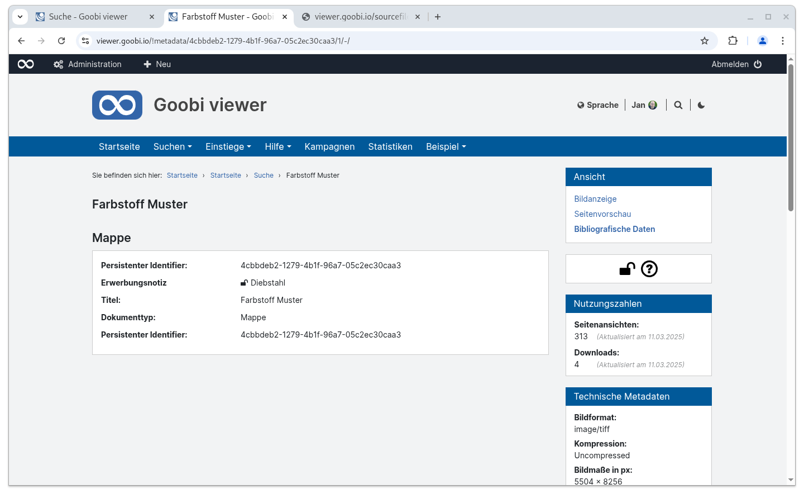

# 1.14 zugriffsbeschränkte Metadaten

## Allgemein

Der Goobi viewer unterstützt ab der Version 24.12 auch zugriffsbeschränkte Metadaten innerhalb einer METS/MODS Datei. Um diese von vorne bis hinten zu konfigurieren ist dies hier als Anwendungsfall dokumentiert.

### Goobi workflow

Damit ein Metadatum mit Zugriffsbeschränkung geschützt werden kann muss die Funktionalität im Regelsatz mit dem Attribut `allowAccessRestriction="true"` aktiviert werden:

```xml
<MetadataType allowAccessRestriction="true">
    <Name>Acquisition</Name>
    <language name="en">Acquisition note</language>
    <language name="de">Erwerbungsnotiz</language>
</MetadataType>
```

Im Metadateneditor kann die Zugriffsbeschränkung anschließend über einen Toggle des Schloss-Icons aktiviert oder deaktiviert werden.&#x20;

Wenn ein Metadatum geschützt ist, wird dies im exportierten MODS über das Attribut `shareable="no"` angezeigt:

```xml
<mods:note type="acquisition" shareable="no">Diebstahl</mods:note>
```

### Goobi viewer Indexer


Zugriffsbeschränkte Metadaten **müssen** gruppiert indexiert werden.


Der Goobi viewer Indexer erkennt anhand des Attributs die Zugriffsbeschränkung automatisch und setzt hierfür den Wert **metadata\_access\_restricted**. Nachfolgend eine exemplarische Feldkonfiguration für die Indexierung:



```xml
<MD_ACQUISITION>
    <list>
        <item>
            <xpath>mets:xmlData/mods:mods/mods:note[@type="acquisition"]</xpath>
            <addToDefault>true</addToDefault>
            <onefield>false</onefield>
            <groupEntity type="OTHER">
                <field name="MD_VALUE">text()</field>
            </groupEntity>
        </item>
    </list>
</MD_ACQUISITION>
```



### Goobi viewer Core

Für die Freischaltung im Goobi viewer Core gibt es verschiedene Dinge zu beachten. Einerseits muss das Metadatum für die Anzeige an der gewünschten Stelle konfiguriert werden:



```xml
<metadata label="MD_ACQUISITION" group="true">
    <param key="MD_VALUE" type="field" />
</metadata>
```



Andererseits muss im Backend die Zugriffsbeschränkung ohne das Recht "Metadaten anschauen" konfiguriert werden:

<figure><figcaption><p>konfigurierte Zugriffsbeschränkung ohne das Recht "Metadaten anschauen"</p></figcaption></figure>

Im Frontend werden zugriffsbeschränkte Metadaten, sofern man das Recht hat diese zu betrachten und sie angezeigt werden, mit einem offenen Schlosssymbol gekennzeichnet:

<figure><figcaption><p>Anzeig eines zugriffsbeschränkten Metadatums auf der Seite "Bibliographische Daten" im Goobi viewer Frontend</p></figcaption></figure>

Außerdem wird bei der Auslieferung der METS/MODS Datei ein XSLT angewendet, dass die zugriffsbeschränkten Metadaten entfernt. Die Datei [METS\_filter.xsl](https://github.com/intranda/goobi-viewer-core-config/blob/develop/goobi-viewer-core-config/src/main/resources/install/METS_filter.xsl) muss dafür im Verzeichnis `/opt/digiverso/viewer/config/` vorhanden sein werden.

Das dieses XSLT angewendet wurde kann daran erkannt werden, dass in der ersten Zeile der ausgelieferten METS/MODS Datei folgender Kommentar steht: `<!-- XSLT was applied... -->`&#x20;
