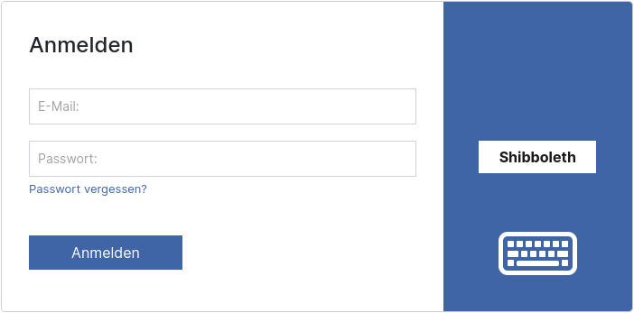

# 1.14 Shibboleth

## Allgemein

Die Implementierung der Authentifizierung ist im Goobi viewer und Goobi workflow prinzipiell ähnlich. Trotzdem gibt es die folgenden Unterschiede:

In Goobi workflow wird die gesamte Applikation gesichert und im Goobi viewer natürlich nur die Seiten, die eine vorherige Anmeldung benötigen.

In Goobi workflow muss ein Benutzeraccount vorher existieren und dann der Authentifizierungsart zugeordnet werden. Erst dann steht die Single-Sign-On Funktionalität zur Verfügung. Im Goobi viewer wird ein Account bei erfolgreicher Authentifizierung automatisch angelegt sofern dieser noch nicht existiert. Damit stehen alle Funktionalitäten ohne weitere Registrierung automatisch zur Verfügung. Nur für weitergehende Rechte, wie zum Beispiel dem Zugriff auf das Admin-Backend müssen manuell weitere Einstellungen geändert werden.

## Konfiguration


Die folgenden Abschnitte beziehen sich auf ein Ubuntu Linux, wie es auch in der Installationsanleitung beschrieben ist.


### shibd, Apache und Tomcat

Für die Installation reicht es aus, auf dem Server auf dem der Apache läuft, das Paket libapache2-mod-shib2 zu installieren. Das installiert alle notwendigen Abhängigkeiten mit:

```
apt install libapache2-mod-shib2
```

Anschließend ist die Konfiguration des shibd notwendig. In der Regel gibt es hier bereits in den Einrichtungen die Shibboleth einsetzen fertige Konfigurationen. Beachtung finden sollten vor allem die folgenden Dateien:

* /etc/shibboleth/**attribute-map.xml**
* /etc/shibboleth/**attribute-policy.xml**
* /etc/shibboleth/**shibboleth2.xml**
* /etc/shibboleth/**sp-metadata.xml**

In der `shibboleth2.xml` und der `sp-metadata.xml` sollte eine aussagekräftige `entityID` gesetzt werden, zum Beispiel `https://viewer.example.org/shibboleth`. In  der `shibboleth2.xml` ist das Attribut in dem Element `<ApplicationsDefaults />` gemeint, und in der `sp-metadata.xml` das Attribut in dem `<md:EntityDescriptor />` Tag.

In der `attribute-map.xml` muss dem Attribut mit der E-Mailadresse der Präfix `AJP_` vorangestellt werden. Nur diese Attribute werden von dem AJP Modul dann zum Tomcat übertragen. Das Attribut hat dann im Tomcat aber keinen Präfix. Hier ein Beispiel für einen Eintrag in der `attribute-map.xml`:

```xml
<Attribute name="urn:oid:1.2.3456.77777777.888.9.0" id="AJP_shib-email" />
```


Bei Ubuntu Linux 18.04 und Tomcat 9.0.16 sind in der server.xml keine weiteren Einstellungen notwendig. Ab Ubuntu Linux 20.04 und Tomcat 9.0.31 ist es notwendig im AJP Connector das Attribut mit der Einstelloption allowedRequestAttributesPattern explizit zu benennen.


Im Apache Webserver wird dann ein spezieller REST Endpoint vom Goobi viewer über die Shibboleth Authentifizierung gesichert:

```apacheconf
<Location "/api/v1/auth/header">
    Require shibboleth
    AuthType shibboleth
    ShibRequestSetting requireSession 1
</Location>
```

### Goobi viewer

In der lokalen config\_viewer.xml muss nun noch ein entsprechender [Authenticationprovider](../../conf/1/5/1.md) eingerichtet werden. Eine Beispielkonfiguration ist wie folgt:

```xml
<authenticationProviders>
    <provider type="httpHeader" 
              enabled="true" 
              name="Shibboleth" 
              parameterType="attribute" 
              parameterName="shib-email" 
              endpoint="https://viewer.example.org/api/v1/auth/header" />
</authenticationProviders>
```

Das **type** Attribut legt die gewünschte Authentifizierungsmethode fest. Mit dem **enabled** Schalter kann die Authentifizierung ein- und ausgeschaltet werden. Der **name** legt fest, was in dem Anmeldedialog in dem Button erscheinen soll. Mit dem **parameterType** wird spezifiziert ob ein HTTP Header oder eine Attribut ausgewertet werden soll. Im **parameterName** wird der Name des Headers oder des Attributs konfiguriert. Als **endpoint** wird die absolute URL zu dem im Apache gesicherten REST Endpoint angegeben.

## Anmeldung

Um die Anmeldung durchzuführen muss im Anmeldedialog auf den entsprechenden Provider-Button geklickt werden. In dem folgenden Screenshot "Shibboleth". Dieser verweist auf den konfigurierten Endpoint, dort übernehmen Apache und shibd die Authentifizierung und geben das Ergebnis auch an den Endpoint zurück. Der Goobi viewer übernimmt die Information, meldet den Benutzer an und leitet auf die Seite zurück auf der die Anmeldung initiiert wurde.

<figure><figcaption><p>Anmeldedialog mit aktivierter Shibboleth Authentifizierung</p></figcaption></figure>
