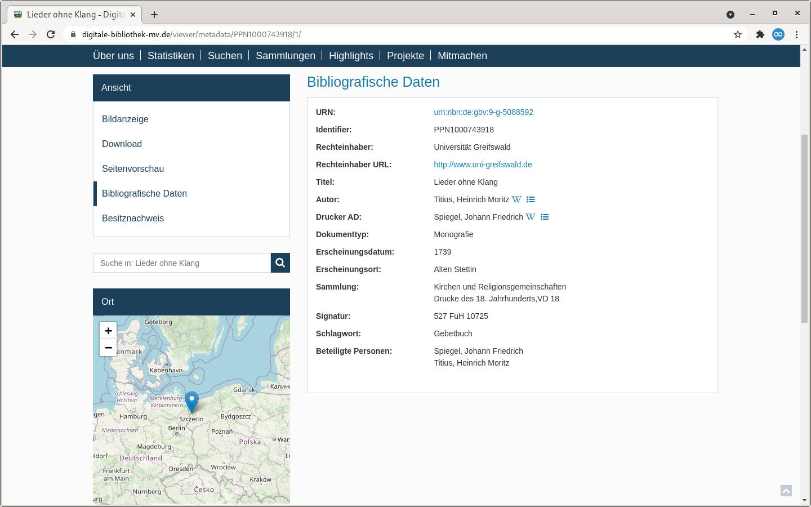
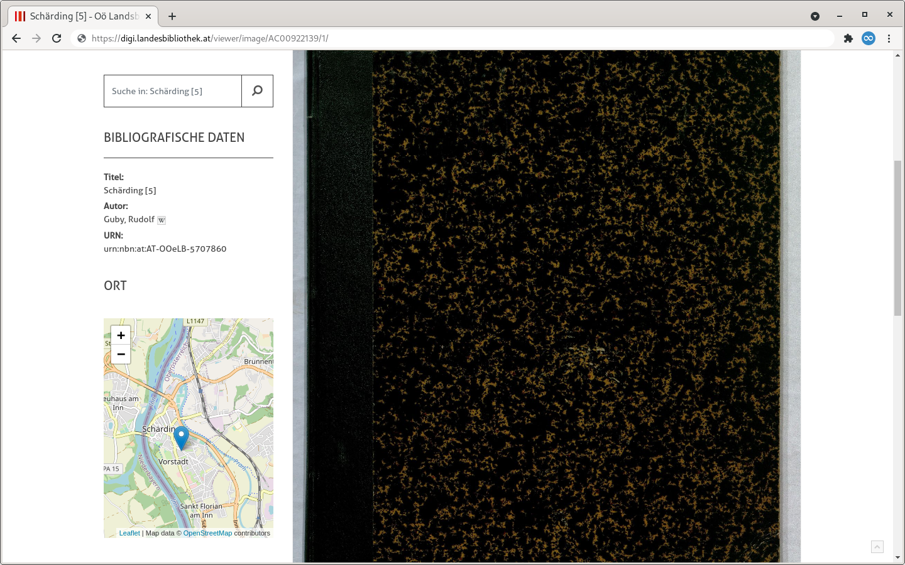
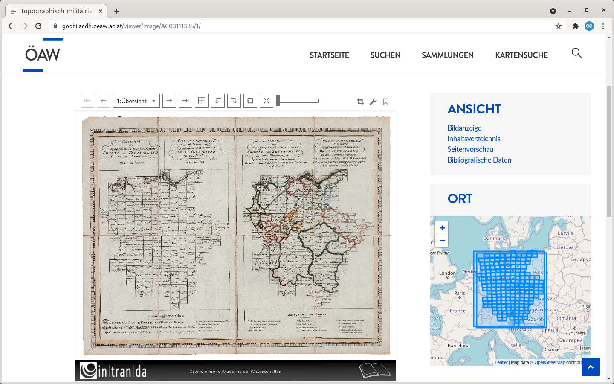

# 1.6 Karten

## Allgemein

Der Goobi viewer unterstützt die Darstellung von Koordinaten auf einer Karte. Bei der Erfassung, der Indexierung und der Anzeige gibt es dort verschiedene Möglichkeiten. Diese sind auf dieser Seite aufgeführt.

## Erfassen und Indexieren

### GND

Die einfachste Variante ist, wenn zum Beispiel ein Erscheinungsort gleich beim Import aus dem Katalog mit einem GND Datensatz verknüpft ist und dieser Koordinaten enthält.&#x20;

#### Goobi workflow



```markup
<!-- Definition -->
<MetadataType normdata="true">
    <Name>PlaceOfPublication</Name>
    <language name="de">Erscheinungsort</language>
    <language name="en">place of publication</language>
</MetadataType>

<!-- ... -->

<!-- MODS Export -->
<Metadata>
    <InternalName>PlaceOfPublication</InternalName>
    <WriteXPath>./mods:mods/mods:originInfo[1]/#mods:place/mods:placeTerm[@type='text']</WriteXPath>
</Metadata>

```



#### Goobi viewer Indexer&#x20;



```markup
<MD_PLACEPUBLISH>
    <list>
        <item>
            <xpath>mets:xmlData/mods:mods/mods:originInfo[not(mods:edition[text() = '[Electronic ed.]'])]/mods:place/mods:placeTerm[@type="text"]</xpath>
            <getchilds>all</getchilds>
            <addToDefault>true</addToDefault>
            <groupEntity type="LOCATION" addCoordsToDocstruct="true">
                <field name="MD_VALUE">text()</field>>
                <field name="NORM_URI">@valueURI</field>
            </groupEntity>
        </item>
    </list>
</MD_PLACEPUBLISH>
```



#### Beispiel

In einer exportierten METS/MODS Datei könnte die Auszeichnung eines Erscheinungsortes so aussehen und die Anzeige im Goobi viewer dann wie im folgenden Screenshot:

```markup
<mods:originInfo>
    <mods:place>
        <mods:placeTerm authority="gnd" authorityURI="http://d-nb.info/gnd/" type="text" valueURI="http://d-nb.info/gnd/4057392-8">Alten Stettin</mods:placeTerm>
    </mods:place>
</mods:originInfo>
```



### GeoNames

Metadaten können wie in der folgenden Konfiguration gezeigt auch mit der GeoNames Normdatenbank verknüpft werden.&#x20;

#### Goobi workflow



```markup
<!-- Definition -->
<MetadataType normdata="true">
    <Name>SubjectGeographic</Name>
    <language name="de">Geographisches Schlagwort</language>
    <language name="en">GeographicPerson</language>
</MetadataType>

<!-- ... -->

<!-- MODS Export -->
<Metadata>
    <InternalName>SubjectGeographic</InternalName>
    <WriteXPath>./mods:mods/mods:subject/#mods:geographic[@type="text"]</WriteXPath>
</Metadata>
```



#### Goobi viewer Indexer



```markup
<MD_SUBJECTGEOGRAPHIC>
    <list>
        <item>
            <xpath>mets:xmlData/mods:mods/mods:subject/mods:geographic</xpath>
            <getchilds>all</getchilds>
            <addToDefault>true</addToDefault>
            <groupEntity type="OTHER" addCoordsToDocstruct="true">
                <field name="MD_VALUE">text()</field>
                <field name="MD_DISPLAYFORM">text()</field>
                <field name="NORM_URI_VIAF">@valueURI</field>
            </groupEntity>
        </item>
    </list>
</MD_SUBJECTGEOGRAPHIC>
```



#### Beispiel

In einer exportierten METS/MODS Datei könnte die Auszeichnung des geographischen Schlagworts so aussehen und die Anzeige im Goobi viewer dann wie im folgenden Screenshot:

```markup
<mods:geographic type="text" valueURI="http://www.geonames.org/2766155">Schärding</mods:geographic>
```



### Latitude und Longitude

#### Separat erfasst

Wenn Koordinaten als Latitude und Longitude vorliegen können diese separat erfasst werden.

**Goobi** **workflow**



```markup
<!-- Definition -->
<MetadataType>
    <Name>locationNameDE</Name>
    <language name="de">Name DE</language>
    <language name="en">locationNameDE</language>
</MetadataType>
<MetadataType>
    <Name>locationLatitude</Name>
    <language name="de">Latitude</language>
    <language name="en">locationLatitude</language>
</MetadataType>
<MetadataType>
    <Name>locationLongitude</Name>
    <language name="de">Longitude</language>
    <language name="en">locationLongitude</language>
</MetadataType>

<Group>
    <Name>LocationGroup</Name>
    <language name="de">Ort</language>
    <language name="en">Location</language>
    <metadata>locationNameDE</metadata>
    <metadata>locationLatitude</metadata>
    <metadata>locationLongitude</metadata>
</Group>
        
<!-- ... -->

<!-- MODS Export -->
<Group>
    <InternalName>LocationGroup</InternalName>
    <WriteXPath>./mods:mods/mods:extension/#intranda:location</WriteXPath>
    <Metadata>
        <InternalName>locationNameDE</InternalName>
        <WriteXPath>./intranda:name[@language='ger']</WriteXPath>
    </Metadata>
    <Metadata>
        <InternalName>locationLatitude</InternalName>
        <WriteXPath>./intranda:latitude</WriteXPath>
    </Metadata>
    <Metadata>
        <InternalName>locationLongitude</InternalName>
        <WriteXPath>./intranda:longitude</WriteXPath>
    </Metadata>
</Group>
```



**Goobi viewer Indexer**

```markup
<MD_COORDINATES>
    <list>
        <item>
            <xpath>mets:xmlData/mods:mods/mods:extension/intranda:location</xpath>
            <addToDefault>true</addToDefault>
            <onefield>false</onefield>
            <geoJSONSource separator=" / " addSearchField="true">mods:coordinates/point</geoJSONSource>
            <groupEntity type="LOCATION">
                <field name="MD_VALUE">concat(intranda:longitude/text(), " / ", intranda:latitude/text())</field>
            </groupEntity>
        </item>
    </list>
</MD_COORDINATES>
```

**Beispiel**

Latitude und Longitude Informationen sind in MODS nicht vorgesehen, weswegen sie in einen eigenen Namespace exportiert werden. Die Anzeige erfolgt dann als Punktkoordinate wie oben bereits in Screenshots gezeigt

```markup
<mods:extension>
    <intranda:location>
        <intranda:name language="ger">Schönwalde</intranda:name>
        <intranda:latitude>53.586123100000002</intranda:latitude>
        <intranda:longitude>15.733848099999999</intranda:longitude>
    </intranda:location>
</mods:extension>
```

#### Gemeinsam erfasst

Latitude und Longitude können auch gemeinsam erfasst werden.

**Goobi workflow**



```markup
<!-- Definition -->
<MetadataType>
    <Name>Coordinates</Name>
    <language name="de">Koordinaten (Lat+Lon)</language>
    <language name="en">Coordinates (Lat+Lon)</language>
</MetadataType>

<!-- ... -->

<!-- MODS Export -->
<Metadata>
    <InternalName>Coordinates</InternalName>
    <WriteXPath>./mods:mods/mods:extension/intranda:cartographics/#intranda:coordinates</WriteXPath>
</Metadata>
```



**Goobi viewer Indexer**

Bei gemeinsam erfassten Metadaten werden die Werte bei der Indexierung an einem konfigurierten Separator aufgesplittet.



```markup
<MD_COORDINATES>
    <list>
        <item>
            <xpath>mets:xmlData/mods:mods/mods:extension/intranda:location/intranda:coordinates</xpath>
            <addToDefault>true</addToDefault>
            <onefield>false</onefield>
            <geoJSONSource separator=" / " addSearchField="true">intranda:coordinates/point</geoJSONSource>
        </item>
    </list>
</MD_COORDINATES>
```



**Beispiel**

Die Anzeige erfolgt dann als Punktkoordinate wie oben bereits in Screenshots gezeigt.

```markup
<mods:cartographics>
    <mods:coordinates>54.04592419999999 / 13.247582599999987</mods:coordinates>
</mods:cartographics>
```

### Bounding Box

Karten können nicht nur als Punkte, sondern auch als Bounding Box erfasst und angezeigt werden. Die Koordinaten können sehr einfach mit einem Bounding Box Tool von Klokantech ermittelt werden:



Unterhalb der Karte befindet sich ein Copy und Paste Feld für das MARC Feld 034. Der Inhalt der einzelnen Subfelder ist anhand des folgenden Beispiels erläutert:

```markup
# exemplarischer Feldinhalt für 034
$$dE0081339$$eE0083333$$fN0533708$$gN0532442

# Subfeldzuordnung
$d - westlichster Längengrad:  E0081339
$e - östlichster Längengrad:   E0083333
$f - nördlichster Breitengrad: N0533708
$g - südlichster Breitengrad:  N0532442
```

#### Goobi workflow



```markup
<!-- Definition -->
<MetadataType>
    <Name>CoordinatesWesternmostLongitude</Name>
    <language name="de">Koordinaten: westlichster Längengrad</language>
    <language name="en">Coordinates: westernmost longitude</language>
</MetadataType>
<MetadataType>
    <Name>CoordinatesEasternmostLongitude</Name>
    <language name="de">Koordinaten: östlichster Längengrad</language>
    <language name="en">Coordinates: easternmost longitude</language>
</MetadataType>
<MetadataType>
    <Name>CoordinatesNorthernmostLatitude</Name>
    <language name="de">Koordinaten: nördlichster Breitengrad</language>
    <language name="en">Coordinates: northernmost latitude</language>
</MetadataType>
<MetadataType>
    <Name>CoordinatesSouthernmostLatitude</Name>
    <language name="de">Koordinaten: südlichster Breitengrad</language>
    <language name="en">Coordinates: southernmost latitude</language>
</MetadataType>

<!-- ... -->

<!-- MODS Export -->
<Metadata>
    <InternalName>CoordinatesWesternmostLongitude</InternalName>
    <WriteXPath>./mods:mods/mods:subject/mods:cartographics/#mods:coordinates[@type='western']</WriteXPath>
</Metadata>
<Metadata>
    <InternalName>CoordinatesEasternmostLongitude</InternalName>
    <WriteXPath>./mods:mods/mods:subject/mods:cartographics/#mods:coordinates[@type='eastern']</WriteXPath>
</Metadata>
<Metadata>
    <InternalName>CoordinatesNorthernmostLatitude</InternalName>
    <WriteXPath>./mods:mods/mods:subject/mods:cartographics/#mods:coordinates[@type='northern']</WriteXPath>
</Metadata>
<Metadata>
    <InternalName>CoordinatesSouthernmostLatitude</InternalName>
    <WriteXPath>./mods:mods/mods:subject/mods:cartographics/#mods:coordinates[@type='southern']</WriteXPath>
</Metadata>
```



#### Goobi viewer Indexer



```markup
<MD_GPS_POLYGON>
    <list>
        <item>
            <xpath>concat(mets:xmlData/mods:mods/mods:subject/mods:cartographics/mods:coordinates[@type="western"], ' ', mets:xmlData/mods:mods/mods:subject/mods:cartographics/mods:coordinates[@type="eastern"], ' ', mets:xmlData/mods:mods/mods:subject/mods:cartographics/mods:coordinates[@type="northern"], ' ', mets:xmlData/mods:mods/mods:subject/mods:cartographics/mods:coordinates[@type="southern"])</xpath>
            <addToDefault>false</addToDefault>
            <addUntokenizedVersion>false</addUntokenizedVersion>
            <onefield separator="#SPACE#">true</onefield>
            <geoJSONSource addSearchField="true">sexagesimal:polygon</geoJSONSource>
        </item>
    </list>
</MD_GPS_POLYGON>
```



#### Beispiel

Die Punktkoordinaten sind einzeln ausgezeichnet und werden bei der Indexierung zu einem Rechteck aggregiert. In dem unten angezeigten Screenshot ist ein Atlas zu sehen bei dem die einzelnen Karten der Strukturelemente ebenfalls georeferenziert wurden.

```markup
<mods:cartographics>
    <mods:coordinates type="western">E0081339</mods:coordinates>
    <mods:coordinates type="eastern">E0083333</mods:coordinates>
    <mods:coordinates type="northern">N0533708</mods:coordinates>
    <mods:coordinates type="southern">N0532442</mods:coordinates>
</mods:cartographics>
```



## Suche über  URL

Seit der Version 4.6 unterstützt der Goobi viewer die Suche nach Koordinaten. Dabei lassen sich GML-Punkte und -Polygone (so wie in DenkXweb) sowie mods:coordinates als geoJSON indexieren und auf Karten darstellen. Weiter können Facettierungs-Queries für Suchen nach Punkten, Punkten im Polygon, Polygon-Überschneidungen direkt in der URL übergeben werden. Dazu werden die Koordinaten als WKT indexiert. \
Um die Facettierung möglichst vielseitig zu erlauben, muss die gesamte WKT-Query im Client (also etwa im JavaScript) formuliert werden. Beispiele sind:

* Suche nach Punkt:\
  `https://viewer.example.org/search/-/-/1/-/WKT_COORDS:"Intersects(POINT(9.86929194928373 51.8163517626803)) distErrPct=0"/`
* Enthalten im Polygon (zum Beispiel Punkte):\
  `https://viewer.example.org/search/-/-/1/-/WKT_COORDS:"IsWithin(POLYGON((0 0, 0 90, 90 90, 90 0, 0 0))) distErrPct=0"/`
* Teilweise enthalten in Polygon (zum Beispiel anderes Polygon):\
  `https://viewer.example.org/search/-/-/1/-/WKT_COORDS:"Intersects(POLYGON((0 0, 0 90, 90 90, 90 0, 0 0))) distErrPct=0"/`
* Nicht enthalten im Polygon:\
  `https://viewer.example.org/search/-/-/1/-/WKT_COORDS:"IsDisjointTo(POLYGON((0 0, 0 -90, -90 -90, -90 0, 0 0))) distErrPct=0"/`\


Weitere Informationen zur Indexierung stehen in [Kapitel 2.5](../../conf/2/5.md#geojsonsource) der Konfiguration des Goobi viewer Indexers.\


## Konfiguration

Damit indexierte Geokoordinaten auf einer Karte dargestellt werden können muss eine entsprechende Solr Query formuliert werden. Das können zum Beispiel alle Werke mit indexierten Geokoordinaten sein:

```markup
+BOOL_WKT_COORDS:true
```

Alternativ auch alle Werke, die Geokoordinaten in einem bestimmten Feld haben und einer Sammlung angehören:

```markup
+MD_COORDINATES:* +DC:archives*
```

Wichtig ist hier noch, dass die Felder in denen die Koordinaten indexiert wurden dem Goobi viewer bekannt gemacht werden. Dafür muss das Feld in folgenden Liste innerhalb der `config_viewer.xml` definiert sein:



```markup
<maps>
    <coordinateFields includeMetadataDocs="false">
        <field>MD_GEOJSON_POINT</field>
        <field>NORM_COORDS_GEOJSON</field>
    </coordinateFields>
</maps>
```



Das Attribut `includeMetadataDocs` legt fest, ob auch in SOLR Dokumenten vom Typ METADATA nach den konfigurierten Feldern gesucht werden soll, oder nur in Dokumenten vom Typ DOCSTRCT. Eine Aktivierung kann führt unter Umständen zu mehr gefundenen Koordinaten, kann aber die Ladezeit verlängern.

Weitere Möglichkeiten zur Konfiguration stehen in [Kapitel 1.36](../../conf/1/36.md) der Konfiguration des Goobi viewer Core.
