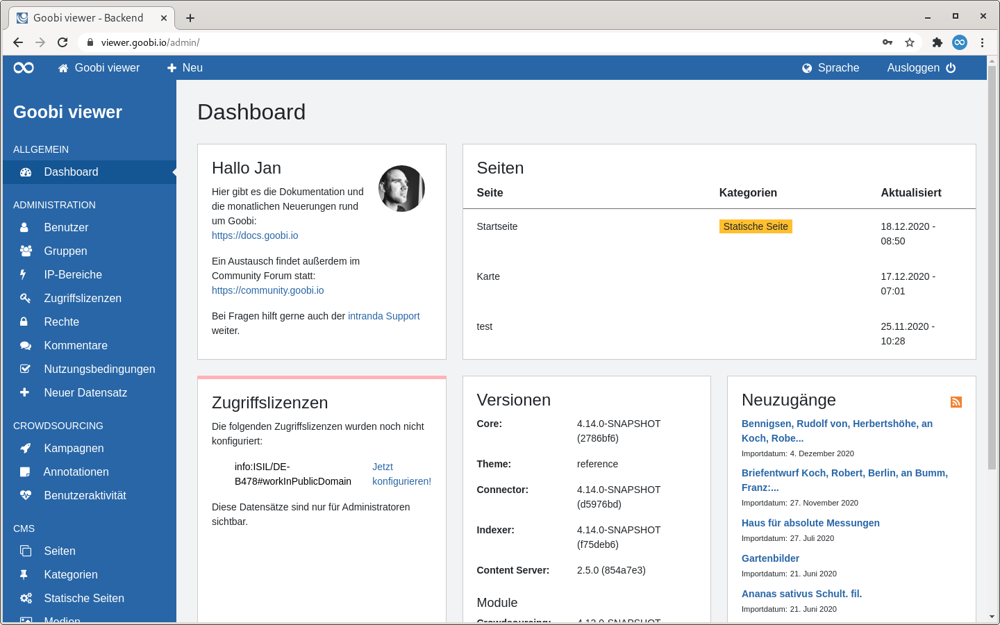
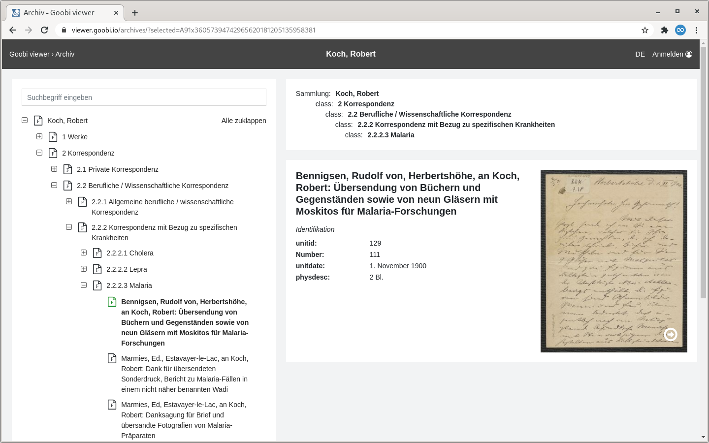
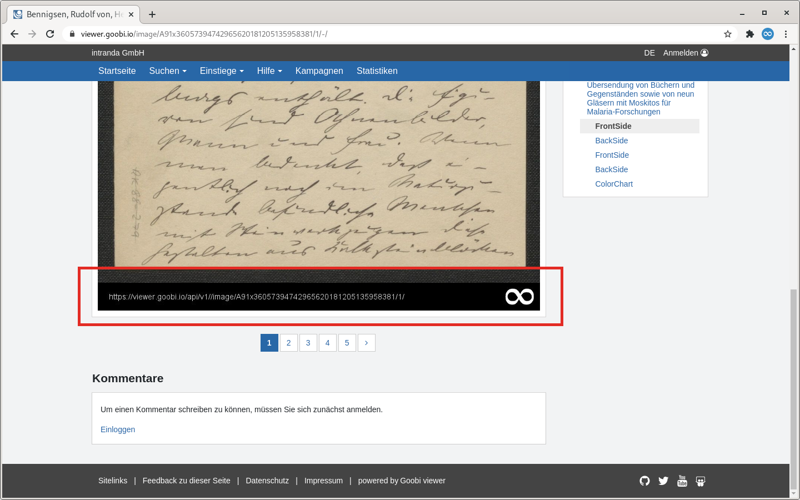
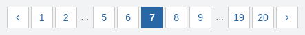
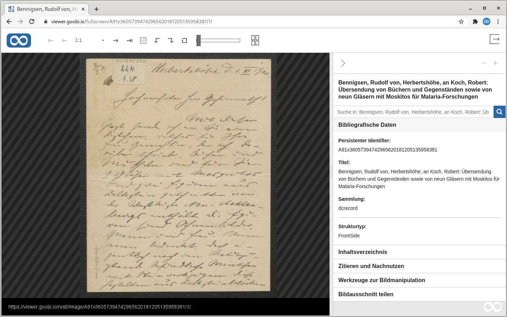

# 3. Glossar

## A

### Adminbackend

Das Adminbackend beschreibt eine Oberfläche, über die Teile der Inhalte und der Funktionalität des Goobi viewers webbasiert gesteuert werden können. Die Oberfläche steht nur Benutzeraccounts mit Administratorenrechten oder Benutzeraccounts mit erweiterten Rechten zum Beispiel für Kampagnen oder das CMS zur Verfügung.

Siehe dazu auch [Kapitel 2](../ui/2/) und Unterseiten in dem Bereich Oberfläche.

### Archivansicht

Die Archivansicht beschreibt eine Ansicht, die speziell für die Darstellung von Archivbeständen konzipiert wurde.

## B

### Bildfooter 

Siehe [Imagefooter](3.md#imagefooter).

### Bildspiegel

Siehe [Imagefooter](3.md#imagefooter).

## C

### Content Bereich

Bezeichnung für den Teil des Layouts in dem die Inhalte wie zum Beispiel Bilder, Volltexte, Suchergebnisse oder CMS-Inhalte angezeigt werden.

Siehe dazu auch [Kapitel 1](../ui/1.md) in dem Bereich Oberfläche.

### Crowdsourcing Modul

Mit dem Crowdsourcing Modul können Volltext Koordinaten erzeugt und bearbeitet werden. Die Bezeichnung steht in Abgrenzung zu den [Kampagnen](3.md#kampagnen). Das Modul ist kostenpflichtig.

## D

### digitale Kollektionen

Siehe [Sammlungen](3.md#sammlungen).

## F

### Footer

Bezeichnung für den Bereich ganz am Ende einer Seite. In dem Footer können zum Beispiel Öffnungszeiten, Kontaktangaben, Links zum Impressum oder Datenschutz angegeben werden.

Siehe dazu auch [Kapitel 1](../ui/1.md) in dem Bereich Oberfläche.

## H

### Header

Bezeichnung für den Bereich ganz am oben einer Webseite. In dem Header können zum Beispiel ein Logo, ein Titel und das Hauptmenü enthalten sein.

Siehe dazu auch [Kapitel 1](../ui/1.md) in dem Bereich Oberfläche.

## I

### Imagefooter

Der Imagefooter bezeichnet einen festen Bereich unterhalb des Bildes der in der Regel ein Logo und eine URL enthält. Der Bereich ist in dem folgenden Screenshot mit einem roten Kasten gekennzeichnet.

## K

### Kampagnen

Die Kampagnen beschreiben eine Funktionalität des Goobi viewers mit der Crowdsourcing realisiert werden kann. Dabei können Bildbereiche annotiert, Georeferenziert oder Metadaten ergänzt werden. Die Kampagnen sind komplett IIIF Konform und werden über das [Adminbackend](3.md#adminbackend) verwaltet.

Siehe dazu auch [Kapitel 2.3](../ui/2/3/) in dem Bereich Oberfläche.

Im Gegensatz zu dem Crowdsourcing Modul sind die Kampagnen Open Source.

## P

### Paginator

Ein Paginator bietet die Möglichkeit zwischen verschiedenen Seiten zu blättern. Das können zum Beispiel mehrere Seiten von Suchergebnissen sein, aber auch zwischen den einzelnen Bildern innerhalb eines Werkes.

## S

### Sammlungen

Sammlungen und Untersammlungen bezeichnen die Funktionalität mehrere Werke zu Sammlungen zusammenzufassen. Der Begriff "Digitale Kollektion" und "Unterkollektionen" werden hier als Synonym verwendet.

### Sidebar

Die Sidebar ist der Teil des Layouts der links oder rechts neben dem [Content Bereich](3.md#content-bereich) angezeigt wird. In der Sidebar befinden sich je nach angezeigter Seite verschiedene [Widgets](3.md#widget), zum Beispiel in der Suche die Möglichkeiten zur Facettierung oder in der Werkansicht die Möglichkeiten zur Navigation im Werk, ein Inhaltsverzeichnis oder Metadaten.

Siehe dazu auch [Kapitel 1](../ui/1.md) in dem Bereich Oberfläche.

## V

### Vollbildansicht

Die Vollbildansicht zeigt alle Informationen zu einem Werk zentral an. Sie kann über das entsprechende Icon oberhalb des Bildes oder direkt über die URL geöffnet werden.

## W

### Werkansicht

Der Begriff Werkansicht oder auch Werkanzeige bezeichnet die Anzeige eines Datensatzes im Corporate Design. In der Regel ist damit die Bildanzeige gemeint. Der Begriff umfasst aber auch das Inhaltsverzeichnis, die Seitenvorschau oder die Bibliographischen Daten.

Der Begriff wird in Abgrenzung zu den Begriffen [Vollbildansicht](3.md#vollbildansicht) und [Archivansicht](3.md#archivansicht) verwendet.

### Widget

Ein Widget ist ein Element in der [Sidebar](3.md#sidebar). Je nach angezeigter Seite und aktivierter Funktionalität stellt der Goobi viewer hier verschiedene Möglichkeiten zur Auswahl. In dem obigen Screenshot zur [Werkansicht](3.md#werksansicht) sind zum Beispiel die Widgets "Ansicht", "Suche im Werk", "Archiv" und "Suchtreffer" zu sehen.

