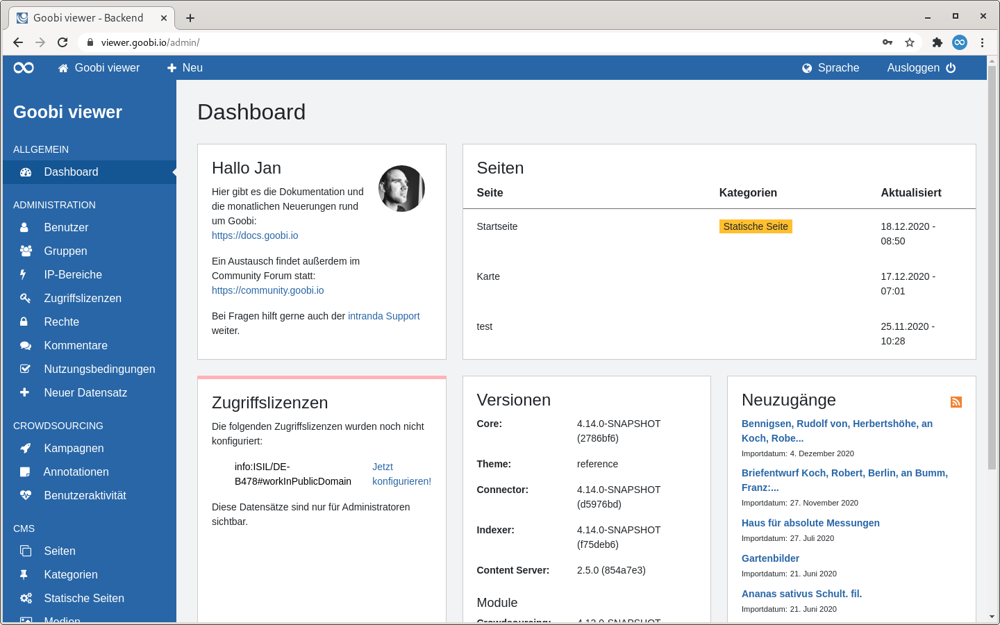
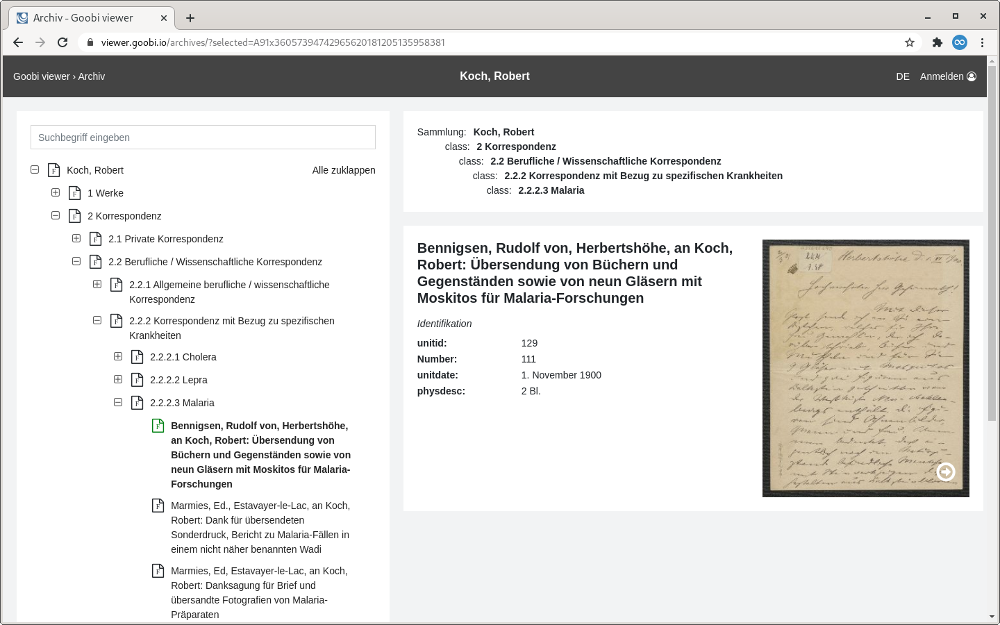
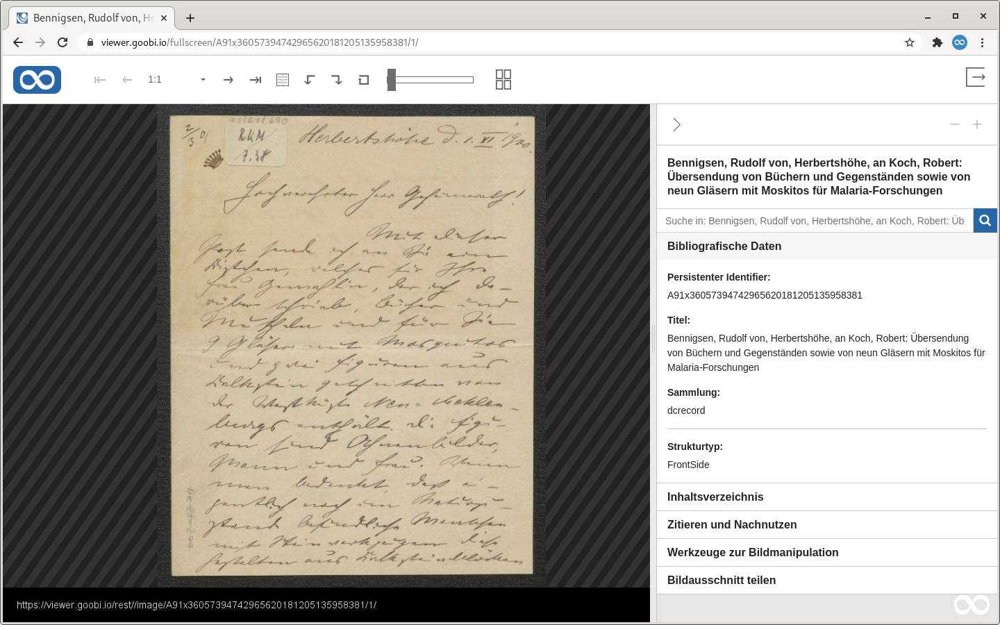
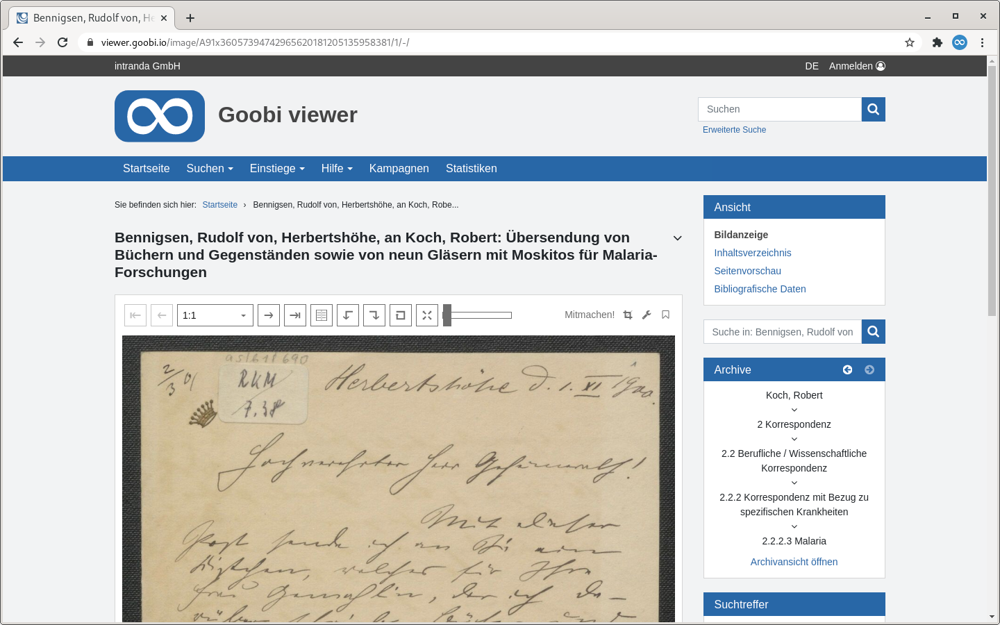

# 3. Glossar

## A

### Adminbackend

Das Adminbackend beschreibt eine Oberfläche, über die Teile der Inhalte und der Funktionalität des Goobi viewers webbasiert gesteuert werden können. Die Oberfläche steht nur Benutzeraccounts mit Administratorenrechten oder Benutzeraccounts mit erweiterten Rechten zum Beispiel für Kampagnen oder das CMS zur Verfügung.

Siehe dazu auch [Kapitel 2](../ui/2/) und Unterseiten in Bereich Oberfläche.

### Archivansicht

Die Archivansicht beschreibt eine Ansicht, die speziell für die Darstellung von Archivbeständen konzipiert wurde.

## D

### digitale Kollektionen

Siehe [Sammlungen](3.md#sammlungen).

## C

### Crowdsourcing Modul

Mit dem Crowdsourcing Modul können Volltext Koordinaten erzeugt und bearbeitet werden. Die Bezeichnung steht in Abgrenzung zu den Kampagnen. Das Modul ist kostenpflichtig.

## K

### Kampagnen

Die Kampagnen beschreiben eine Funktionalität des Goobi viewers mit der Crowdsourcing realisiert werden kann. Dabei können Bildbereiche annotiert, Georeferenziert oder Metadaten ergänzt werden. Die Kampagnen sind komplett IIIF Konform und werden über das Adminbackend verwaltet. 

Siehe dazu auch [Kapitel 2.3](../ui/2/3/) in Bereich Oberfläche.

Im Gegensatz zu dem Crowdsourcing Modul sind die Kampagnen Open Source.

## P

### Paginator

Ein Paginator bietet die Möglichkeit zwischen verschiedenen Seiten zu blättern. Das können zum Beispiel mehrere Seiten von Suchergebnissen sein, aber auch zwischen den einzelnen Bildern innerhalb eines Werkes.

## S

### Sammlungen

Sammlungen und Untersammlungen bezeichnen die Funktionalität mehrere Werke zu Sammlungen zusammenzufassen. Der Begriff "Digitale Kollektion" und "Unterkollektionen" werden hier als Synonym verwendet.

## V

### Vollbildansicht

Die Vollbildansicht zeigt alle Informationen zu einem Werk zentral an. Sie kann über das entsprechende Icon oberhalb des Bildes oder direkt über die URL geöffnet werden.

## W

### Werksansicht

Der Begriff Werkansicht oder auch Werkanzeige bezeichnet die Anzeige eines Datensatzes im Corporate Design. In der Regel ist damit die Bildanzeige gemeint. Der Begriff umfasst aber auch das Inhaltsverzeichnis, die Seitenvorschau oder die Bibliographischen Daten.

Der Begriff wird in Abgrenzung zu den Begriffen Vollbildanzeige und Archivansicht verwendet.

