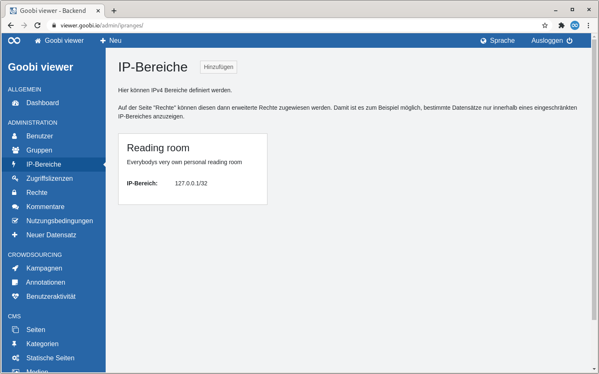
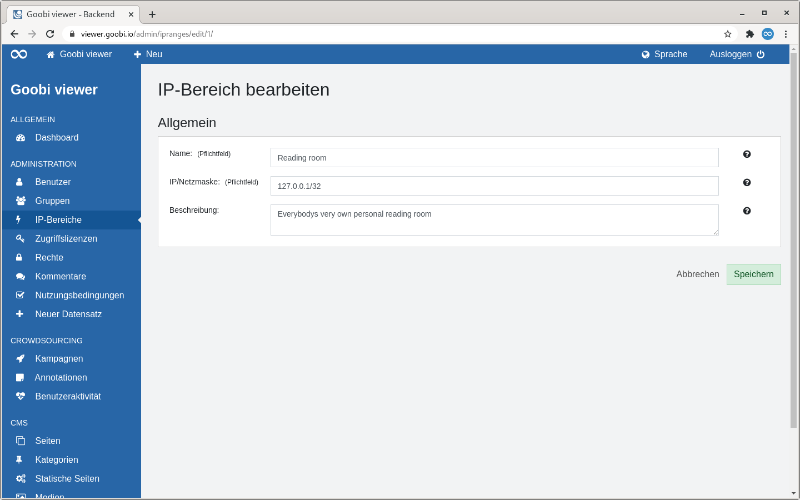

# 2.2.3 IP-Bereiche

## Übersicht

Die Seite "IP-Bereiche" listet alle angelegten IP-Bereiche als Kacheln auf.

Rechts neben der Seitenüberschrift befindet sich ein Button um einen neuen IP-Bereich hinzuzufügen.

Anschließend folgt ein beschreibender Text mit einem Hinweis auf die Möglichkeit IP-Bereiche auf der Seite "Rechte" weitere Rechte zuzuweisen.

Darunter werden die verfügbaren IP-Bereiche in einer Kachelansicht dargestellt. Eine Kachel enthält den Namen des IP-Bereichs als Überschrift sowie darunter optional eine Beschreibung. Außerdem ist der IP-Bereich selbst aufgeführt.

Fährt man mit der Maus über eine Kachel wird ein Link zum Bearbeiten oder Löschen des IP-Bereiches sichtbar.


Das Löschen eines IP-Bereiches ist nur möglich, wenn diesem keine Rechte zugewiesen sind.


## Hinzufügen

Wird ein IP-Bereich hinzugefügt wird nur ein Abschnitt angezeigt: "Allgemein".

Der Name eines IP-Bereiches ist genau wie die IP/Netzmaske ein Pflichtfeld. Die optionale Beschreibung hilft den Bereich genauer zu Beschreiben. Sie ist nur für Administratoren sichtbar.

