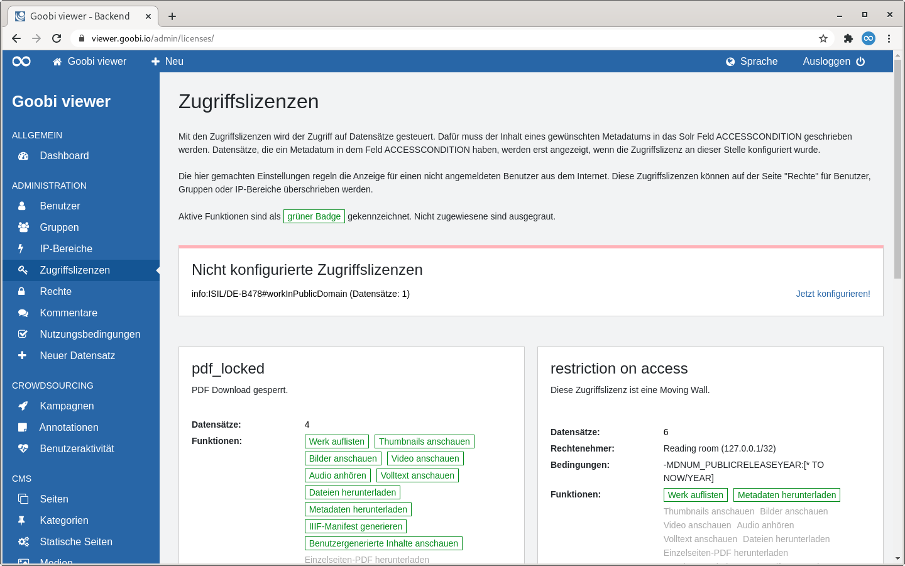
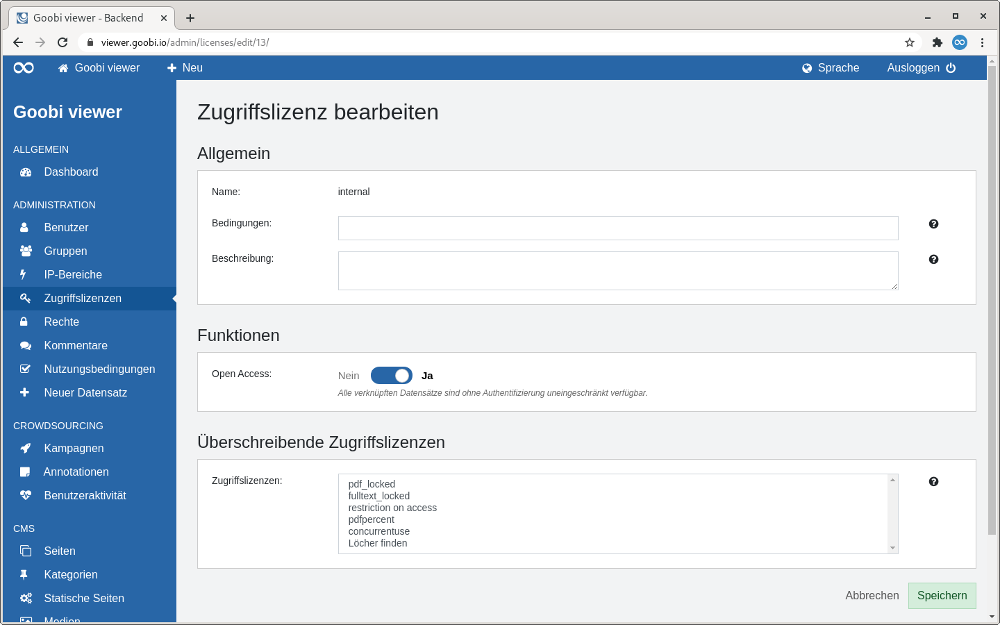
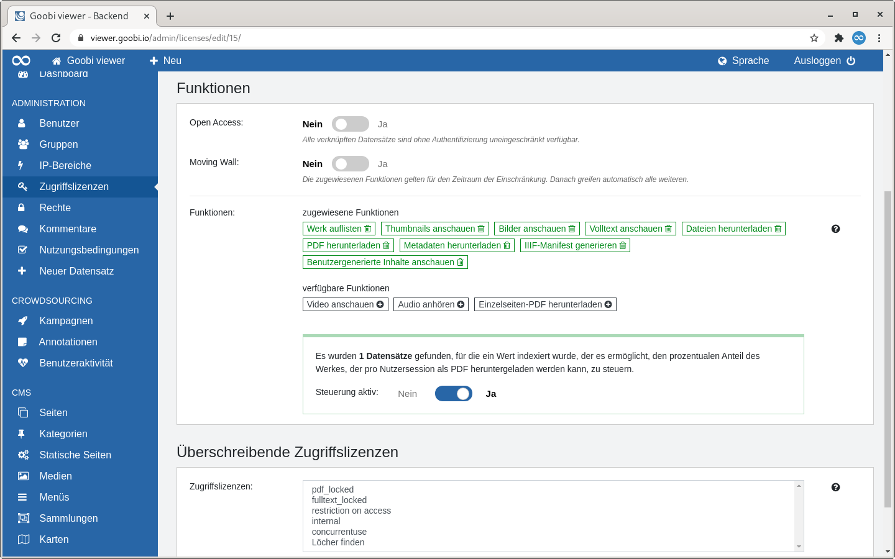

# 2.2.4 Zugriffslizenzen

## Allgemein

Mit den Zugriffslizenzen wird der Zugriff auf Datensätze gesteuert. Werke mit Zugriffslizenz sind automatisch gesperrt und damit nur für Administratoren sichtbar bis die Lizenz konfiguriert wurde. An dieser Stelle wird die Standardkonfiguration festgelegt, die für Benutzer ohne Anmeldung gelten.

Für ein Anwendungsbeispiel siehe auch Kapitel 6.8: [Konfiguration der Zugriffsbeschränkung]().

## Übersicht

Die Seite "Zugriffslizenzen" listet alle konfigurierten Zugriffslizenzen als Kacheln auf. Wenn nicht konfigurierte Lizenzen existieren wird darauf am Seitenanfang prominent hingewiesen.

Nach der Seitenüberschrift wird die Funktionalität der Zugriffslizenzen noch einmal beschrieben. Aktive und nicht zugewiesene Funktionen sind in den Kacheln als Badges gekennzeichnet. Dabei folgen die Farben der Badges dem folgenden Schema:

* **Grün**: Die Funktion ist aktiv
* **Grau**: Die Funktion ist nicht zugewiesen und steht damit für Datensätze mit dieser Zugriffslizenz nicht zur Verfügung 

Darunter erscheint optional der Bereich der auf die nicht konfigurierten Zugriffslizenzen hinweist.

Anschließend werden die konfigurierten Zugriffslizenzen in einer Kachelansicht dargestellt. Die Kacheln enthalten die folgenden Elemente:

<table>
  <thead>
    <tr>
      <th style="text-align:left">Element</th>
      <th style="text-align:left">Beschreibung</th>
    </tr>
  </thead>
  <tbody>
    <tr>
      <td style="text-align:left"><b>&#xDC;berschrift</b>
      </td>
      <td style="text-align:left">Der interne Wert der Lizenz wird als &#xDC;berschrift angezeigt.</td>
    </tr>
    <tr>
      <td style="text-align:left"><b>Hinweis</b>
      </td>
      <td style="text-align:left">Ist eine Lizenz als Moving Wall oder als Open Access markiert wird ein
        entsprechender Hinweistext angezeigt. Das gleiche gilt auch f&#xFC;r Lizenzen,
        die den gleichzeitigen Zugriff oder den prozentualen Anteil eines Werkes
        der pro Nutzersession heruntergeladen werden kann, einschr&#xE4;nken.</td>
    </tr>
    <tr>
      <td style="text-align:left"><b>Beschreibung</b>
      </td>
      <td style="text-align:left">Wurde f&#xFC;r eine Zugriffslizenz eine Beschreibung eingegeben ist diese
        in der Kachel sichtbar.</td>
    </tr>
    <tr>
      <td style="text-align:left"><b>Datens&#xE4;tze</b>
      </td>
      <td style="text-align:left">Die Anzahl der Datens&#xE4;tze, die diese Lizenz umfasst ist angegeben.
        Wird die Zahl angeklickt, so l&#xF6;st das eine Suche nach diesen Werken
        aus.</td>
    </tr>
    <tr>
      <td style="text-align:left"><b>Rechtenehmer</b>
      </td>
      <td style="text-align:left">Wenn einem Benutzer, einer Gruppe oder einem IP-Bereich f&#xFC;r diese
        Lizenz spezielle Rechte zugewiesen wurden, so werden die Rechtenehmer an
        dieser Stelle angezeigt.</td>
    </tr>
    <tr>
      <td style="text-align:left"><b>Bedingungen</b>
      </td>
      <td style="text-align:left">Wenn f&#xFC;r eine Lizenz eine Bedingung formuliert wurde wird sie hier
        angezeigt. Bedingungen m&#xFC;ssen zur Zeit nur f&#xFC;r eine Moving Wall
        formuliert werden.</td>
    </tr>
    <tr>
      <td style="text-align:left"><b>Funktionen</b>
      </td>
      <td style="text-align:left">
        
Hier wird eine Liste der aktiven und nicht zugewiesenen Funktionen angezeigt.
          Aktive werden als gr&#xFC;ner Badge visualisiert. Nicht zugewiesene Funktionen
          sind ausgegraut.

        
Ist eine Lizenz als &quot;Open Access&quot; markiert, dann werden keine
          Funktionen aufgelistet, da grunds&#xE4;tzlich alles erlaubt ist.

        
Betrifft eine Lizenz die Anzeige von Annotationen aus einer Kampagne,
          steht nur die Funktion &quot;Benutzergenerierte Inhalte anschauen&quot;
          zur Verf&#xFC;gung.

      </td>
    </tr>
  </tbody>
</table>

Fährt man mit der Maus über eine Kachel wird ein Link zum Bearbeiten oder Löschen der Zugriffslizenz sichtbar.


Das Löschen einer Zugriffslizenz ist nur möglich wenn sie keine Rechtenehmer hat.


## Konfigurieren

Wird eine Zugriffslizenz konfiguriert sind drei Abschnitte sichtbar: "Allgemein" und "Funktionen" und "Überschreibende Zugriffslizenzen".

### Allgemein

Im Abschnitt Allgemein ist der Name bereits durch den internen Wert der Zugriffslizenz belegt. Eine Bedingung und die Beschreibung sind optional.

### Funktionen

Im Abschnitt "Funktionen" wird eingestellt, was die Zugriffslizenz bedeutet. 

#### Open Access

Wird eine Lizenz als "Open Access" markiert bedeutet dass, dass der Zugriff uneingeschränkt und ohne Authentifizierung zur Verfügung steht.

#### Moving Wall

Wird eine Lizenz als "Moving Wall" markiert, stehen die zugewiesenen Funktionen für den Zeitraum der Einschränkung zur Verfügung. Danach greifen automatisch alle weiteren.  
Für eine Moving Wall muss immer auch eine Bedingung in Form einer Solr-Query formuliert werden. 

Für ein Anwendungsbeispiel siehe auch Kapitel 6.3: [Moving Wall](../../../misc/1/2.md)

#### Funktionen

Der Bereich "Funktionen" gliedert sich in zwei Bereiche: die verfügbaren und die zugewiesenen Funktionen. Über den Mausklick auf einen Badge können verfügbare Funktionen zu den zugewiesenen Funktionen hinzugefügt oder auch andersherum wieder entfernt werden. 

Die Funktionen bedeuten im einzelnen:

| Name | Beschreibung |
| :--- | :--- |
| **Werk auflisten** | Steuert die grundsätzliche Anzeige des Datensatzes. Ist diese Funktion aktiv wird der Datensatz mit seinen Metadaten angezeigt. Ist sie nicht aktiv, ist der Datensatz nur für Administratoren sichtbar. |
| **Thumbnails anschauen** | Diese Funktion kann verwendet werden, um ohne die Funktion "Bilder anschauen" dennoch Vorschaubilder eines Datensatzes anzuzeigen. Der Schwellwert, bis zu welcher Größe ein Bild als Thumbnail gilt, wird in der Konfigurationsdatei in der Sektion  festgelegt. In der Standardkonfiguration sind das 400px Bildbreite. |
| **Bilder anschauen** | Wenn aktiv, ist der Zugriff auf hoch aufgelösten Bilder gestattet. Diese Funktion überschreibt damit die Funktion "Thumbnails anschauen". |
| **Video anschauen** | Wenn ein Datensatz Videos enthält, kann der Zugriff darauf freigeschaltet oder gesperrt werden. |
| **Audio anhören** | Wenn ein Datensatz Audio Dateien enthält, kann der Zugriff darauf freigeschaltet oder gesperrt werden. |
| **Volltext anschauen** | Wenn Volltexte für den Datensatz vorliegen, zum Beispiel im Plaintext, ALTO oder TEI Format, kann der Zugriff darauf gesteuert werden. |
| **Dateien herunterladen** | Steuert den Zugriff auf zusätzliche zum Download angebotene Dateien für Datensätze. Diese sind in der Werkansicht in der Sidebar im Widget "Downloads" sichtbar. |
| **Einzelseiten-PDF herunterladen** | Diese Funktion kann verwendet werden, um ohne die Funktion "PDF herunterladen" dennoch die Generierung von PDF-Einzelseiten zu erlauben. |
| **PDF herunterladen** | Wenn aktiv, stehen alle PDF-Downloadmöglichkeiten zur Verfügung. Diese Funktion überschreibt damit die Funktion "Einzelseiten-PDF herunterladen". |
| **Metadaten herunterladen** | Diese Funktion kann verwendet werden, um den Download von Metadaten \(zum Beispiel METS, LIDO, DublinCore, MARCXML, ...\) im Widget "Zitieren und Nachnutzen" zu steuern. Diese Einschränkung ergibt zum Beispiel in Kombination mit einer Moving Wall Sinn. Wenn Datensätze bis zum Ablauf der Moving Wall unter einer bestimmten Lizenz stehen und danach unter einer anderen kann die Anzeige in der Oberfläche dafür abweichend zu den Werten in den Quelldateien manipuliert werden. In diesem Fall soll der Zugriff auf die Quelldateien mit der nicht manipulierten Lizenzangabe verhindert werden. |
| **IIIF-Manifest generieren** | Steuert den Zugriff auf das IIIF Manifest für einen Datensatz. Siehe auch die weitere Beschreibung zu der Funktion "Metadaten herunterladen". |
| **Benutzergenerierte Inhalte anschauen** | Wenn in einer Crowdsourcing Kampagne die Ergebnisse mit einer Zugriffslizenz versehen werden, dann kann der Zugriff darauf mit dieser Funktion gesteuert werden. So kann der Zugriff zum Beispiel grundsätzlich gesperrt und nur für eine dedizierte Benutzergruppe ein entsprechendes Recht vergeben werden. |

Weiter besteht die Möglichkeit den PDF-Download innerhalb einer Nutzersession auf einen prozentualen Anteil des Werkes zu beschränken. Dafür muss die Prozentzahl in dem Solr-Feld `ACCESSCONDITION_PDF_PERCENTAGE_QUOTA` gespeichert sein.  
Außerdem kann der gleichzeitige Zugriff auf ein Werk beschränkt werden. Dafür muss die Anzahl der gleichzeitig erlaubten Benutzer in dem Solr-Feld `ACCESSCONDITION_CONCURRENTUSE` gespeichert sein.

Sofern einer der beiden Werte existiert wird unterhalb der Funktionen ein Kasten angezeigt, der auf das Vorhandensein der zusätzlichen Einschränkungsmöglichkeit hinweist. Es wird angegeben für wie viele Datensätze ein Wert erkannt wurde. Die zusätzliche Einschränkung kann dann in dem Kasten ein- oder ausgeschaltet werden.

### Überschreibende Zugriffslizenzen

Besitzt ein Werk mehrere Zugriffslizenzen reicht es, dass ein Benutzer nur für eine dieser Lizenzen eine Recht besitzt. Dafür kann an dieser Stelle eine oder mehrere überschreibende Lizenzen ausgewählt werden.

