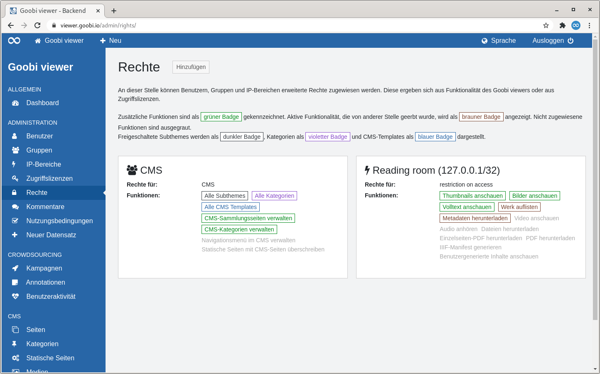
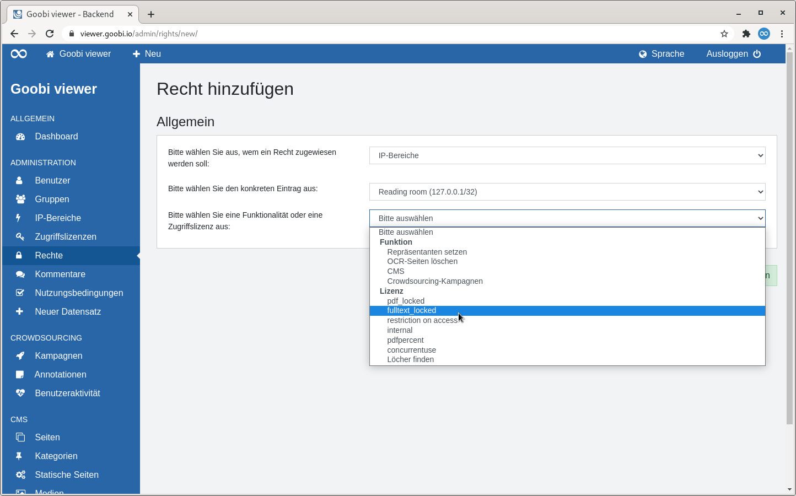
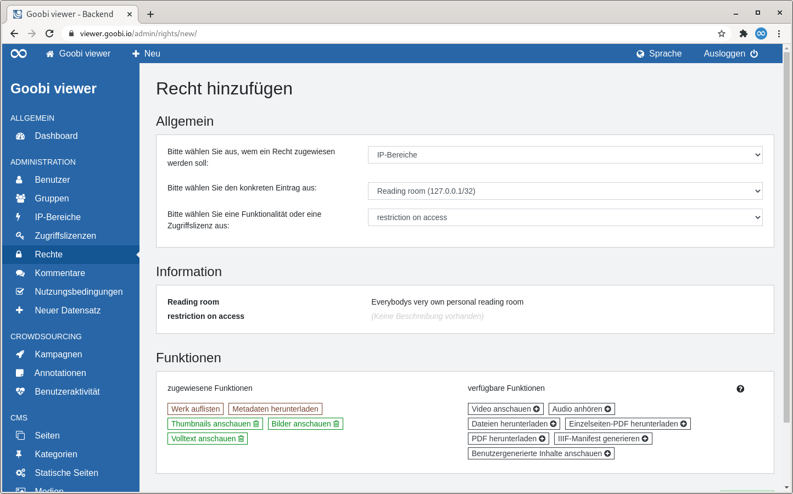
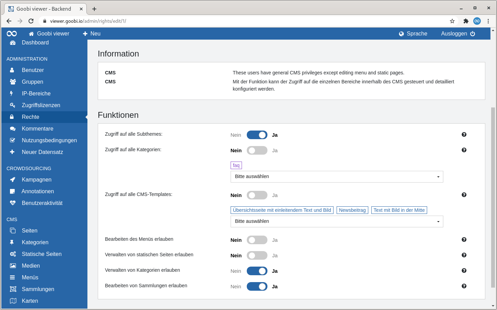

# 2.2.5 Rechte

## Allgemein

Mit den Rechten können [Benutzern](1.md), [Gruppen](2.md) und [IP-Bereichen](3.md) erweiterte Privilegien zugewiesen werden. Diese ergeben sich aus der Funktionalität des Goobi viewers oder den Zugriffslizenzen.

Wenn zum Beispiel Datensätze einer [Zugriffslizenz](4.md) nur aus einem bestimmten IP-Bereich zugänglich sein sollen, oder ein normaler Benutzeraccount auch bestimmte CMS-Seiten bearbeiten können soll, dann ist das hier die Stelle für die Konfiguration.

## Übersicht

Die Seite "Rechte" listet alle konfigurierten Rechte als Kacheln auf.

Rechts neben der Seitenüberschrift befindet sich ein Button um ein weiteres Recht hinzuzufügen.

Nach der Seitenüberschrift wird die Funktionalität der Rechte noch einmal beschrieben. Die Funktionen aus den Zugriffslizenzen sind in den Kacheln als Badges gekennzeichnet. Dabei folgen die Farben der Badges dem folgenden Schema:

* **Grün**: Die Funktion ist in den Rechten zusätzlich vergeben worden
* **Braun**: Die Funktion wurde bereits aus der Standardkonfiguration geerbt
* **Grau**: Die Funktion ist nicht zugewiesen und steht damit für Datensätze mit dieser Zugriffslizenz nicht zur Verfügung 

Die Funktionen die im Kontext CMS vergeben werden können sind ebenfalls als Badges visualisiert. Dabei folgenden die zusätzlichen Farben dem folgenden Schema:

* **Schwarz**: Listet die freigeschalteten Subthemes auf
* **Violett**: Listet die freigeschalteten Kategorien auf
* **Blau**: Listet die freigeschalteten CMS-Templates auf

Anschließend werden die konfigurierten Rechte in einer Kachelansicht dargestellt. Die Kacheln enthalten die folgenden Elemente:

| Element | Beschreibung |
| :--- | :--- |
| **Überschrift** | In der Überschrift sind zwei Informationen kodiert. Das Symbol visualisiert ob das Recht einem Benutzer, einer Gruppe oder einem IP-Bereich zugewiesen wurde. Danach folgt der Name des Rechtenehmers. |
| **Rechte für** | Gibt an wofür der Rechtenehmer zusätzliche Rechte bekommen hat, also zum Beispiel für eine bestimmte Zugriffslizenz oder eine Funktionalität. |
| **Funktionen** | Listet die einzelnen Funktionen in Form von Badges auf. |

Fährt man mit der Maus über eine Kachel wird ein Link zum Bearbeiten oder Löschen des Rechtes sichtbar.

## Hinzufügen

### Allgemein

Wenn ein neues Recht hinzugefügt wird, steht zuerst nur der Abschnitt "Allgemein" zur Verfügung.

Dort müssen drei Punkte ausgewählt werden:

1. Wem ein Recht zugewiesen werden soll \(Benutzer, Gruppe, IP-Bereich\)
2. Den konkreten Eintrag
3. Welche Funktionalität oder Zugriffslizenz behandelt werden soll.

Immer, wenn ein Punkt ausgewählt wurde erscheint das DropDown Menü für das nächste. Sobald alle drei Punkte ausgewählt sind erscheinen automatisch zwei weitere Abschnitte "Information" und "Funktionen"

### Information

Im diesem Abschnitt werden Informationen zu den beiden ausgewählten Einträgen angezeigt. Für Benutzer wird die E-Mail-Adresse und der letzte Login angezeigt. Für eine Gruppe und einen IP-Bereich dessen Beschreibung. Dasselbe gilt auch für die ausgewählte Funktion oder Lizenz.

### Funktionen

#### Zugriffslizenzen

Bei den Funktionen gibt es die von den Zugriffslizenzen bekannte Ansicht von zugewiesenen und verfügbaren Funktionen. Bei den zugewiesenen Funktionen werden die aus der Standardkonfiguration geerbten als brauner Badge dargestellt. Per Klick auf einen Badge können Funktionen aktiviert oder deaktiviert werden.

#### CMS

Soll keiner Zugriffslizenz sondern Rechte bei der Funktionalität CMS vergeben werden, sieht der Abschnitt "Funktionen" anders aus. Die einzelnen Funktionen im Kontext CMS sind aufgelistet. Über Schalter können einzelne Bereiche komplett ein- oder ausgeschaltet werden. Für Subthemes, Kategorien und CMS-Templates können auch einzelne Einträge ausgewählt werden.

