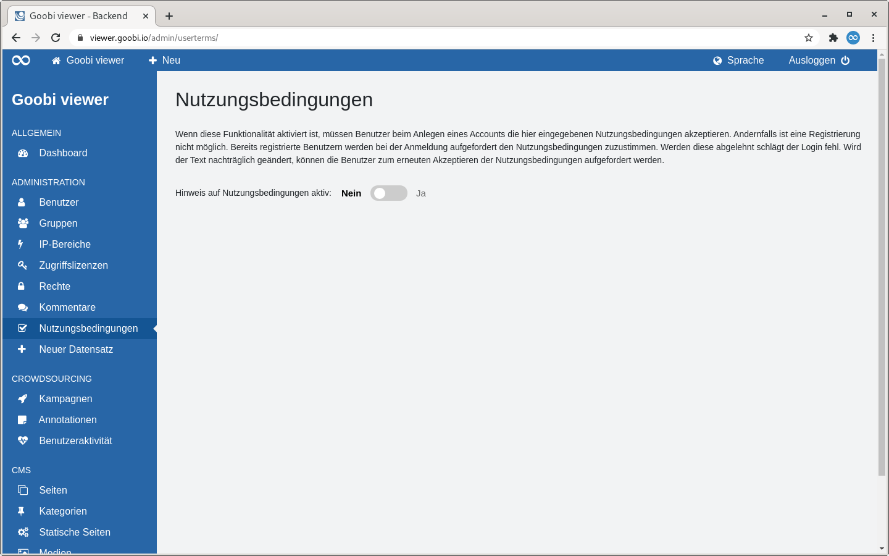

# 2.2.7 Nutzungsbedingungen

## Allgemein

Auf der Seite "Nutzungsbedingungen" kann ein Text hinterlegt werden, dem beim Registrieren eines neuen Accounts zugestimmt werden muss. Wird die Funktionalität nachträglich aktiviert, werden bereits registrierte Benutzer bei der nächsten Anmeldung aufgefordert diesen Text zu akzeptieren. Wird der Text nachträglich geändert, können die Benutzer zum erneuten Akzeptieren aufgefordert werden.

## Übersicht

Unter der Überschrift steht ein beschreibender Text. Darunter gibt es einen Schalter mit dem die Funktionalität ein- oder ausgeschaltet werden kann. Die Funktionalität ist standardmäßig deaktiviert.


Wenn die Nutzungsbedingungen deaktiviert werden verbleibt der aktuelle Status der Nutzerzustimmungen für die einzelnen Benutzer in der Datenbank. Um vollständig zurückzusetzen muss die Zustimmung immer noch einmal explizit zurückgesetzt werden.


## Bearbeiten

Wenn die Funktionalität eingeschaltet wurde erscheinen zwei Abschnitte: "Text verwalten" und "Zustimmung zurücksetzen verwalten".

### Text verwalten

Im Abschnitt "Text verwalten" gibt es eine Reiteranzeige. Die Standardsprache steht an erster Stelle. Dahinter folgen ein bisschen abgesetzt die Reiter für die aktivierten Übersetzungen. 

In der Standardsprache müssen die Pflichtfelder ausgefüllt werden bevor der Text für eine Übersetzung eingepflegt werden kann. Vollständig ausgefüllte Übersetzungen werden über eine grüne Reiterfarbe signalisiert.

### Zustimmung zurücksetzen

Wird der Text nachträglich geändert und müssen dementsprechend die Benutzer erneut Zustimmen, dann kann die Zustimmung für alle Benutzer an dieser Stelle zurückgesetzt werden.

