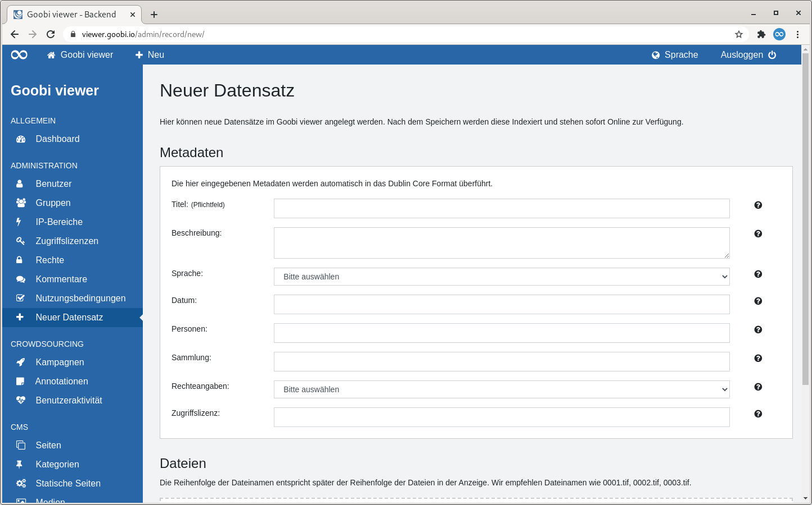
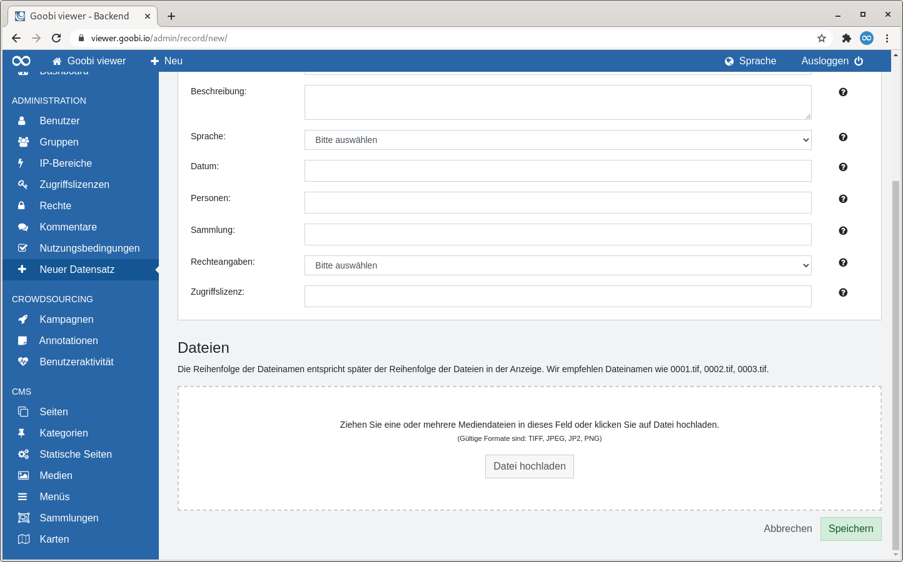

# 2.2.8 Neuer Datensatz

## Allgemein

Normalerweise nimmt der Goobi viewer Datensätze im `METS/MODS`, `LIDO` oder `DenkXweb` Format von externen Systemen entgegen um diese zu indexieren und anzuzeigen. Für kleine Einrichtungen ist jedoch das Erstellen der Formate bereits eine Hürde vor der Arbeit mit dem Goobi viewer.  
Aus diesem Grund können über das Formular auf dieser Seite standardisierte Dublin Core Datensätze inklusive dazugehöriger Bilder angelegt werden.

## Übersicht

Nach einem einleitenden Text gliedert sich die Seite in zwei Abschnitte auf: "Metadaten" und "Dateien".

### Metadaten

Das einzige Pflichtmetadatum in dem Formular auf dieser Seite ist der Titel. Als Identifier wird im Hintergrund automatisch eine UUID generiert. Für Sprach- und Rechteangaben steht ein DropDown Menü mit Werten zur Verfügung. Dadurch werden zum Beispiel valide ISO 639-2b Sprachcodes geschrieben ohne diese selbst kennen zu müssen. Zu allen Feldern existiert eine Inline-Hilfe mit weiteren Erläuterungen.

### Dateien

In dem Abschnitt können Bilder per Drag and Drop auf die Fläche, oder klassisch über eine Dateiauswahl hochgeladen werden. Erlaubt sind die Dateiformate `TIFF`, `JPEG`, `JP2` und `PNG`.


Die Reihenfolge der Dateinamen entspricht später der Reihenfolge der Dateien in der Anzeige. Wir empfehlen deswegen Dateinamen wie zum Beispiel 0001.tif, 0002.tif, 0003.tif


Nach dem Speichern werden die Daten automatisch indexiert.

