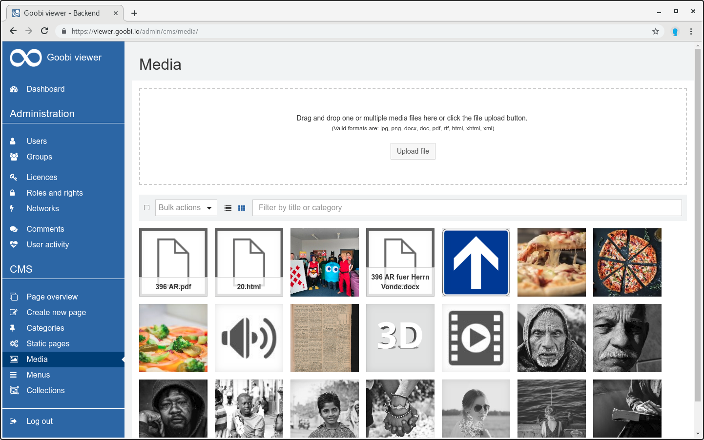
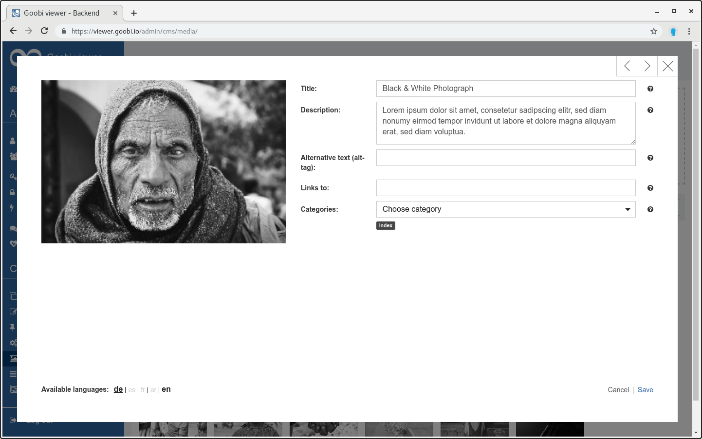

# 2.4.4 Medien

Auf der Medien-Seite des CMS hat der Benutzer die Möglichkeit Bilder für die Seiten und Artikel hochzuladen.

Um ein Bild hochladen zu können, muss der Benutzer auf die Schaltfläche `Datei hochladen` klicken. Nach dem Upload kann auf das Bild geklickt werden. Es öffnet sich ein Dialogfenster, in dem Einstellungen für das Bild getroffen werden können.

Als Erstes muss der Benutzer die Bilddatei von seinem Computer auswählen. Anschließend kann er der Datei noch einen Titel und eine Beschreibung geben. Diese können in unterschiedlichen Sprachen über die Links `de`, `en` und `es` verfasst werden. Die Anpassungen werden mit einem Klick auf den Link `Speichern` übernommen. 

Über das Vorschaubild in der Übersicht hat der Benutzer die Möglichkeit, nachträglich den Titel und/oder die Beschreibung des Bildes zu bearbeiten. Außerdem kann er es auch wieder löschen, indem er auf das Löschen-Symbol klickt.

