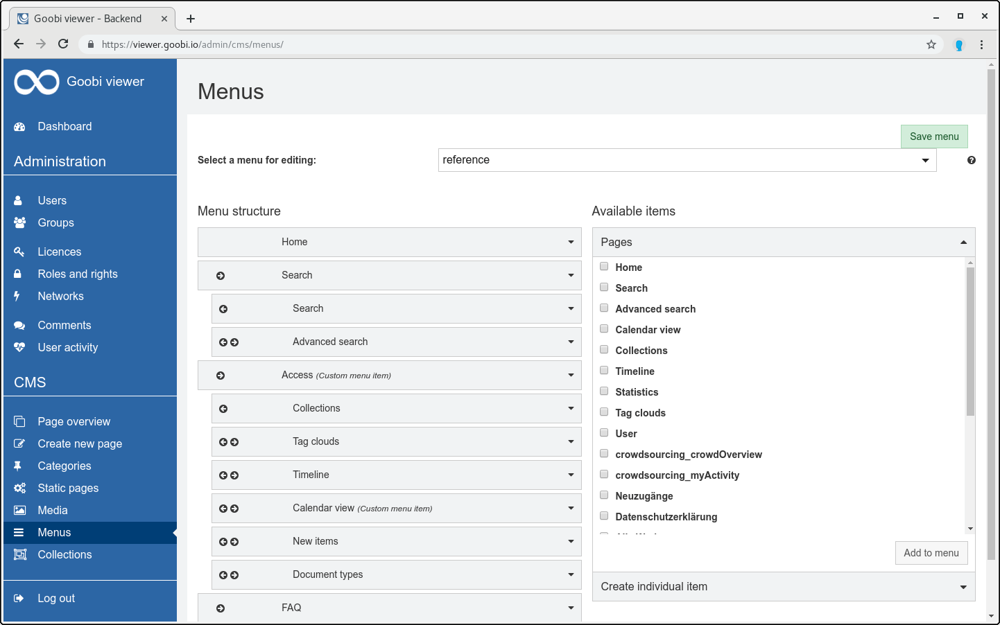

# 2.4.5 Menüs

Um das Navigationsmenü des Goobi viewer zu konfigurieren, bietet das CMS die Möglichkeit die Menüpunkte festzulegen und Untermenüs zu erstellen.



Die Auswahl ist in zwei Spalten aufgeteilt. In der rechten Spalte `Verfügbare Einträge` werden die verfügbaren Menüpunkte aufgelistet und in der Spalte `Menü-Struktur`die angezeigten Menüpunkte aufgelistet.  
  
Um Menüpunkte zu den verwendeten hinzuzufügen, müssen diese per Drag-and-Drop von der rechten Spalte in die linke gezogen werden. Die Pfeile neben den Menüpunktnamen stellen die Hierarchieebene des Menüpunkts dar. Es ist möglich, Untermenüs bis zu einer Tiefe von vier Verschachtelungen zu erstellen.

Damit die Einstellungen für das Menü auch greifen, muss nach der Konfiguration noch auf die Schaltfläche `Menü Speichern` geklickt werden.  


Menüeinträge selbst sind KEYs, können also durch Einträge in den lokalen messages Dateien übersetzt werden. Es empfiehlt sich einen Key zu verwenden, der einen kundenspezifischen Präfix aufweist und außerdem in der Oberfläche sofort erkennbar ist, dass dieser String noch übersetzt werden muss. Beispiel:

```text
customer_FOO_menu_search
```

Dieser KEY kann anschließend in den lokalen deutschen und englischen messages Dateien übersetzt werden:


```text
customer_FOO_menu_search=Suchen
```



```text
customer_FOO_menu_search=Search
```



